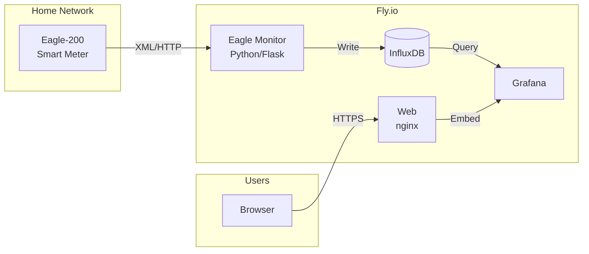

# Linknode Energy Monitor

A real-time energy monitoring dashboard that tracks power consumption using Eagle-200 smart meter data. Built with modern web technologies, comprehensive testing, enhanced security, and deployed on Fly.io.


## Live Demo

**Production URLs**:
- **Main Site**: [https://linknode.com](https://linknode.com)
- **Grafana Dashboard**: https://linknode-grafana.fly.dev
- **Eagle Monitor API**: https://linknode-eagle-monitor.fly.dev/api/stats
- **Health Check**: https://linknode-eagle-monitor.fly.dev/health

## Features

- **Real-time Power Monitoring**
  - Eagle-200 smart meter integration (XML format)
  - Live power consumption with 5-second refresh
  - Time-series data storage (InfluxDB)
  - Public Grafana dashboard (no login required)
  - Data staleness detection with age indicators

- **Modern Web Interface**
  - Dark theme with animated gradients
  - Embedded Grafana dashboard
  - API status indicators
  - Responsive design (mobile to 4K)

- **Cloud Native on Fly.io**
  - 4 microservices: web, eagle-monitor, grafana, influxdb
  - Automatic SSL/TLS termination
  - Global edge network deployment
  - Automated CI/CD via GitHub Actions

- **Comprehensive Testing**
  - 3-phase E2E test suite (Playwright)
  - Visual regression testing
  - Performance profiling
  - Accessibility testing

- **Security**
  - CSP headers and HSTS
  - API authentication with rate limiting
  - Grafana role-based access (Viewer for anonymous)
  - Security scanning in CI/CD

## Quick Start

```bash
# Clone and install
git clone https://github.com/murr2k/linknode-com.git
cd linknode-com
npm install

# Run tests
npm test                    # All tests
npm run baseline:compare    # Regression comparison

# Deploy (automated via GitHub Actions on push to main)
git push origin main
```

## Project Structure

```
linknode-com/
├── fly/                      # Fly.io services (production)
│   ├── web/                  # Main website (nginx + index.html)
│   ├── eagle-monitor/        # Power monitoring API (Python/Flask)
│   ├── grafana/              # Metrics dashboard
│   └── influxdb/             # Time-series database
├── e2e/                      # E2E test suite
│   ├── tests/                # Test specifications
│   ├── pages/                # Page object models
│   └── utils/                # Test utilities
├── scripts/                  # Utility scripts
│   ├── capture-baseline.ts   # Baseline capture
│   ├── compare-baseline.ts   # Baseline comparison
│   └── [deployment scripts]
├── test-baselines/           # Regression baselines
│   ├── visual/               # Screenshot baselines
│   └── baseline.json         # Performance/feature baseline
├── docs/                     # Documentation
│   ├── THEORY_OF_OPERATION.md  # System architecture
│   ├── archive/              # Historical docs
│   ├── e2e/                  # Testing guides
│   └── slack/                # Slack integration
├── monitoring/               # Operations toolkit
├── .github/workflows/        # CI/CD pipelines
└── websites/                 # Related website projects
```

## Testing

```bash
# Test categories
npm test                  # All tests
npm run test:api          # API integration
npm run test:visual       # Visual regression
npm run test:perf         # Performance
npm run test:a11y         # Accessibility
npm run test:phase3       # Advanced tests

# Regression testing
npm run baseline:capture  # Capture new baseline
npm run baseline:compare  # Compare to baseline
npm run test:regression   # Full regression suite
```

**Baseline**: v1.0.0-baseline (2025-07-23)
- 8 visual screenshots (desktop, tablet, mobile)
- Performance metrics: FCP 148ms
- All API endpoints validated

## Deployment

### Automated (Recommended)
Push to `main` triggers deployment via GitHub Actions:
```bash
git push origin main
```

### Manual
```bash
cd fly/web && flyctl deploy
cd fly/eagle-monitor && flyctl deploy
cd fly/grafana && flyctl deploy
cd fly/influxdb && flyctl deploy
```

### Required Secrets

**GitHub Secrets**:
- `FLY_API_TOKEN` - Fly.io deployment token
- `INFLUXDB_TOKEN` - InfluxDB authentication
- `GRAFANA_ADMIN_PASSWORD` - Grafana admin access

**Fly.io Secrets** (per service):
- `INFLUXDB_TOKEN` - Database access
- `EAGLE_PASSWORD` - Eagle-200 authentication
- `GF_SECURITY_ADMIN_PASSWORD` - Grafana admin

## CI/CD Workflows

| Workflow | Trigger | Purpose |
|----------|---------|---------|
| `deploy-fly.yml` | Push to main | Deploy all services |
| `e2e-tests.yml` | PRs, pushes | Multi-browser E2E tests |
| `e2e-tests-phase3.yml` | Manual | Advanced testing |
| `regression-tests.yml` | PRs | Baseline comparison |
| `security-scan.yml` | PRs, pushes | Security validation |

## Documentation

| Document | Description |
|----------|-------------|
| [docs/THEORY_OF_OPERATION.md](docs/THEORY_OF_OPERATION.md) | System architecture and data flow |
| [docs/HEALTH_CHECKS.md](docs/HEALTH_CHECKS.md) | Service health endpoints |
| [docs/REGRESSION_TESTING.md](docs/REGRESSION_TESTING.md) | Baseline management guide |
| [docs/e2e/](docs/e2e/) | E2E testing guides |
| [fly/grafana/README.md](fly/grafana/README.md) | Grafana setup and security |
| [CHANGELOG.md](CHANGELOG.md) | Version history |

## Architecture



See [docs/THEORY_OF_OPERATION.md](docs/THEORY_OF_OPERATION.md) for detailed architecture diagrams.

## Recent Changes

### 2026-01-14: Security & Cleanup
- Fixed critical Grafana vulnerability (anonymous Admin → Viewer)
- Rotated InfluxDB credentials
- Removed hardcoded secrets from scripts
- Major project cleanup (~43M removed)
- Reorganized root directory (84 → 12 files)

### 2025-08-09: Data Staleness Detection
- Dashboard shows dashes when data is stale (>2 min)
- Age indicator: "Live", "Updated Xs ago", "No data for Xm"

See [CHANGELOG.md](CHANGELOG.md) for full history.

## License

MIT License - see [LICENSE](LICENSE)

## Author

**Murray Kopit** - [@murr2k](https://github.com/murr2k)

---

Built with [Claude](https://anthropic.com) | Deployed on [Fly.io](https://fly.io) | Tested with [Playwright](https://playwright.dev)
