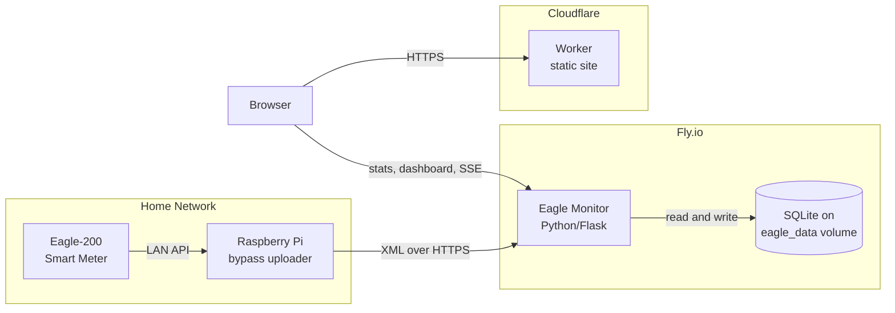

# Linknode Energy Monitor

A real-time energy monitoring dashboard that tracks household power consumption from an Eagle-200 smart meter. A small Flask service on Fly.io stores every reading in SQLite, and a static site on Cloudflare's edge charts it natively.


## Live Demo

**Production URLs**:
- **Main Site**: [https://linknode.com](https://linknode.com) (energy dashboard at [#energy-dashboard](https://linknode.com/#energy-dashboard))
- **Eagle Monitor API**: https://linknode-eagle-monitor.fly.dev/api/stats
- **Dashboard API**: https://linknode-eagle-monitor.fly.dev/api/dashboard?range=24h
- **Health Check**: https://linknode-eagle-monitor.fly.dev/health
- **Telemetry Freshness**: https://linknode-eagle-monitor.fly.dev/health/data

`energy.linknode.com`, the old Grafana dashboard, redirects to the dashboard section of the main site.

## Features

- **Real-time Power Monitoring**
  - Eagle-200 smart meter integration (XML format)
  - Live gauge driven by Server-Sent Events
  - Power trend chart for 1h, 6h, 24h, 7d or 30d (average line with a min-to-max band, so short peaks stay visible at every range) and stats: min/average/peak power, energy consumed, meter reading, rate, cost per hour, estimated cost
  - Time-series storage in SQLite on a Fly volume (5-year retention, daily snapshots)
  - Data staleness detection with age indicators

- **BC Hydro Bill Calculator**
  - "This Bill So Far" tile: the running total for the current two-month billing period, including GST, with the bill lines on hover
  - Built line by line like a BC Hydro residential tiered bill: basic charge, Tier 1/Tier 2 energy, rate rider, transit levy, GST
  - Verified against a real bill: a unit test reproduces the Jul 30, 2026 bill ($123.75) to the cent
  - Details in [Bill Calculator](#bill-calculator)

- **Outage Alerting**
  - Data staleness monitor detects when the power meter stops reporting (no new reading for 30 minutes) or its readings freeze
  - Slack notifications on outage and recovery (fires once per state change, no spam)
  - Pushover emergency-priority siren that repeats every 60 s until acknowledged, for up to about 50 minutes; it is retried until delivered, and a reminder follows each day the outage lasts
  - A watchdog on the Raspberry Pi reports the ingest service or the site going down, and the ingest service reports the watchdog going quiet
  - How the two fit together, and what neither sees: [docs/ALERTING.md](docs/ALERTING.md)

- **Failover & Resilience** (the Eagle-200 meter is failing; see [docs/THEORY_OF_OPERATION.md](docs/THEORY_OF_OPERATION.md))
  - Local-API bypass: a Raspberry Pi on the home network polls the meter's LAN API and
    ships Rainforest-style XML to the ingest endpoint. See [deploy/README.md](deploy/README.md)
  - Persistent, CRC-checkpointed reliability stats survive reboots; `--report` prints a
    human-readable outage and uptime report
  - Live uptime on the dashboard: real **Data Uptime** and **device health** figures
    from the bypass heartbeat, which the ingest service keeps across restarts

- **Web Interface**
  - Dark theme with animated gradients, no framework
  - Hand-coded SVG gauge; one vendored library (uPlot, 51KB) for the trend chart
  - API status indicators
  - Responsive design (mobile to 4K)

- **Lean infrastructure (~$2.09/month)**
  - One Fly.io machine (shared CPU, 256MB) with a 1GB volume
  - Static site on Cloudflare Workers (static assets are free)
  - Automated CI/CD via GitHub Actions; unit tests gate every backend deploy

- **Security**
  - Content Security Policy, HSTS and related headers from Cloudflare (`web/public/_headers`)
  - Basic-auth ingest endpoint with rate limiting
  - CORS allow-list on the API
  - Security scanning in CI/CD

## Bill Calculator

The ingest service estimates the current BC Hydro bill from the readings it stores. It follows
BC Hydro's residential tiered rate (rate schedule 1101) and builds the total the way the bill
does, rounding each line to the cent:

| Line | Calculation | Value (from Apr 1, 2026) |
|---|---|---|
| Basic charge | days x daily charge | $0.2344/day |
| Tier 1 energy | kWh up to the threshold x Tier 1 rate | $0.1187/kWh |
| Tier 2 energy | kWh above the threshold x Tier 2 rate | $0.1408/kWh |
| Deferral account rate rider | % of basic charge + energy | -1.5% |
| Regional transit levy | days x daily levy | $0.0624/day |
| GST | % of the subtotal | 5% |

The Tier 1 threshold is 22.1918 kWh per day, prorated over the days in the period (1,354 kWh
for a 61-day period). Energy is the trapezoidal integral of the power readings, which matched
the meter's own register to within 0.01% over 30 days.

- **Billing period.** BC Hydro bills every two months. For this account the periods start in
  odd months around the 26th (the day after the meter read), and days are counted in Vancouver
  time. The read date drifts by a few days, so `BILLING_PERIOD_START` (the start date on the
  latest bill) pins the period exactly, and `BILLING_NEXT_READ` (the next read date on that
  bill) ends it on the day the meter is actually read.
- **Forecast.** The Bill Forecast chart plots the bill so far against the day of the cycle and
  fits a straight line through it, carried on to the last day. The slope is the spend rate in
  $/day and the line's end is the bill if that rate holds. It is `billing_period.trend` in
  `GET /api/stats`, and appears once one full day of the period is in.
- **"So far" means "if the period ended today".** The threshold is prorated to the days
  elapsed, so early in a period one heavy day can show some Tier 2 use that the full period
  would absorb.
- **Where it shows.** The This Bill So Far tile on linknode.com, and `billing_period` in
  `GET /api/stats` (`start`, `next_start`, `days`, `cycle_days`, `energy_kwh` and a
  `tiered_cost` breakdown whose `total_cost` is the amount due). The dashboard's rate, cost per
  hour and estimated cost use the Tier 1 rate. The Eagle reports its own price
  (`meter_price_per_kwh`), but BC Hydro doesn't update it when rates change, so it is shown and
  never used for costs.
- **Keeping it current.** BC Hydro raises the Tier 1 rate and the basic charge every April 1
  (Tier 2 is held at 14.08 cents by BCUC order G-42-25), and the rider and transit levy change
  from time to time. When a bill shows new values, update the defaults in
  `fly/eagle-monitor/app.py` (or override them in `fly.toml` `[env]`) together with the
  expected lines in `test_api.TestBilling`. Settings: `TIER1_RATE`, `TIER2_RATE`,
  `DAILY_THRESHOLD_KWH`, `BASIC_CHARGE_DAILY`, `RATE_RIDER_PCT`, `TRANSIT_LEVY_DAILY`,
  `GST_PCT`, `BILLING_CYCLE_MONTHS`, `BILLING_CYCLE_FIRST_MONTH`, `BILLING_CYCLE_START_DAY`,
  `BILLING_PERIOD_START`, `BILLING_TZ`.

## Quick Start

```bash
# Clone and install
git clone https://github.com/murr2k/linknode-com.git
cd linknode-com
npm install                  # wrangler, for the site

# Preview the site locally (http://127.0.0.1:8771, live production data)
run.cmd

# Backend tests
python -m venv .venv
.venv/Scripts/pip install -r fly/eagle-monitor/requirements.txt
.venv/Scripts/python -m unittest discover -s fly/eagle-monitor -p "test_*.py"

# Deploy (automated via GitHub Actions on push to main)
git push origin main
```

## Project Structure

```
linknode-com/
├── fly/
│   └── eagle-monitor/        # Ingest + API service (Python/Flask, SQLite)
│       ├── app.py            # Routes: /eagle, /api/stats, /api/dashboard, /api/stream, /health
│       ├── store.py          # SQLite time-series store
│       ├── dashboard.py      # Chart series and stat-panel math
│       └── test_*.py         # Unit tests
├── web/                      # The site (Cloudflare Worker, static assets)
│   ├── wrangler.jsonc        # Worker config and routes
│   └── public/               # index.html, _headers, 404.html, vendor/uplot-*
├── deploy/                   # Raspberry Pi bypass deployment
├── scripts/                  # Pi uploader (eagle_bypass.py) and utilities
├── docs/                     # Documentation
│   ├── THEORY_OF_OPERATION.md  # System architecture
│   └── archive/              # Historical docs
├── run.cmd                   # Local site preview
└── .github/workflows/        # CI/CD pipelines
```

## Deployment

### Automated (Recommended)
Pushes to `main` deploy whatever changed:
- `fly/eagle-monitor/**`: `deploy-fly.yml` runs the unit tests, then deploys the Fly app
- `web/**`: `deploy-web.yml` deploys the site to Cloudflare

### Manual
```bash
cd fly/eagle-monitor && flyctl deploy --remote-only
npx wrangler deploy --config web/wrangler.jsonc     # needs wrangler login
```

### Required Secrets

**GitHub Secrets**:
- `FLY_API_TOKEN` - Fly.io deployment token
- `CLOUDFLARE_API_TOKEN` - Cloudflare Workers deploy token
- `CLOUDFLARE_ACCOUNT_ID` - Cloudflare account

**Fly.io Secrets** (linknode-eagle-monitor):
- `EAGLE_PASSWORD` - Basic auth for the ingest endpoint
- `SLACK_WEBHOOK_URL` - Outage notifications
- `PUSHOVER_API_TOKEN`, `PUSHOVER_USER_KEY` - Emergency outage siren

## CI/CD Workflows

| Workflow | Trigger | Purpose |
|----------|---------|---------|
| `deploy-fly.yml` | Push to main (`fly/eagle-monitor/**`) | Test and deploy the ingest service |
| `deploy-web.yml` | Push to main (`web/**`) | Deploy the site to Cloudflare |
| `security-scan.yml` | PRs, pushes | Security validation |

## Documentation

| Document | Description |
|----------|-------------|
| [docs/THEORY_OF_OPERATION.md](docs/THEORY_OF_OPERATION.md) | System architecture and data flow |
| [docs/ALERTING.md](docs/ALERTING.md) | Outage alerting: the two watchers, what each alert means, what to do when one arrives |
| [deploy/README.md](deploy/README.md) | Pi uploader and watchdog: install and operate |
| [docs/HEALTH_CHECKS.md](docs/HEALTH_CHECKS.md) | Service health endpoints |
| [CHANGELOG.md](CHANGELOG.md) | Version history |

## Architecture


```mermaid
flowchart LR
    subgraph Home["Home Network"]
        Eagle["Eagle-200<br/>Smart Meter"]
        Pi["Raspberry Pi<br/>bypass uploader"]
    end

    subgraph Fly["Fly.io"]
        Monitor["Eagle Monitor<br/>Python/Flask"]
        DB[("SQLite on<br/>eagle_data volume")]
    end

    subgraph CF["Cloudflare"]
        Site["Worker<br/>static site"]
    end

    Browser["Browser"]

    Eagle -->|LAN API| Pi
    Pi -->|XML over HTTPS| Monitor
    Monitor -->|read and write| DB
    Browser -->|HTTPS| Site
    Browser -->|"stats, dashboard, SSE"| Monitor
```

The Pi reads the meter over the LAN about every 33 seconds and posts each reading to the
ingest service. The page loads from Cloudflare's edge and calls the API directly for
data. See [docs/THEORY_OF_OPERATION.md](docs/THEORY_OF_OPERATION.md) for detail.

## Recent Changes

### 2026-09-27: BC Hydro bill calculator
- "This Bill So Far" tile with the running total for the current billing period, including GST
- Cost figures use BC Hydro's April 2026 rates; the rider, transit levy and GST are now included
- Two-month billing cycle counted in Vancouver time; verified against a real bill to the cent

### 2026-09-27: Leaner stack (~$13 to ~$2.09 a month)
- Replaced InfluxDB with SQLite inside the ingest service; 30 days of history carried over
- Replaced Grafana with a native uPlot chart and stat tiles on the main site, with a range picker
- Moved the site from nginx on Fly to Cloudflare Workers; retired three of the four Fly apps

### 2026-07-14: Live uptime on the dashboard
- Real **Data Uptime** and **device health** figures from a bypass heartbeat, replacing a hardcoded 100%
- Outage log with reliability analytics for the bypass (`--report`: uptime %, MTBF, duration histogram, hour-of-day pattern)

### 2026-07-12: Eagle-200 failover bypass
- A Raspberry Pi polls the meter's LAN API and ships synthetic XML to fill gaps when the meter's cloud uploader stalls
- Added because the Eagle-200 hardware is failing (storage wear causing repeated data outages)
- Persistent, CRC-checkpointed statistics that survive reboots

### 2026-01-14: Security & Cleanup
- Fixed critical Grafana vulnerability (anonymous Admin to Viewer)
- Rotated InfluxDB credentials
- Removed hardcoded secrets from scripts
- Major project cleanup (~43M removed)

See [CHANGELOG.md](CHANGELOG.md) for full history.

## License

MIT License - see [LICENSE](LICENSE)

## Author

**Murray Kopit** - [@murr2k](https://github.com/murr2k)

---

Built with [Claude](https://anthropic.com) | API on [Fly.io](https://fly.io) | Site on [Cloudflare](https://workers.cloudflare.com)
