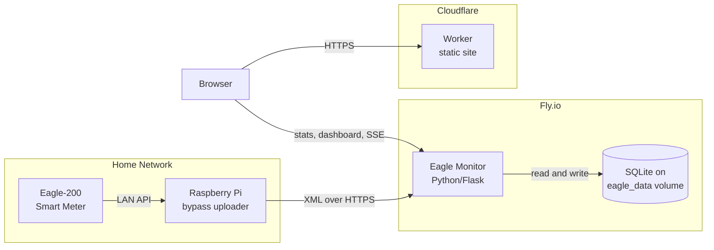

# Linknode Energy Monitor

A real-time energy monitoring dashboard that tracks household power consumption from an Eagle-200 smart meter. A small Flask service on Fly.io stores every reading in SQLite, and a static site on Cloudflare's edge charts it natively.


## Live Demo

**Production URLs**:
- **Main Site**: [https://linknode.com](https://linknode.com) (energy dashboard at [#energy-dashboard](https://linknode.com/#energy-dashboard))
- **Eagle Monitor API**: https://linknode-eagle-monitor.fly.dev/api/stats
- **Dashboard API**: https://linknode-eagle-monitor.fly.dev/api/dashboard?range=24h
- **Health Check**: https://linknode-eagle-monitor.fly.dev/health

`energy.linknode.com`, the old Grafana dashboard, redirects to the dashboard section of the main site.

## Features

- **Real-time Power Monitoring**
  - Eagle-200 smart meter integration (XML format)
  - Live gauge driven by Server-Sent Events
  - Power trend chart and stats for 1h, 6h, 24h, 7d or 30d: min/average/peak power, energy consumed, meter reading, rate, cost per hour, estimated cost
  - Time-series storage in SQLite on a Fly volume (5-year retention, daily snapshots)
  - Data staleness detection with age indicators

- **Outage Alerting**
  - Data staleness monitor detects when the power meter stops reporting
  - Slack notifications on outage and recovery (fires once per state change, no spam)
  - Pushover emergency-priority siren that repeats until acknowledged

- **Failover & Resilience** (the Eagle-200 meter is failing; see [docs/THEORY_OF_OPERATION.md](docs/THEORY_OF_OPERATION.md))
  - Local-API bypass: a Raspberry Pi on the home network polls the meter's LAN API and
    ships Rainforest-style XML to the ingest endpoint. See [deploy/README.md](deploy/README.md)
  - Persistent, CRC-checkpointed reliability stats survive reboots; `--report` prints a
    human-readable outage and uptime report
  - Live uptime on the dashboard: real **Data Uptime** and **device health** figures
    from the bypass heartbeat, which the ingest service keeps across restarts

- **Web Interface**
  - Dark theme with animated gradients, no framework
  - Hand-coded SVG gauge; one vendored library (uPlot, 51KB) for the trend chart
  - API status indicators
  - Responsive design (mobile to 4K)

- **Lean infrastructure (~$2.09/month)**
  - One Fly.io machine (shared CPU, 256MB) with a 1GB volume
  - Static site on Cloudflare Workers (static assets are free)
  - Automated CI/CD via GitHub Actions; unit tests gate every backend deploy

- **Security**
  - Content Security Policy, HSTS and related headers from Cloudflare (`web/public/_headers`)
  - Basic-auth ingest endpoint with rate limiting
  - CORS allow-list on the API
  - Security scanning in CI/CD

## Quick Start

```bash
# Clone and install
git clone https://github.com/murr2k/linknode-com.git
cd linknode-com
npm install                  # wrangler, for the site

# Preview the site locally (http://127.0.0.1:8771, live production data)
run.cmd

# Backend tests
python -m venv .venv
.venv/Scripts/pip install -r fly/eagle-monitor/requirements.txt
.venv/Scripts/python -m unittest discover -s fly/eagle-monitor -p "test_*.py"

# Deploy (automated via GitHub Actions on push to main)
git push origin main
```

## Project Structure

```
linknode-com/
├── fly/
│   └── eagle-monitor/        # Ingest + API service (Python/Flask, SQLite)
│       ├── app.py            # Routes: /eagle, /api/stats, /api/dashboard, /api/stream, /health
│       ├── store.py          # SQLite time-series store
│       ├── dashboard.py      # Chart series and stat-panel math
│       └── test_*.py         # Unit tests
├── web/                      # The site (Cloudflare Worker, static assets)
│   ├── wrangler.jsonc        # Worker config and routes
│   └── public/               # index.html, _headers, 404.html, vendor/uplot-*
├── deploy/                   # Raspberry Pi bypass deployment
├── scripts/                  # Pi uploader (eagle_bypass.py) and utilities
├── docs/                     # Documentation
│   ├── THEORY_OF_OPERATION.md  # System architecture
│   └── archive/              # Historical docs
├── run.cmd                   # Local site preview
└── .github/workflows/        # CI/CD pipelines
```

## Deployment

### Automated (Recommended)
Pushes to `main` deploy whatever changed:
- `fly/eagle-monitor/**`: `deploy-fly.yml` runs the unit tests, then deploys the Fly app
- `web/**`: `deploy-web.yml` deploys the site to Cloudflare

### Manual
```bash
cd fly/eagle-monitor && flyctl deploy --remote-only
npx wrangler deploy --config web/wrangler.jsonc     # needs wrangler login
```

### Required Secrets

**GitHub Secrets**:
- `FLY_API_TOKEN` - Fly.io deployment token
- `CLOUDFLARE_API_TOKEN` - Cloudflare Workers deploy token
- `CLOUDFLARE_ACCOUNT_ID` - Cloudflare account

**Fly.io Secrets** (linknode-eagle-monitor):
- `EAGLE_PASSWORD` - Basic auth for the ingest endpoint
- `SLACK_WEBHOOK_URL` - Outage notifications
- `PUSHOVER_API_TOKEN`, `PUSHOVER_USER_KEY` - Emergency outage siren

## CI/CD Workflows

| Workflow | Trigger | Purpose |
|----------|---------|---------|
| `deploy-fly.yml` | Push to main (`fly/eagle-monitor/**`) | Test and deploy the ingest service |
| `deploy-web.yml` | Push to main (`web/**`) | Deploy the site to Cloudflare |
| `security-scan.yml` | PRs, pushes | Security validation |

## Documentation

| Document | Description |
|----------|-------------|
| [docs/THEORY_OF_OPERATION.md](docs/THEORY_OF_OPERATION.md) | System architecture and data flow |
| [deploy/README.md](deploy/README.md) | Eagle-200 failover bypass: install and operate on the Pi |
| [docs/HEALTH_CHECKS.md](docs/HEALTH_CHECKS.md) | Service health endpoints |
| [CHANGELOG.md](CHANGELOG.md) | Version history |

## Architecture


```mermaid
flowchart LR
    subgraph Home["Home Network"]
        Eagle["Eagle-200<br/>Smart Meter"]
        Pi["Raspberry Pi<br/>bypass uploader"]
    end

    subgraph Fly["Fly.io"]
        Monitor["Eagle Monitor<br/>Python/Flask"]
        DB[("SQLite on<br/>eagle_data volume")]
    end

    subgraph CF["Cloudflare"]
        Site["Worker<br/>static site"]
    end

    Browser["Browser"]

    Eagle -->|LAN API| Pi
    Pi -->|XML over HTTPS| Monitor
    Monitor -->|read and write| DB
    Browser -->|HTTPS| Site
    Browser -->|"stats, dashboard, SSE"| Monitor
```

The Pi reads the meter over the LAN every ~35 seconds and posts each reading to the
ingest service. The page loads from Cloudflare's edge and calls the API directly for
data. See [docs/THEORY_OF_OPERATION.md](docs/THEORY_OF_OPERATION.md) for detail.

## Recent Changes

### 2026-09-27: Leaner stack (~$13 to ~$2.09 a month)
- Replaced InfluxDB with SQLite inside the ingest service; 30 days of history carried over
- Replaced Grafana with a native uPlot chart and stat tiles on the main site, with a range picker
- Moved the site from nginx on Fly to Cloudflare Workers; retired three of the four Fly apps

### 2026-07-14: Live uptime on the dashboard
- Real **Data Uptime** and **device health** figures from a bypass heartbeat, replacing a hardcoded 100%
- Outage log with reliability analytics for the bypass (`--report`: uptime %, MTBF, duration histogram, hour-of-day pattern)

### 2026-07-12: Eagle-200 failover bypass
- A Raspberry Pi polls the meter's LAN API and ships synthetic XML to fill gaps when the meter's cloud uploader stalls
- Added because the Eagle-200 hardware is failing (storage wear causing repeated data outages)
- Persistent, CRC-checkpointed statistics that survive reboots

### 2026-01-14: Security & Cleanup
- Fixed critical Grafana vulnerability (anonymous Admin to Viewer)
- Rotated InfluxDB credentials
- Removed hardcoded secrets from scripts
- Major project cleanup (~43M removed)

See [CHANGELOG.md](CHANGELOG.md) for full history.

## License

MIT License - see [LICENSE](LICENSE)

## Author

**Murray Kopit** - [@murr2k](https://github.com/murr2k)

---

Built with [Claude](https://anthropic.com) | API on [Fly.io](https://fly.io) | Site on [Cloudflare](https://workers.cloudflare.com)
