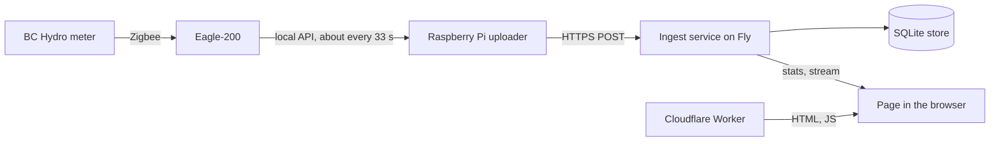
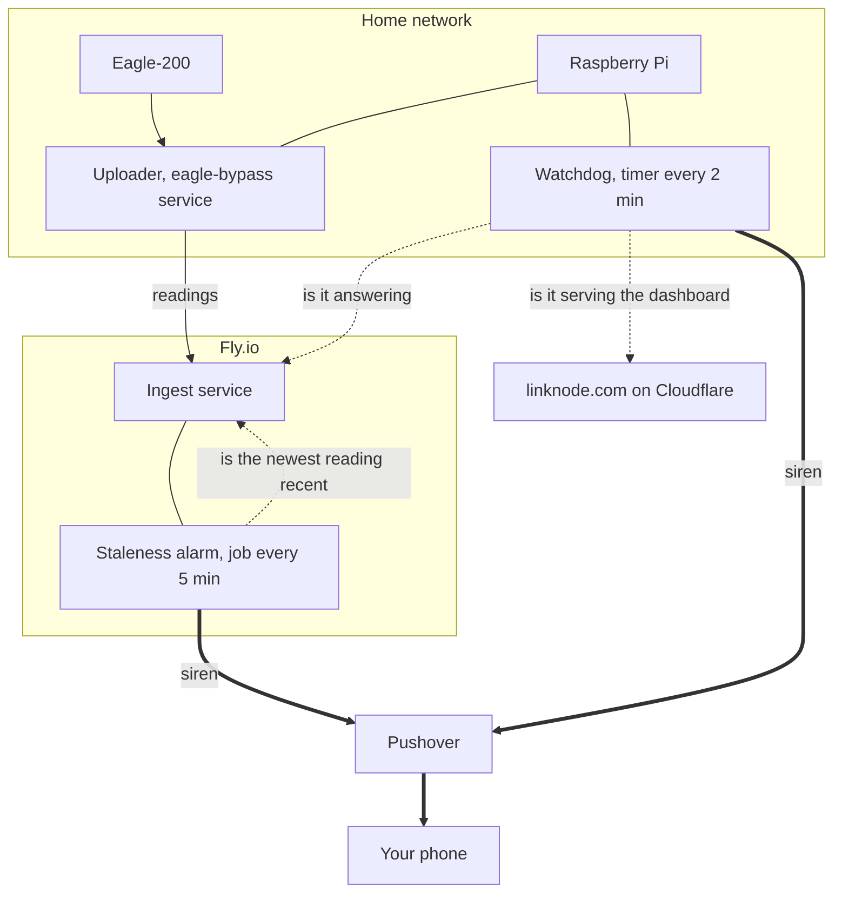
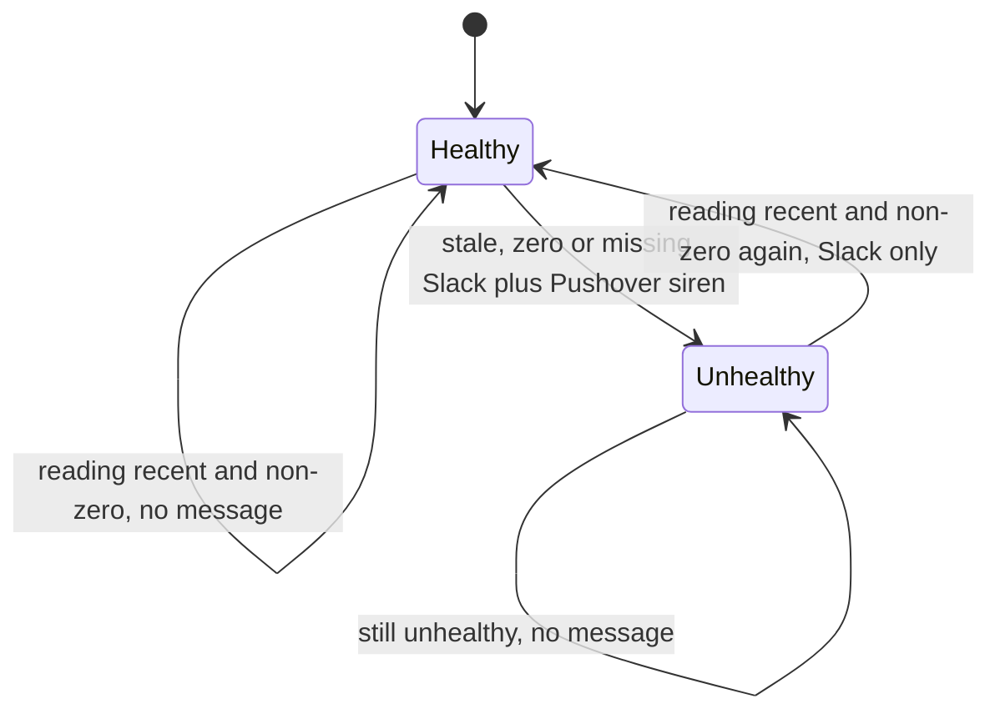
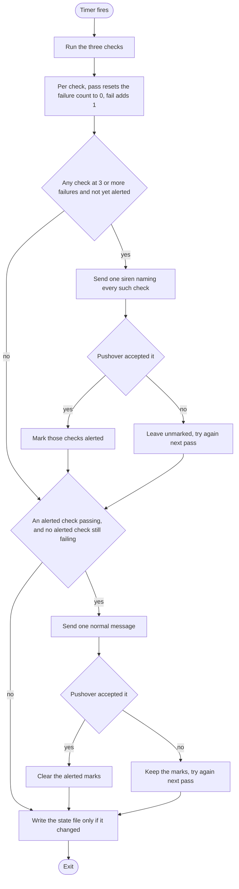
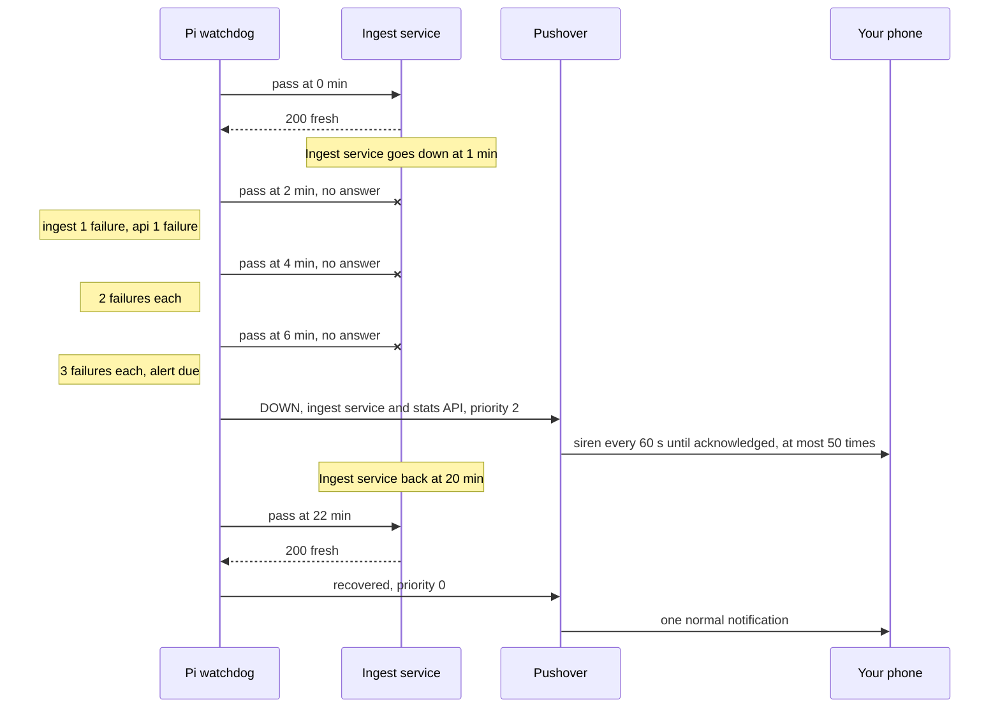

# Outage Alerting: Theory of Operation

How linknode.com tells you that it has stopped working. Covers the alarm inside the Fly
ingest service, the watchdog on the Raspberry Pi, why there are two, and what neither of
them sees.

For the system as a whole see [THEORY_OF_OPERATION.md](THEORY_OF_OPERATION.md). For
installing the Pi half see [deploy/README.md](../deploy/README.md).

Last checked against the code and the live system: 2026-10-03. The comments in
`scripts/linknode_watchdog.py` and `fly/eagle-monitor/monitor_data_staleness.py` are older
than that check. Where they differ from this page, this page is right.

## What it is for

linknode.com is not mission critical. The alerting has one job: to say that the system has
stopped reporting, so that it can be fixed within a day or two. Against that bar the speed
of an alert matters little. What matters is an outage that is never reported, and noise.
The fixes agreed against that bar are under [Planned fixes](#planned-fixes).

## The problem

The data path is a chain. A break anywhere in it leaves the site showing nothing new:



Two facts shape the design:

1. **A watcher cannot report its own death.** An alarm that lives inside the ingest
   service is silent when the ingest service is down.
2. **"Something arrived" is not "something new arrived".** When the Eagle loses the meter
   but keeps answering, the Pi keeps posting the last reading it has. Requests keep
   arriving; the data is frozen.

The second fact, and the remedy for it, rest on two things about the Eagle that this repo
does not prove:

- The fact assumes the Eagle goes on serving the last demand value after the meter link is
  lost. If it served none, the Pi would post no power reading and the alarm would fire
  anyway.
- The remedy, the freshness signal below, assumes the Eagle's `LastContact` stops advancing
  then. If it kept advancing, both watchers would stay silent.

The code handles the assumed case and the tests simulate it. No capture of the device
doing either is recorded here.

## Two watchers



- The **staleness alarm** runs inside the ingest service. It notices when telemetry stops,
  which covers everything upstream of Fly: the meter link, the Eagle, the Pi, the home
  network and power.
- The **watchdog** runs on the Pi. It notices when the ingest service or the site stops
  answering, which is the part the alarm cannot see.

Each covers the other's main blind spot, but the cover is not symmetric. The watchdog
checks the alarm's host directly. The alarm sees the Pi only through the readings its
uploader sends, so if the watchdog stops running while the uploader carries on, nothing
reports it. The cases that go unreported are listed under
[What nothing notices](#what-nothing-notices).

## The freshness signal

Both watchers start from one number: **the age of the newest power reading in the store**,
which is the Fly machine's clock minus the reading's timestamp.

The Pi does not stamp a demand or summation reading with the time it posts it. It stamps
it with the Eagle's `LastContact`, the moment the Eagle last heard from the meter. So the
newest reading's timestamp advances only when the whole chain, meter to database, is
working.

The alarm used to watch the arrival time of the last POST. This is the case that would
have got past it, with the Eagle behaving as assumed above:


A re-posted reading has the same timestamp as the one already stored, so it overwrites
that row and the newest reading does not move.

The stamp has exceptions. The first two fail towards *fresh*. The third fails towards
stale first, then towards fresh:

- If the Eagle's reply carries no usable `LastContact`, the Pi stamps the reading with its
  own clock (`_reading_ts` in `scripts/eagle_bypass.py`).
- If a timestamp arrives missing, unparseable or more than a year away from the server's
  clock, the ingest service stores the reading at its arrival time. A `LastContact` earlier
  than 2000-01-01 takes this path, because the Pi cannot encode it.
- A reading stamped ahead of the Fly clock is stored but not counted until its time comes.
  Until then the newest counted reading goes on ageing, so stamps more than about 5 minutes
  ahead read `stale` with data arriving. Once they come due the feed reads fresh, and it
  goes on reading fresh for that much longer after readings really stop.

In the first two cases a frozen, non-zero reading that keeps being re-posted looks fresh to
both watchers. As of 2026-10-03 no power reading stored since the SQLite store went live
(2026-09-26; its older rows, back to 2026-08-27, are a backfill) carries an arrival-time
stamp from the server, and none is stamped in the future. A reading stamped by the Pi's
clock cannot be told apart in the store.

The age also depends on the clock behind the stamp. `LastContact` is a time the Eagle
reports, so any offset between the Eagle's clock and Fly's counts as age, and nothing
measures it. A stamp that runs 5 minutes or more behind reads `stale` with data flowing:
one false siren, after which the alarm stays unhealthy and says nothing for a real outage.
A stamp that runs ahead delays both watchers by that much. On 2026-10-03 the offset was a
few seconds.

The signal is exposed at `GET /health/data`:

| Reply | Meaning |
|---|---|
| 200, `status: fresh` | Newest reading is 5 minutes old or less |
| 503, `status: stale` | Newest reading is older than 5 minutes; `reading_age_seconds` says how old |
| 503, `status: no_data` | No power reading is visible: the store is empty, did not open at startup, or holds only readings stamped in the future. A store that did not open fails `/health` too, so from outside expect an error page or no answer in place of this reply |
| 503, `status: unavailable` | The store is open but the query failed |

The threshold is `STALE_THRESHOLD_MINUTES` (default 5), reported as `stale_after_seconds`.

`GET /health` is a different thing and is left alone. It is Fly's service check: it reports
that the process is up and the store answers. While it fails, Fly stops routing requests to
the machine. It does not restart it. With one machine that takes the whole API offline,
uploads included, until the check passes again. So freshness must not be wired into
`/health`: a stale feed would then cut off the very uploads that could make it fresh.

What Fly does for this machine, and what it does not:

| Event | What Fly does |
|---|---|
| The process exits with an error (crash, out of memory) | Restarts it: restart policy `on-failure`, up to 10 tries within 5 minutes. If it still fails, Fly leaves the machine stopped |
| The process hangs, or `/health` fails | Stops routing to it. No restart: someone has to run `fly machine restart` |
| The machine is stopped | Starts it again on the next request (Fly's default when `auto_start_machines` is not set) |
| The host fails | Nothing. The volume is a disk on that host, so the machine stays down until the host returns. Rebuilding from a snapshot is a manual step and loses the readings since the snapshot |

The restart policy was read from the live machine on 2026-10-03. The rest is Fly's documented
behaviour ([restart policy](https://docs.fly.io/machines/guides-examples/machine-restart-policy),
[health checks](https://docs.fly.io/reference/health-checks),
[fly.toml reference](https://docs.fly.io/reference/configuration),
[host unavailable](https://docs.fly.io/apps/trouble-host-unavailable)) and has not been
exercised here. The `restart_limit` lines in `fly.toml` are left over from Fly's older
platform and do nothing.

## Watcher 1: the staleness alarm (Fly)

`monitor_data_staleness.py`, driven by a scheduler job in `app.py` every 5 minutes.

Each run reads the newest power reading and calls the feed **unhealthy** when either:

- the reading is older than `STALE_THRESHOLD_MINUTES` (default 5), or
- there is no reading, or the reading is exactly 0 W.

The 0 W rule belongs to the alarm alone: `/health/data` reports a fresh 0 W reading as
`fresh`. The store has never held one (as of 2026-10-03 the lowest reading since 2026-08-27
is 138 W).

It alerts on a change of state, never on a state:



- **One siren per continuous outage.** A six-hour outage produces one alert, not
  seventy-two. There is no debounce in either direction, though. One run decides each edge,
  so a feed that stalls, recovers and stalls again sends a siren for every stall that a
  run catches.
- **One attempt.** On the change to unhealthy the alarm posts once to Slack and once to
  Pushover, then saves the new state whether or not either was accepted. A Pushover failure
  at that moment loses the Fly siren for the whole outage.
- **The state survives restarts.** It is saved to `/data/monitor_state.json` on the volume,
  so a deploy in the middle of an outage does not send the Fly siren again. The file is
  created at the first change of state. Until then it does not exist.
- **Time to alert:** the reading must be over 5 minutes old and the job runs every 5
  minutes, so the siren comes 5 to 10 minutes after the newest reading's timestamp. Two
  things stretch that. The first run is 5 minutes after the process starts, so a restart
  or deploy adds up to 5 minutes. A run that starts more than 1 second late is skipped (the
  scheduler's default), which adds 5 more. A stall alerts only if a run lands while the
  newest stored reading is over 5 minutes old: a gap of less than about 5 minutes never
  alerts, one of 10 minutes or more always does, and in between it is chance, about 1 in 2
  at 7.5 minutes.
- **The text does not name the cause.** Every outage message begins "Data is not arriving
  from power meter!", whether the meter, the Pi, the network or the store on Fly is at
  fault.
- **A store that cannot be read silences the alarm.** If the query for the newest reading
  raises an error, the job logs it and sends nothing. `/health/data` answers `unavailable`,
  and it is the watchdog that reports it.

## Watcher 2: the watchdog (Pi)

`scripts/linknode_watchdog.py`, started by `linknode-watchdog.timer` every 2 minutes (in
practice 2:00 to 2:15 apart: the timer allows 15 seconds of slack). Each start is one pass:
three checks, then a decision.

| Check | Request | Passes when |
|---|---|---|
| `ingest` | `GET /health/data` on the ingest service | Any 200 with a JSON body. A 503 `stale` reply also passes while the reading is 15 minutes old or less (see below). `no_data`, `unavailable`, a body that is not JSON, or no answer fail |
| `site` | `GET https://linknode.com/` | 200, and the page contains the marker `id="power-chart"` |
| `api` | `GET /api/stats` with the site's `Origin` header | 200, `Access-Control-Allow-Origin` equals the site's origin, and `current_power` is not null |

The `api` check is the closest thing to "can the page read the API" short of running a
browser. If the CORS header is missing the page loads but the browser will not let it read
the replies, so the tiles and the chart stay empty. (The gauge does not show it reliably:
the live stream sends its own CORS header and keeps feeding it.) The check says little
about whether the present usage is displayed: `current_power` is the last value posted
since the process started, so it is null only between a restart and the next power
reading, and it stays set however old it gets. Freshness is the `ingest` check's job. The
page's CSP is not checked.

**The backstop.** A 503 `stale` from `/health/data` means the ingest service is alive and
telemetry has stopped. That is the staleness alarm's outage, so the watchdog lets it pass at
first. Once the reading is over 15 minutes old (`WATCH_BACKSTOP_SECS`) the check fails, and
after three failing passes the watchdog sends a siren of its own, about 19 to 22 minutes
after the newest reading's timestamp. It cannot tell whether the alarm already fired. So
this happens on every telemetry outage that lasts that long while the Pi and its internet
link are up (meter link lost, Eagle not answering, uploader stopped), not only when the
alarm job has died. Such an outage gives two sirens. The second reads "Ingest service:
newest reading is N min old", although the ingest service is working.

One pass:



- **Three failures before a siren.** With passes 2:00 to 2:15 apart, a check must fail for
  about 4 to 7 minutes: up to about 6.5 when requests fail at once, and at least 20 seconds
  more for each request that times out. A break shorter than about 4 minutes never alerts,
  and one of up to about 6.5 minutes may not. A deploy takes the ingest service away for
  well under a minute, and that stays quiet as long as readings are arriving.
- **Checks that cross together share one siren.** When Fly goes down, `ingest` and `api`
  normally reach three failures on the same pass and share a single message. A check that
  gets there on a later pass sends its own.
- **An unsent alert is retried while the check is still failing.** A check is marked
  alerted only when Pushover accepts the message. If the home network is down too, the
  watchdog tries again on each pass. If the check recovers before a send is accepted, the
  alert is dropped and nothing is sent afterwards.
- **One recovery message**, at normal priority, once every check that alerted is passing
  again and Pushover accepts it. Until then the alerted marks stay, and a marked check that
  fails again sends no new siren.
- **The script does not wear the SD card.** Its state lives in
  `/var/lib/linknode-watchdog/state.json` and is written only when it changes. While
  everything passes it writes nothing. systemd still does its own work on every pass. It
  records the pass in its journal, which on this Pi is kept in RAM. And because the unit
  sets `PrivateTmp=true`, it creates and removes a private directory under `/tmp` and
  under `/var/tmp`; whether those two are on the card was not checked.

## An outage, start to finish

The ingest service goes down and comes back:



During that outage the staleness alarm said nothing, because it was down with the service
it lives in. The readings taken in those minutes are gone: the uploader does not keep or
re-send what it could not post.

## Who notices what

| What fails | First alert | When | Then |
|---|---|---|---|
| Meter link lost, Eagle still answering | Staleness alarm | 5 to 10 min | Watchdog backstop at about 19 to 22 min |
| Eagle stops answering, or the uploader stops | Staleness alarm | 5 to 10 min | Watchdog backstop at about 19 to 22 min |
| The Pi itself, home network or power | Staleness alarm | 5 to 10 min | Nothing more: the watchdog is down or cannot send |
| Ingest service down or hung, or `/health` failing | Watchdog, `ingest` and `api` checks | about 4 to 7 min | Fly restarts a crashed process, not a hung one: see [When an alert arrives](#when-an-alert-arrives). If the alarm job is still running and can read the store, it adds its own siren once the newest reading is over 5 minutes old, since no upload gets through |
| Store on Fly did not open when the process started | Staleness alarm or watchdog, whichever runs first | Alarm 5 min after the process starts, watchdog about 4 to 7 min | Two sirens within a few minutes of each other. The alarm's reads "No data received yet" |
| Store on Fly opened, but its queries now fail | Watchdog, `ingest` check | about 4 to 7 min | The staleness alarm stays silent. If `/health` fails as well, Fly stops routing and the `api` check fails too |
| Store on Fly rejects writes | Staleness alarm | 5 to 10 min | Watchdog backstop. The uploader is answered 200 and counts the reading as delivered |
| linknode.com not serving the dashboard | Watchdog, `site` check | about 4 to 7 min | |
| API up but its CORS header is missing | Watchdog, `api` check | about 4 to 7 min | |
| Telemetry stopped and the alarm silent | Watchdog backstop | about 19 to 22 min | |

The alarm's times, and the backstop's, count from the newest reading's timestamp. The
watchdog's other times count from the start of the failure.

Three cases produce an alert for something that is not down:

- **A late DOWN after a home internet outage.** While the Pi's own link is down every check
  fails with "no answer" and the siren cannot be sent. After two failed passes (an outage
  of about 4 minutes or more), a pass during which the link returns sends a DOWN, reading
  "no answer", for services that were up all along. So does the first pass after the link
  returns, if it runs before the uploader's first new reading has landed and the newest
  reading is by then more than 15 minutes old: that one reads "newest reading is N min
  old". Either way the next pass sends "recovered".
- **A restart of the ingest service while no power readings are arriving** (Eagle not
  answering, or the uploader stopped). `current_power` stays null, the `api` check fails,
  and after three passes the watchdog reports the stats API as down.
- **A fresh reading of exactly 0 W when the alarm's job runs.** The alarm sends its siren
  ("Invalid power reading: 0.0W") although readings are arriving. `/health/data` says
  `fresh` and the watchdog stays quiet.

## What nothing notices

- **The Pi down and Fly or the site down at the same time.** While the Pi is off, nothing
  watches Fly or the site. If the Pi went first you will have had the alarm's siren for it.
- **The watchdog stopped while the uploader keeps running.** A pass that crashes (a bad
  value in the env file, a state file that cannot be written), a pass that never ends (the
  20 second timeout bounds each socket operation, not the pass, and the unit has no start
  timeout), a stopped timer, or Pushover credentials that are rejected all leave the feed
  fresh, so the alarm sees nothing wrong. The next Fly or site outage then goes unreported.
  The commands under [Checking and testing it](#checking-and-testing-it) show whether it
  is alive.
- **An alarm that cannot send.** The Fly alarm tries once. If Pushover or its credentials
  fail at that moment, the outage gets no Fly siren. The Slack message is a separate
  request and may still arrive, but it is not a siren. The only other siren is the
  watchdog's backstop, and only if the Pi is up and online.
- **Pushover itself unavailable**, or its app disabled or silenced on the phone. Both
  watchers send through one Pushover account. Emergency priority overrides Pushover's own
  quiet hours. A muted phone or Do Not Disturb can still silence it unless the app has been
  allowed to override them.
- **A Cloudflare failure that takes the site and Pushover together.** As of 2026-10-03
  `linknode.com` and `api.pushover.net` both resolve to Cloudflare addresses, so the `site`
  check and the only path for its siren share a provider. If the site passes again before
  Pushover accepts the siren, the alert is dropped. A fault in the linknode.com zone alone
  (a bad deploy, a route or DNS change) alerts normally.
- **A long outage, once the siren stops.** Pushover repeats an emergency at most 50 times,
  so with a 60 second retry the siren ends after about 50 minutes. Neither watcher alerts
  again while the same outage continues. A recovery does not stop a siren that is still
  repeating: acknowledge it in the app.
- **A repeat outage while an earlier alert is still open.** The watchdog clears its alerted
  marks only on a pass where every marked check passes. Until then a marked check that came
  back and fails again sends nothing. The likely case is a long telemetry outage: once the
  backstop has fired, `ingest` stays marked and failing until readings return, so `site`
  and `api` get at most one siren each in that time, and no "recovered" in between.
- **A frozen reading that a clock fallback stamps as new** (the exceptions under
  [The freshness signal](#the-freshness-signal)), or an Eagle whose `LastContact` keeps
  advancing while the meter link is down.
- **A thin feed.** One reading every 4 minutes counts as fresh indefinitely. The opposite
  failure is noisy, not silent: a feed that keeps stalling sends a siren for every stall
  longer than 10 minutes, and for some of those between 5 and 10.
- **The page failing in a real browser** for a reason the three requests do not exercise,
  such as a script error, a `connect-src` that no longer lists the API host, or the live
  stream failing while the stats request works. During a frozen-reading outage the gauge
  also keeps saying "Live", because that indicator follows the arrival of posts, not the
  reading's own time.
- **A machine started without its volume.** The service opens an empty store, passes
  `/health` and goes fresh on the first reading. The history is simply missing.

## The alerts themselves

Both watchers send through the same Pushover application.

| | Outage | Recovery |
|---|---|---|
| Staleness alarm | Slack, plus Pushover priority 2 (siren) | Slack only |
| Watchdog | Pushover priority 2 (siren) | Pushover priority 0, normal |

Priority 2 is Pushover's emergency level. As sent here (`retry` 60, `expire` 3600) it
repeats every 60 seconds until acknowledged in the app, and Pushover stops it after 50
repeats, about 50 minutes.

Change the watchdog's level with `WATCH_PRIORITY` in `/etc/linknode-watchdog.env`. The copy
on the Pi came from the first version of the example, in which each tuning line has a
`# ...` comment after the value. Delete that comment when you uncomment a line, then check
the file as described under [Checking and testing it](#checking-and-testing-it).

What each message means:

| Title | Text | From | Means |
|---|---|---|---|
| Linknode Power Monitor Alert | "Data is not arriving from power meter!" then "Last data received N minutes ago (threshold: 5 minutes)" | Staleness alarm | The newest reading is over 5 minutes old. The cause can be anywhere from the meter to the store on Fly |
| Linknode Power Monitor Alert | ... then "No data received yet" | Staleness alarm | No power reading is visible: the store is empty, did not open at startup, or holds only readings stamped in the future |
| Linknode Power Monitor Alert | ... then "Invalid power reading: 0.0W" | Staleness alarm | The newest reading was exactly 0 W when the job ran. Nothing is down |
| Linknode watchdog: DOWN | "Ingest service: no answer (...)" or "Ingest service: HTTP ..., not the health JSON", usually with a "Stats API" line | Watchdog | The Pi cannot reach the Fly service, or what answered was not the service's JSON (an error page, for example) |
| Linknode watchdog: DOWN | "Ingest service: HTTP 503, status 'no_data'" or "... status 'unavailable'" | Watchdog | The ingest service is answering. `no_data`: no power reading is visible in the store. `unavailable`: the query for the newest reading failed |
| Linknode watchdog: DOWN | "Ingest service: newest reading is N min old" | Watchdog backstop | Telemetry has been stopped for over 15 minutes. The ingest service is answering |
| Linknode watchdog: DOWN | "linknode.com: ..." | Watchdog | The site did not return the dashboard page |
| Linknode watchdog: DOWN | "Stats API (what the page reads): ..." alone | Watchdog | `/api/stats` failed the `api` check. The text gives the reason: "no CORS header ...", "no current_power in the reply", "HTTP ...", "no answer (...)" or "reply is not JSON" |
| Linknode watchdog: recovered | "... answering again." | Watchdog | Every check that alerted is passing again |
| Linknode Power Monitor Alert (Slack only) | "Power meter is back online!" | Staleness alarm | The alarm is healthy again: a run found the newest reading 5 minutes old or less and not 0 W |

### When an alert arrives

Read the alert's text first. `/health/data` answers for the feed only. A watchdog alert
with a "linknode.com: ..." line, or a lone "Stats API (what the page reads): ..." line, is
about the site or the page's API, and the feed can stay `fresh` for the whole of that
outage.

```bash
# What does the freshness signal say?
curl -s -m 15 -w '\nHTTP %{http_code}\n' https://linknode-eagle-monitor.fly.dev/health/data
```

- **No answer, or an error page:** the ingest service is unreachable. Look at
  `fly status -a linknode-eagle-monitor`, `fly checks list -a linknode-eagle-monitor` and
  `fly logs -a linknode-eagle-monitor`. Fly does not restart a process that is running but
  not answering: `fly machine restart <machine-id> -a linknode-eagle-monitor` (the id is in
  `fly status`). If `fly status` reports the machine's host as unreachable, a restart
  cannot help: wait for the host, or rebuild from a snapshot as Fly's
  [host unavailable](https://docs.fly.io/apps/trouble-host-unavailable) page describes,
  which loses every reading since the snapshot. If the machine is started and both checks
  pass, one possible cause, not tested here, is the connection limit: `fly.toml` allows 25
  concurrent connections, and every open page holds one for its live stream.
- **`stale`:** the service is answering and no new reading is reaching the store. The
  fault can be anywhere from the meter to the store on Fly. Look on the Pi:
  `systemctl status eagle-bypass`, `journalctl -u eagle-bypass -n 20` and
  `cat /run/eagle-bypass/stats.json`.
  - The Pi does not answer from the home network: it is off, or off the network.
  - The journal says `local read failed`: the Eagle is not answering.
  - The journal says `upload FAILED HTTP 401`: the Pi and Fly passwords differ.
    `upload FAILED HTTP None`: the Pi cannot reach Fly.
  - The journal says `shipped 3/3 messages` every cycle: the Pi is delivering, so the
    fault is at one of the two ends. If `meter_status` in `stats.json` is not `Connected`,
    or `meter_last_contact` does not change from one cycle to the next, the Eagle is
    re-serving a frozen reading. If it keeps changing, suspect the store on Fly:
    `fly logs -a linknode-eagle-monitor` shows `Failed to write to SQLite`.
  - The alert was a lone "Stats API (what the page reads): no current_power in the reply":
    the service has also restarted, and no power reading has been posted since. That is
    this outage, not an API fault. The check passes again at the next power reading.
- **`no_data`:** no power reading is visible, normally an empty store. An empty store
  turns `fresh` at the next upload, so a reply that stays `no_data` means nothing is being
  stored either. Check that the volume is attached
  (`fly volumes list -a linknode-eagle-monitor`), then follow the `stale` steps.
- **`unavailable`:** the store is open and the query for the newest reading failed.
  `fly logs -a linknode-eagle-monitor` shows `Error reading the store for /health/data`
  with the SQLite error. See also [HEALTH_CHECKS.md](HEALTH_CHECKS.md).
- **`fresh`:** telemetry is arriving. That says nothing about the site or the stats API.
  - The alert has a "linknode.com: ..." or "Stats API (what the page reads): ..." line:
    that check failed and may still be failing. Treat it as down until a "Linknode
    watchdog: recovered" message arrives. `python scripts/linknode_watchdog.py --dry-run`
    (any machine with the repo) repeats the three checks and prints the reason for each.
    For the site, look at the Cloudflare Worker and the last `deploy-web.yml` run. For
    "no CORS header", look at the `CORS(...)` origins in `fly/eagle-monitor/app.py`. "no
    current_power in the reply" means the service restarted and no power reading has
    arrived since.
  - Otherwise it has already recovered, or the alert was the 0 W rule (the text says so),
    or it was a late DOWN after a home internet outage.
- Acknowledge the siren in the Pushover app. A recovery does not stop it.

## Where things live

| Piece | Location |
|---|---|
| Staleness alarm | `fly/eagle-monitor/monitor_data_staleness.py`, job and `/health/data` in `app.py` |
| Alarm state | `/data/monitor_state.json` on the Fly volume, created at the first change of state |
| Alarm credentials | Fly secrets `PUSHOVER_API_TOKEN`, `PUSHOVER_USER_KEY`, `SLACK_WEBHOOK_URL` |
| Watchdog | `scripts/linknode_watchdog.py`, installed at `/opt/linknode-watchdog/` on the Pi |
| Watchdog units | `deploy/linknode-watchdog.service`, `deploy/linknode-watchdog.timer` |
| Watchdog state | `/var/lib/linknode-watchdog/state.json` on the Pi |
| Watchdog credentials | `/etc/linknode-watchdog.env` on the Pi, mode 0600 |

## Checking and testing it

```bash
# The freshness signal, from anywhere
curl -s https://linknode-eagle-monitor.fly.dev/health/data

# The three checks, without alerting or touching state (works on any machine with the repo)
python scripts/linknode_watchdog.py --dry-run

# On the Pi: send one normal-priority test message
sudo sh -c 'set -a; . /etc/linknode-watchdog.env; python3 /opt/linknode-watchdog/linknode_watchdog.py --test-alert'

# On the Pi: is the watchdog itself alive? Nothing else checks this
systemctl list-timers linknode-watchdog.timer
systemctl is-failed linknode-watchdog.service    # "failed" means the last pass crashed
journalctl -u linknode-watchdog.service -n 20
sudo cat /var/lib/linknode-watchdog/state.json

# On Fly: is the alarm job running? It logs a pair of lines every 5 minutes. Leave this
# running until the next pair arrives, then Ctrl-C. Not with --no-tail: that returns only
# the newest 100 lines, about 5 minutes of this log and less while a page is open.
fly logs -a linknode-eagle-monitor | grep "Check data staleness"
```

The watchdog logs nothing while everything passes; the journal shows only systemd's start
and finish lines. A failing check logs one line per pass with the reason. A siren or a
recovery message that Pushover accepts is not logged.

The test message proves the credentials as the shell reads them, and the path to the
phone. Nothing more. It goes at normal priority, as root, with the env file read by the
shell, so it exercises neither the siren request nor the way systemd reads that file.
systemd does not strip a trailing `# comment`: it becomes part of the value. So:

- In `/etc/linknode-watchdog.env`, put nothing after a value. After `WATCH_FAIL_THRESHOLD`,
  `WATCH_BACKSTOP_SECS` or `WATCH_PRIORITY`, a comment makes every pass crash before it
  runs a check. After a Pushover credential nothing crashes and the test message still
  arrives, but a siren, when one is due, goes out with the comment inside the credential.
  Pushover answers an invalid credential with a 4xx, so no siren reaches the phone: the
  watchdog logs `pushover send failed` and tries again on each failing pass.
- After editing that file, run one real pass and confirm it did not fail, then confirm
  that both credential lines are bare values. The second command must print 2:

```bash
sudo systemctl start linknode-watchdog.service && echo ok
sudo grep -cE '^PUSHOVER_(API_TOKEN|USER_KEY)=[A-Za-z0-9]{30}$' /etc/linknode-watchdog.env
```

### Drill record, 2026-10-03

Both sirens were exercised on the live system, for the first time. Times are UTC.

- **Watchdog.** Three passes of the installed script, run through systemd with the real
  env file, a throwaway state directory and a page marker that does not exist
  (`WATCH_SITE_MARKER`). The third pass sent "Linknode watchdog: DOWN" with "linknode.com:
  page served without the dashboard markup" at priority 2, and a normal pass then sent
  "recovered". Both reached the phone at 18:30, the minute they were sent. The real
  watchdog's state was not touched.
- **Staleness alarm.** The uploader was stopped at 18:36:14. The run at 18:41:34 found the
  newest reading 5.8 minutes old, sent Slack and the Pushover siren (both received at
  18:41) and created `/data/monitor_state.json`. The uploader was restarted at 18:42:19,
  and the run at 18:46:34 sent the Slack recovery, which was also received. The drill left
  a gap of 6 minutes 31 seconds in the readings.
- **During the stale period** the real watchdog logged no failure, as designed for a
  reading under 15 minutes old.

Not exercised: the phone muted or in Do Not Disturb, the `ingest` and `api` checks failing
for real, and the backstop.

## Planned fixes

Agreed on 2026-10-03, after a review of the alerting against the code and the live system.
The review found many defects. These seven were chosen against the bar under
[What it is for](#what-it-is-for). The first six are in descending order of value for
effort; the seventh was added afterwards. None is
implemented yet: until one is, the rest of this page describes the system as it runs.

A fix is done only when the documents match it too, whatever its own "Done when" lists.
Every statement it makes false is rewritten, on this page and wherever else the repo's
current documents repeat it (`HEALTH_CHECKS.md`, `THEORY_OF_OPERATION.md`, the
`linknode-stats` skill and the READMEs under `fly/` at least). Each new message goes into
the table under [The alerts themselves](#the-alerts-themselves) and into
[When an alert arrives](#when-an-alert-arrives). Dated records (the changelog, the
journal) are added to, not rewritten.

| # | Fix | Lands in |
|---|---|---|
| 1 | Retune by configuration | `fly.toml`, the Pi's env file and its example |
| 2 | Alarm retries until accepted, then reminds daily | Ingest service |
| 3 | Frozen-data check that does not trust timestamps | Ingest service |
| 4 | Fly notices a watchdog that has stopped calling | Ingest service |
| 5 | Arm the deploy rollback | `deploy-fly.yml` |
| 6 | Small fixes that ride along | Ingest service, `fly.toml`, one test |
| 7 | Watchdog keeps its state in RAM | The watchdog's unit file on the Pi |

Fixes 2, 3, 4 and 6 are one change set in the ingest service, deployed by CI. Nothing here
changes the watchdog's code. Two fixes touch the Pi, both over SSH: fix 1 edits the
watchdog's env file and fix 7 installs a new unit file.

The alarm keeps its single healthy or unhealthy state through fixes 2 and 3: one siren per
outage, whichever of its rules hold. Fix 4 keeps its own record apart from that state, so
that saving one cannot drop the other.

### 1. Retune by configuration

- `STALE_THRESHOLD_MINUTES`: 5 to 30, in `fly.toml` under `[env]`.
- `WATCH_BACKSTOP_SECS`: 900 to 86400 (24 hours), in `/etc/linknode-watchdog.env`. The
  line is commented out there today (900 is the script's default), so the edit uncomments
  it, leaving the bare line `WATCH_BACKSTOP_SECS=86400`, and removes the `# ...` comments that
  follow the values on that file's three tuning lines.
  `deploy/linknode-watchdog.env.example` gets the same live line and a corrected comment,
  so that a Pi rebuilt from it does not fall back to 900.

The backstop must stay well above `STALE_THRESHOLD_MINUTES` x 60. At or below it, the
`ingest` check fails from the first `stale` reply and the watchdog's siren comes within
minutes of the alarm's.

**Closes:** a siren for every stall of a flapping Eagle that lasts under 30 minutes, the
second siren on a telemetry outage that ends within a day, and the thin margin
today (before the 2026-10-03 drill the longest gap since 2026-08-27 was 293 s, against a
300 s threshold).

**Does not close:** the second siren on an outage that lasts past a day. While the Pi and
its internet link are up, the backstop still fires about 24 hours after the newest
reading, whether or not the alarm has spoken. By then it is a reminder that the outage is
still open.

**Costs:** the alarm comes 30 to 35 minutes after the last reading, not 5 to 10, and a
stall shorter than 30 minutes is not reported at all. When the alarm is silent, the
backstop is the only siren, and it comes at about a day, not about 20 minutes. Fix 2
makes a silent alarm rare.

**Done when:** `/health/data` reports `stale_after_seconds: 1800`. On the Pi the command
below prints `86400`: that is the value as systemd reads it, and a line left commented out
prints nothing (the watchdog then runs on its default of 900). The real pass and the
credential check under [Checking and testing it](#checking-and-testing-it) succeed after
the edit. Every figure that follows from 5 or 15 minutes is updated, the drill record
excepted.

```bash
sudo systemd-run --quiet --wait --pipe -p EnvironmentFile=/etc/linknode-watchdog.env /usr/bin/printenv WATCH_BACKSTOP_SECS
```

### 2. Alarm retries until accepted, then reminds daily

Today the alarm makes one attempt and saves its state whatever happens, and it never
speaks again while the same outage lasts. Change: keep, with the state, whether Pushover
accepted the siren and when the last message was accepted. Both are cleared at every
change of state.

- While unhealthy and not yet accepted, every 5-minute run sends the siren again. Only
  the siren is retried: Slack is posted once, at the change of state, as today.
- Once accepted, a reminder follows 24 hours after each accepted message for as long as
  the outage continues: Pushover only, priority 0.
- A 4xx from Pushover is a refusal (a rejected token or user key, or the account over its
  monthly quota), and asking again 5 minutes later cannot help: log the status and wait 24
  hours before the next attempt. The wait is held in memory only, so a restart, which
  `fly secrets set` causes, ends it. Credentials that are not set are treated the same
  way.
- A state file in today's format (`status` and `timestamp` only) that says unhealthy is
  read as accepted at its `timestamp`: a deploy in the middle of an outage sends no second
  siren, and the first reminder comes 24 hours after that time.

**Closes:** one failed request meaning the outage is never announced, and one missed
siren meaning it is never mentioned again.

**Costs:** a siren whose reply is lost after Pushover queued it is sent again at the next
run. An outage left alone on purpose brings one normal-priority message a day until the
feed returns, and no stand-down is planned.

**Done when:** tests cover Pushover failing and then succeeding (one siren, one Slack
post), a restart in the middle of an outage with the siren still undelivered (it
retries), a recovery and then a second outage (a second siren), the 24-hour reminder
(priority 0, and none after a recovery), a 4xx (no second request for 24 hours, and the
next outage tries again), and a state file in today's format: one that says healthy, then
an outage (a siren), and one that says unhealthy, then a run (no siren, no exception).

### 3. Frozen-data check that does not trust timestamps

One more rule for the same unhealthy state, judged last and only when today's rules pass
(the newest power reading is recent and not 0 W): the newest row of the meter's kWh
register (`energy_delivered_kwh`), however old it is, holds the same value as the newest
row from 2 hours or more ago. If either row is missing there is no verdict. Between
2026-08-27 and 2026-10-03 the register never went longer than 13 minutes without
changing, so 2 hours leaves a wide margin.

The order matters. Once readings have stopped for 2 hours both lookups return the same
row, so every long outage meets this test, and it must go on being reported as stale. The
rule has its own alert text, used only when the feed is not stale. It has no state, siren
or recovery message of its own. `/health/data` is not changed.

**Closes:** every way a frozen reading can look fresh (the clock fallbacks, a stamp taken
from the wrong device, an Eagle whose `LastContact` does not behave as assumed), whether
the Eagle goes on serving the old register value or stops serving one.

**Costs:** a frozen reading that looks fresh is reported about 2 hours after the register
last moved. `/health/data` still says `fresh` then, so only the alarm reports it: the
watchdog and its backstop do not.

**Done when:** tests cover readings that arrive with new timestamps and an unchanged
register for over 2 hours (unhealthy, with the new text), power readings that keep
arriving with no register row for over 2 hours (the same), a register that moves
(healthy), a store too new to hold a value from 2 hours ago (no verdict), and readings
stopped for over 2 hours followed by a first reading with the register unchanged (one
siren in all, with the stale text).

### 4. Fly notices a watchdog that has stopped calling

The ingest service records when a request with the watchdog's User-Agent
(`linknode-watchdog/1.0`) last reached `/health/data`. It keeps that time across restarts
the way it keeps the Pi's heartbeat: in memory, with a guarded save to the store's `meta`
table that `init_store()` restores. A save that fails is logged and nothing more: it must
not fail the request or abort the job. If no time has been saved yet (the first deploy),
the service's start time is saved in its place.

The job sends a normal-priority message when there has been no such request for 6 hours,
and one when the requests resume. The first is delivered the way fix 2 delivers the
siren: tried again on every run until Pushover accepts it, held off for 24 hours by a 4xx,
and repeated every 24 hours while the silence lasts. The recovery message is tried once.
A run that finds the feed unhealthy sends nothing and restarts the 6 hours: a Pi that is
off is already reported, and one that has just come back has not yet called.

**Closes:** a watchdog that has stopped calling. A pass that fails before its first
request (a tuning line in the env file whose value is not a whole number), a pass that
never ends and a stopped timer all stop the requests.

**Does not close:** a watchdog that still calls and cannot alert. The request to
`/health/data` is the first thing a pass does, so it keeps arriving when a pass crashes
later and when the Pushover credentials on the Pi are rejected or missing. (A state file
that cannot be written is the same kind of failure; fix 7 deals with it.) A run
by hand also counts as the watchdog, a `--dry-run` from any machine included, because it
sends the same User-Agent. After a "silent" message, check on the Pi with
`systemctl list-timers linknode-watchdog.timer` and
`systemctl is-failed linknode-watchdog.service`, not with a dry run.

**Done when:** tests cover a request to `/health/data` with that User-Agent moving the
time on a 200 and on a 503, and one with another User-Agent not moving it; silence for
over 6 hours (one message); Pushover failing and then succeeding (still one message); the
same silence while the feed is unhealthy (no message); a feed that turns healthy after a
long outage before the watchdog has called (no message); the next request (one recovery
message); a store with no saved time (nothing at the first run, one message after 6
hours); a save that fails (the request is still answered); and a restart of the ingest
service during the silence (the time survives and no second message is sent). After the
deploy the recorded time can be read from the live service and is under 5 minutes old.

### 5. Arm the deploy rollback

In `deploy-fly.yml`:

- Read the image tag as `.[0].Tag`. `flyctl image show -j` returns an array of one
  (checked 2026-10-03), and reading `.Tag` from it has made the capture fail on every run.
- Take `--yes` off the rollback's `flyctl deploy --image` line. The rollback runs with the
  failed commit's `fly.toml`, and that flag lets a deploy detach a volume `fly.toml` no
  longer names. The normal deploy runs without it.
- Raise the job's `timeout-minutes` from 20 to 30. A release that starts but never passes
  `/health` takes three attempts of nearly 6 minutes each, so the rollback begins about 18
  minutes into the job.

This goes in a push of its own, ahead of the ingest service changes, so that the capture
is seen to work on a deploy that changes nothing before a deploy that matters depends on
it. Editing the workflow file is itself a deploy: its own path is in its trigger list.

**Closes:** a bad image left on the machine when `flyctl deploy` fails on the last of its
three attempts. The workflow then redeploys the image captured before the deploy.

**Does not close:** anything but the image. The redeploy runs in the failed commit's
checkout, so that commit's `fly.toml` is applied with the old image (fixes 1 and 6 edit
that file). The other branch, a deploy that succeeds and then fails the `/health` curl,
still does not roll back.

**Not proven by this fix:** the rollback command itself. It runs only after three failed
attempts, which no run of this workflow has had, so its first real use is its first test.
The run ends red whether it works or not.

**Done when:** a run logs `Current image: registry.fly.io/linknode-eagle-monitor:...` in
place of the warning; the rollback statements in `HEALTH_CHECKS.md`,
`THEORY_OF_OPERATION.md`, `fly/README.md` and `fly/QUICK_CICD_SETUP.md` say that the
capture works and that the rollback step has never run; and `CHANGELOG.md` gains an entry
for the fix.

### 6. Small fixes that ride along

- In `/api/stats`, report `current_power` from the newest stored reading when no power
  reading has been posted since the process started, so a restart during a telemetry
  outage no longer makes the watchdog report the stats API as down. The in-memory value
  stays unset: the live stream sends it to each page that connects, and the page would
  show it as live.
- When a Slack send fails, log the exception type and the HTTP status, not the exception
  text, which contains the webhook URL.
- In `fly.toml`, raise the connection limits well clear of the number of pages likely to
  be open (soft 150, hard 200), and delete the two `restart_limit` lines, which do
  nothing.
- Pin the clock in `test_stats_shape_and_values`. As written it fails for the first 40
  minutes of each billing period, which blocks a CI deploy; the next such window opens on
  2026-11-27 at 00:00 Vancouver time. The clock is read in three places and all three
  have to return one fixed time: `time.time()` in the test, `datetime.now()` in `app.py`
  and `store.now_ms()`. Take the time from a billing period that has already ended, so
  that leaving any one of them unpinned fails on the first run.

**Done when:** a test stores a power reading, clears the in-memory value, runs startup
again and finds `current_power` set; a test fails a Slack send with an error whose text
holds the webhook's path and finds the path absent from the log;
`test_stats_shape_and_values` passes with its clock pinned in an ended billing period and
fails when that pin is moved to 2026-11-27 00:01 Vancouver time; and `fly.toml` holds
soft 150, hard 200 and no `restart_limit`.

### 7. Watchdog keeps its state in RAM

In `deploy/linknode-watchdog.service`, installed on the Pi over SSH:

- Replace `StateDirectory=linknode-watchdog` with `RuntimeDirectory=linknode-watchdog`,
  `RuntimeDirectoryPreserve=yes` and `Environment=WATCH_STATE_DIR=%t/linknode-watchdog`.
  The state file moves from `/var/lib/linknode-watchdog/` on the SD card to
  `/run/linknode-watchdog/`, which is RAM. The script already reads `WATCH_STATE_DIR`, so
  its code does not change.
- Change `PrivateTmp=true` to `PrivateTmp=disconnected`. On this Pi `/var/tmp` is on the
  SD card, and `PrivateTmp=true` makes systemd create and remove a directory there on
  every pass. `disconnected` gives the unit a private `/tmp` and `/var/tmp` in RAM.

Both were tried on the Pi on 2026-10-03 with throwaway units. The state file was written
to tmpfs, was owned by `pi`, was still there for the next pass and was not rewritten by
it. A unit file with `PrivateTmp=disconnected` started with both temp directories on
tmpfs.

**Closes:** a state file that cannot be written (an SD card that has gone read-only or
is full) leaving the watchdog unable to count to three, so that it never alerts. With
this fix a pass writes nothing to the card.

**Costs:** a reboot of the Pi clears the failure counts and the alerted marks, so an
outage in progress across a reboot sends its siren again after three more failing passes.
`PrivateTmp=disconnected` needs systemd 257 or later, which this Pi has.

**Not proven by this fix:** a real read-only or full card. Nothing in a pass writes to
the card any more (the journal is already kept in RAM), but the card has to be readable
for systemd to start Python and the script.

**Done when:** on the Pi a real pass succeeds, `/run/linknode-watchdog/state.json` exists
on tmpfs, its modification time does not change over a second healthy pass, and the old
`/var/lib/linknode-watchdog` is removed. The old unit file is kept beside the new one
until that pass has succeeded. Every statement of where the state lives is updated: on
this page (the bullet on the SD card, "Where things live", the commands under "Checking
and testing it"), in `deploy/README.md` and in the unit file's own comments.

### Deliberately left as they are

At this bar these are not worth a fix. Each is described above.

- A hung ingest process is not restarted by anything: the watchdog reports it, and a
  manual restart within a day is acceptable.
- The watchdog's own code: the late DOWN after a home internet outage, the alerted marks
  that outlive a recovery, and a crash on an unexpected reply. Each fix would mean changing
  the script and installing it on the Pi. Fix 1 makes the first two rarer. Fix 4 helps
  with none of them: in each the watchdog still makes its requests.
- The backstop's "Ingest service" label, the 0 W rule, the offset between the Eagle's
  clock and Fly's, the scheduler's 1-second grace, a thin feed, a way to stand the alarms
  down for planned work, and a host failure on Fly.
- Test coverage beyond what fixes 2 to 4 and 6 add.
