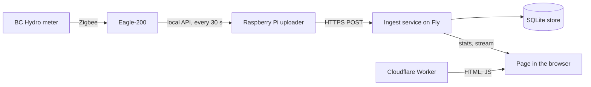
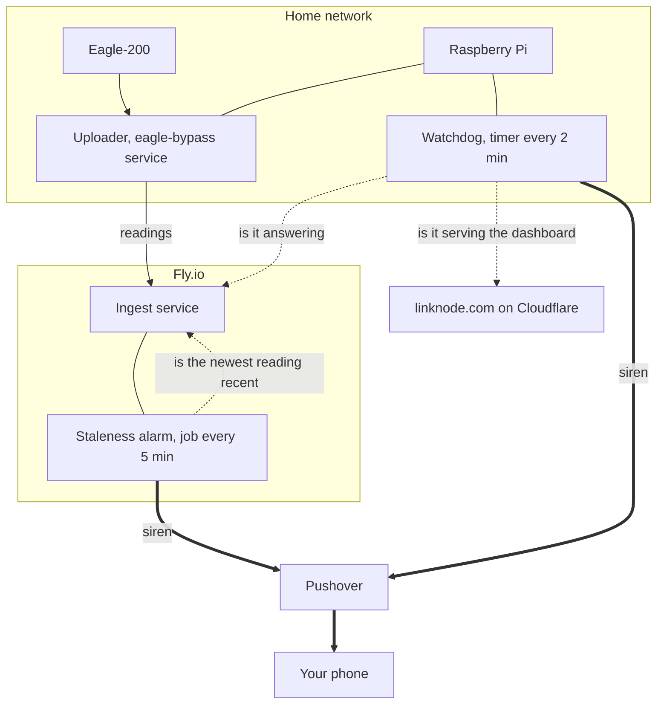
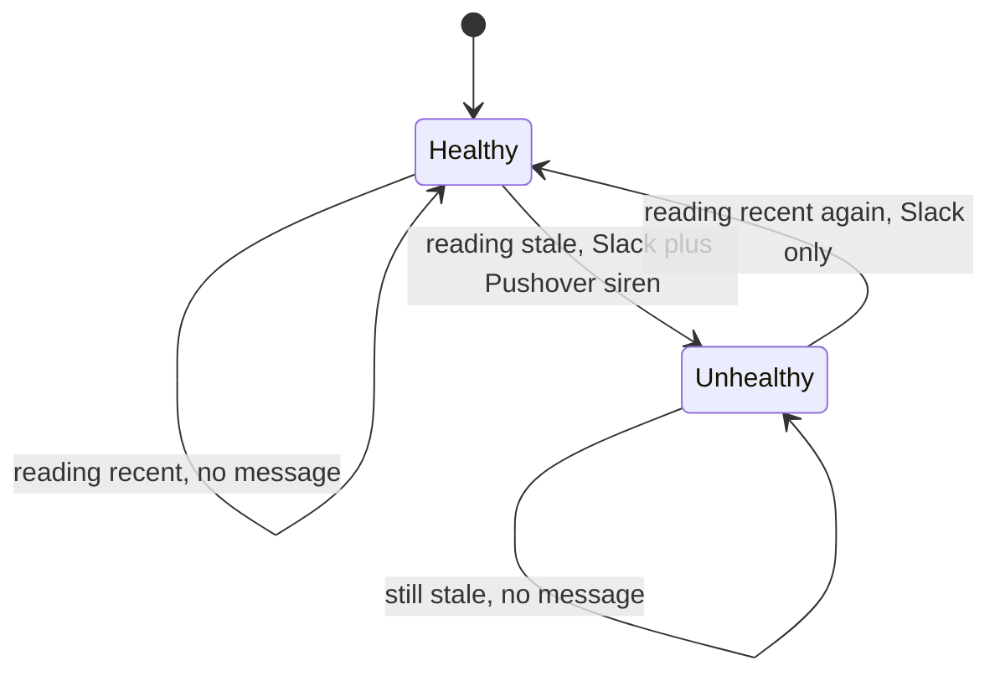
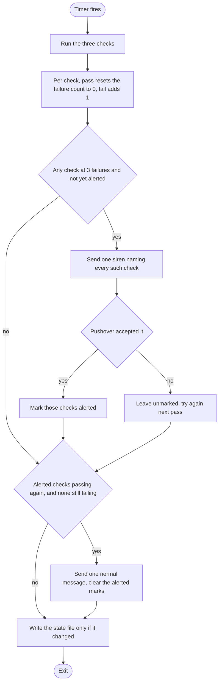
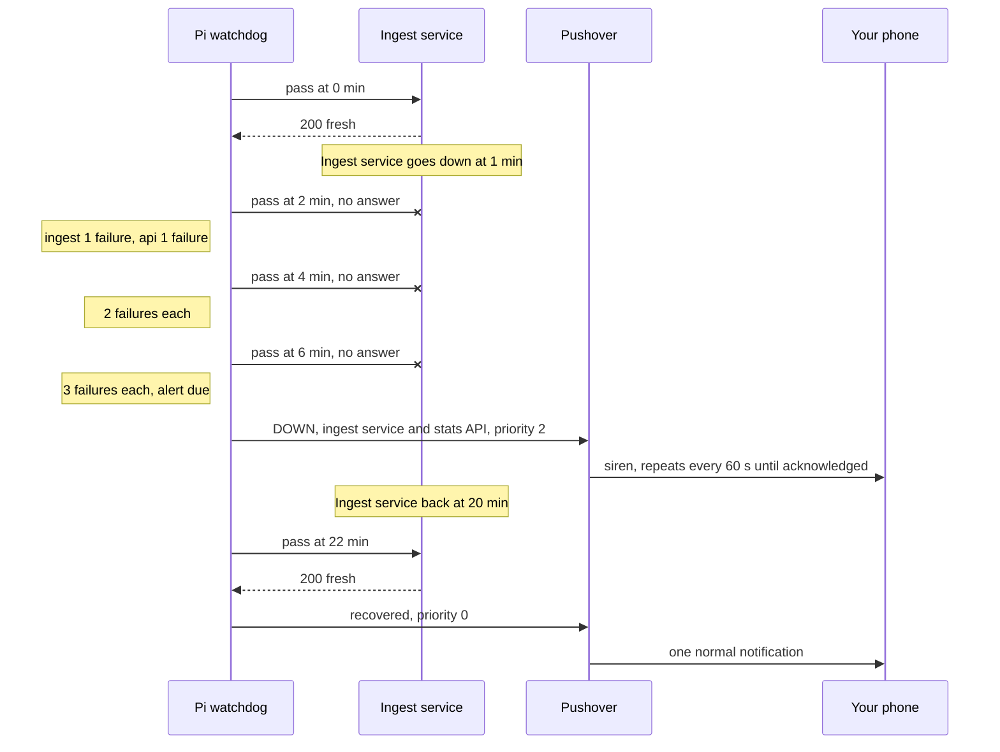

# Outage Alerting: Theory of Operation

How linknode.com tells you that it has stopped working. Covers the alarm inside the Fly
ingest service, the watchdog on the Raspberry Pi, and why there are two.

For the system as a whole see [THEORY_OF_OPERATION.md](THEORY_OF_OPERATION.md). For
installing the Pi half see [deploy/README.md](../deploy/README.md).

## The problem

The data path is a chain. A break anywhere in it leaves the site showing nothing new:



Two facts shape the design:

1. **A watcher cannot report its own death.** An alarm that lives inside the ingest
   service is silent when the ingest service is down.
2. **"Something arrived" is not "something new arrived".** When the Eagle loses the meter
   but keeps answering, the Pi keeps posting the last reading it has. Requests keep
   arriving; the data is frozen.

## Two watchers that watch each other



- The **staleness alarm** runs inside the ingest service. It notices when telemetry stops,
  which covers everything upstream of Fly: the meter link, the Eagle, the Pi, the home
  network and power.
- The **watchdog** runs on the Pi. It notices when the ingest service or the site stops
  answering, which is the part the alarm cannot see.

Each one's blind spot is the other's job. Only both failing at once goes unreported.

## The freshness signal

Both watchers use one number: **the age of the newest power reading in the store.**

The Pi does not stamp a reading with the time it posts it. It stamps it with the Eagle's
`LastContact`, the moment the Eagle last heard from the meter. So the newest reading's
timestamp only advances when the whole chain, meter to database, is working.

The alarm used to watch the arrival time of the last POST. This is the case that got past it:


A re-posted reading has the same timestamp as the one already stored, so it overwrites
that row and the newest reading does not move.

The signal is exposed at `GET /health/data`:

| Reply | Meaning |
|---|---|
| 200, `status: fresh` | Newest reading is under 5 minutes old |
| 503, `status: stale` | Newest reading is older than 5 minutes; `reading_age_seconds` says how old |
| 503, `status: no_data` | The store holds no power reading |
| 503, `status: unavailable` | The store could not be read |

`GET /health` is a different thing and is left alone. It reports that the process is up and
the store answers, and Fly restarts the machine when it fails. A restart fixes a hung
process. It does not fix a dead Pi, so freshness must not be wired into it.

## Watcher 1: the staleness alarm (Fly)

`monitor_data_staleness.py`, driven by a scheduler job in `app.py` every 5 minutes.

Each run reads the newest power reading and calls the feed **unhealthy** when either:

- the reading is older than `STALE_THRESHOLD_MINUTES` (default 5), or
- the reading is zero or missing.

It alerts on a change of state, never on a state:



- **One siren per outage.** A six-hour outage produces one alert, not seventy-two.
- **The state survives restarts.** It is saved to `/data/monitor_state.json` on the volume,
  so a deploy in the middle of an outage does not send the siren again.
- **Time to alert:** the reading must be 5 minutes old and the job runs every 5 minutes,
  so the siren comes 5 to 10 minutes after the last good reading.

## Watcher 2: the watchdog (Pi)

`scripts/linknode_watchdog.py`, started by `linknode-watchdog.timer` every 2 minutes. Each
start is one pass: three checks, then a decision.

| Check | Request | Passes when |
|---|---|---|
| `ingest` | `GET /health/data` on the ingest service | It answers with its JSON. A `stale` reply still passes while the reading is under 15 minutes old (see below) |
| `site` | `GET https://linknode.com/` | 200, and the page contains the dashboard markup |
| `api` | `GET /api/stats` with the site's `Origin` header | 200, the CORS header names the site, and `current_power` has a value |

The `api` check is the closest thing to "is the present usage being displayed" short of
running a browser. If the CORS header is missing the page loads but its requests are
refused, and the gauge stays empty.

**Why a stale reply passes.** A 503 `stale` from `/health/data` means the ingest service is
alive and telemetry has stopped. That is the staleness alarm's outage, and it is already
sounding the siren for it. The watchdog only steps in once the reading is over 15 minutes
old (`WATCH_BACKSTOP_SECS`), by which time the alarm should have fired; this catches an
ingest service that still answers HTTP but whose alarm job has died.

One pass:



- **Three failures before a siren.** Passes are 2 minutes apart, so a check must fail for
  4 to 6 minutes. A deploy restarts the ingest service for under a minute, and that stays
  quiet.
- **One siren for one event.** When Fly goes down, `ingest` and `api` fail together and
  share a single message.
- **An unsent alert is retried.** A check is marked alerted only when Pushover accepts the
  message. If the home network is down too, the watchdog keeps trying every pass until it
  gets through.
- **One recovery message**, at normal priority, once everything that alerted is back.
- **No wear on the SD card.** State lives in `/var/lib/linknode-watchdog/state.json` and is
  written only when it changes. A healthy system writes nothing.

## An outage, start to finish

The ingest service goes down and comes back:



During that outage the staleness alarm said nothing, because it was down with the service
it lives in.

## Who notices what

| What fails | Noticed by | Time to siren |
|---|---|---|
| Meter link (Eagle loses the meter) | Staleness alarm | 5 to 10 min |
| Eagle stops answering | Staleness alarm | 5 to 10 min |
| Pi uploader, Pi itself, home network or power | Staleness alarm | 5 to 10 min |
| Ingest service down | Watchdog, `ingest` and `api` checks | 4 to 6 min |
| linknode.com not serving the dashboard | Watchdog, `site` check | 4 to 6 min |
| API up but the page cannot read it | Watchdog, `api` check | 4 to 6 min |
| Ingest service up but its alarm job dead | Watchdog, `ingest` backstop | about 15 to 20 min |

What nothing notices:

- **The Pi down and Fly or the site down at the same time.** While the Pi is off, nothing
  watches Fly or the site. You would have had the siren for the Pi already.
- **Pushover itself unavailable**, or its app disabled or silenced on the phone.
- **The page failing in a real browser** for a reason the three requests do not exercise,
  such as a script error or the live stream failing while the stats request works.

## The alerts themselves

Both watchers send through the same Pushover application.

| | Outage | Recovery |
|---|---|---|
| Staleness alarm | Priority 2, siren, also Slack | Slack only |
| Watchdog | Priority 2, siren | Priority 0, normal |

Priority 2 is Pushover's emergency level: it repeats every 60 seconds until acknowledged
in the app and gives up after an hour. Change the watchdog's level with `WATCH_PRIORITY`
in `/etc/linknode-watchdog.env`.

## Where things live

| Piece | Location |
|---|---|
| Staleness alarm | `fly/eagle-monitor/monitor_data_staleness.py`, job and `/health/data` in `app.py` |
| Alarm state | `/data/monitor_state.json` on the Fly volume |
| Alarm credentials | Fly secrets `PUSHOVER_API_TOKEN`, `PUSHOVER_USER_KEY`, `SLACK_WEBHOOK_URL` |
| Watchdog | `scripts/linknode_watchdog.py`, installed at `/opt/linknode-watchdog/` on the Pi |
| Watchdog units | `deploy/linknode-watchdog.service`, `deploy/linknode-watchdog.timer` |
| Watchdog state | `/var/lib/linknode-watchdog/state.json` on the Pi |
| Watchdog credentials | `/etc/linknode-watchdog.env` on the Pi, mode 0600 |

## Checking and testing it

```bash
# The freshness signal, from anywhere
curl -s https://linknode-eagle-monitor.fly.dev/health/data

# The three checks, without alerting or touching state (works on any machine with the repo)
python scripts/linknode_watchdog.py --dry-run

# On the Pi: send one normal-priority test message
sudo sh -c 'set -a; . /etc/linknode-watchdog.env; python3 /opt/linknode-watchdog/linknode_watchdog.py --test-alert'

# On the Pi: timer schedule, recent passes, current state
systemctl list-timers linknode-watchdog.timer
journalctl -u linknode-watchdog.service -n 20
sudo cat /var/lib/linknode-watchdog/state.json
```

The watchdog logs nothing while everything passes; the journal shows only systemd's start
and finish lines. A failing check logs one line per pass with the reason.
