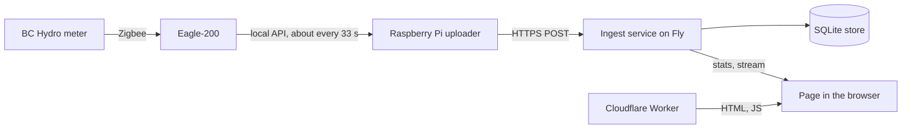
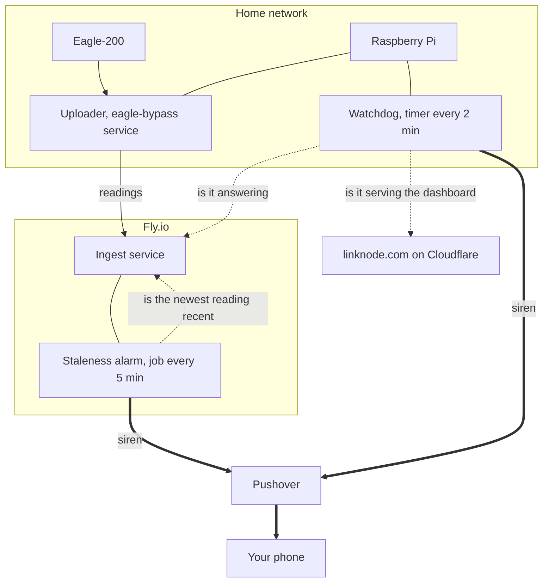
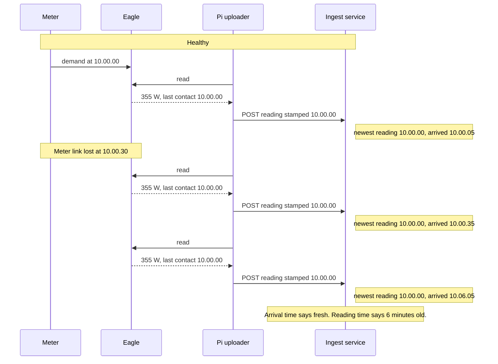
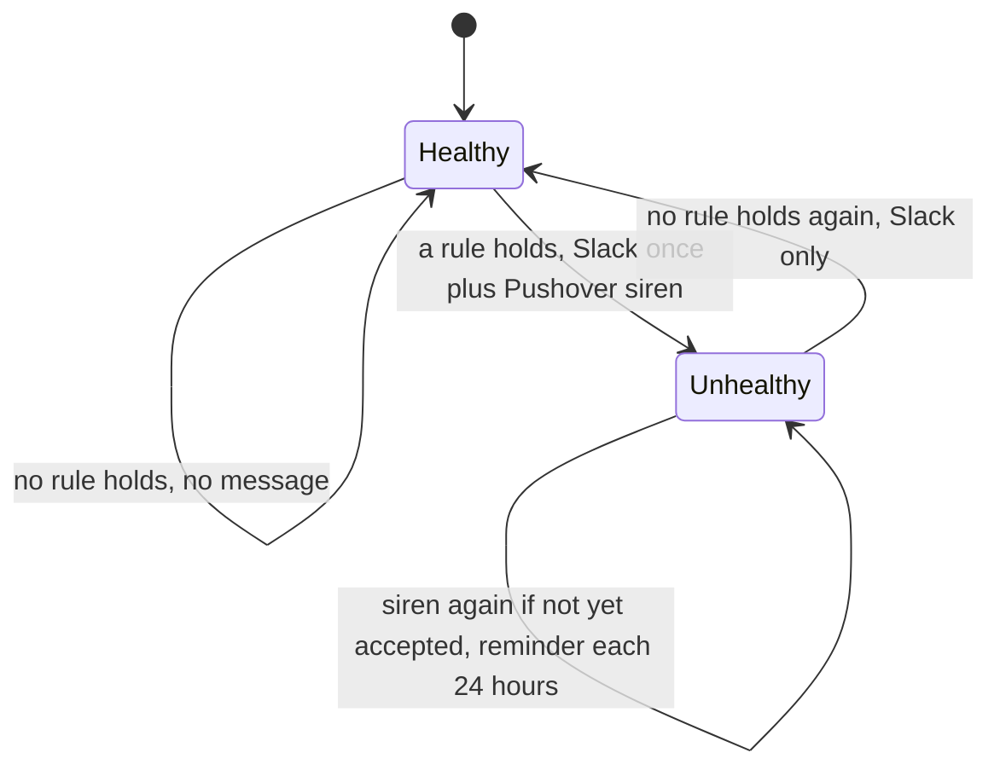
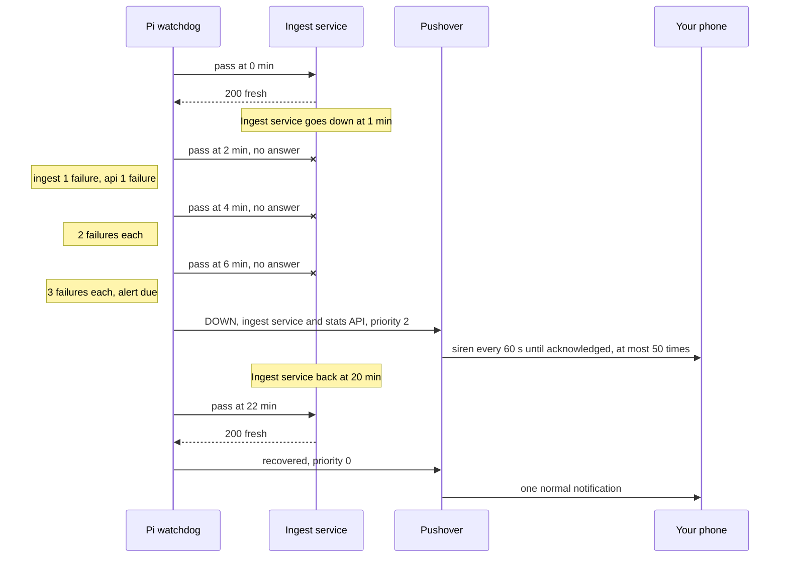

# Outage Alerting: Theory of Operation

How linknode.com tells you that it has stopped working. Covers the alarm inside the Fly
ingest service, the watchdog on the Raspberry Pi, why there are two, and what neither of
them sees.

For the system as a whole see [THEORY_OF_OPERATION.md](THEORY_OF_OPERATION.md). For
installing the Pi half see [deploy/README.md](../deploy/README.md).

Last checked against the code and the live system: 2026-10-03. The comments at the top of
`scripts/linknode_watchdog.py` are older than that check. Where they differ from this
page, this page is right.

## What it is for

linknode.com is not mission critical. The alerting has one job: to say that the system has
stopped reporting, so that it can be fixed within a day or two. Against that bar the speed
of an alert matters little. What matters is an outage that is never reported, and noise.
The thresholds below were chosen for that, and so were the
[changes made on 2026-10-03](#changes-made-on-2026-10-03).

## The problem

The data path is a chain. A break anywhere in it leaves the site showing nothing new:



Two facts shape the design:

1. **A watcher cannot report its own death.** An alarm that lives inside the ingest
   service is silent when the ingest service is down.
2. **"Something arrived" is not "something new arrived".** When the Eagle loses the meter
   but keeps answering, the Pi keeps posting the last reading it has. Requests keep
   arriving; the data is frozen.

The second fact, and the first remedy for it, rest on two things about the Eagle that this
repo does not prove:

- The fact assumes the Eagle goes on serving the last demand value after the meter link is
  lost. If it served none, the Pi would post no power reading and the alarm would fire
  anyway.
- The remedy, the freshness signal below, assumes the Eagle's `LastContact` stops advancing
  then. If it kept advancing, the freshness signal would stay green.

The code handles the assumed case and the tests simulate it. No capture of the device
doing either is recorded here. The alarm's third rule, the frozen register, is there so
that the alerting does not depend on the second assumption.

## Two watchers



- The **staleness alarm** runs inside the ingest service. It notices when telemetry stops,
  which covers everything upstream of Fly: the meter link, the Eagle, the Pi, the home
  network and power.
- The **watchdog** runs on the Pi. It notices when the ingest service or the site stops
  answering, which is the part the alarm cannot see.

Each covers the other's main blind spot, but the cover is not symmetric. The watchdog
checks the alarm's host directly. The alarm sees the Pi through the readings its uploader
sends, and it notes the watchdog's own requests: when they stop for 6 hours while readings
keep arriving, it says so. A watchdog that still makes its requests but cannot alert looks
alive from Fly. The cases that go unreported are listed under
[What nothing notices](#what-nothing-notices).

## The freshness signal

Both watchers start from one number: **the age of the newest power reading in the store**,
which is the Fly machine's clock minus the reading's timestamp.

The Pi does not stamp a demand or summation reading with the time it posts it. It stamps
it with the Eagle's `LastContact`, the moment the Eagle last heard from the meter. So the
newest reading's timestamp advances only when the whole chain, meter to database, is
working.

The alarm used to watch the arrival time of the last POST. This is the case that would
have got past it, with the Eagle behaving as assumed above:



A re-posted reading has the same timestamp as the one already stored, so it overwrites
that row and the newest reading does not move.

The stamp has exceptions. The first two fail towards *fresh*. The third fails towards
stale first, then towards fresh:

- If the Eagle's reply carries no usable `LastContact`, the Pi stamps the reading with its
  own clock (`_reading_ts` in `scripts/eagle_bypass.py`).
- If a timestamp arrives missing, unparseable or more than a year away from the server's
  clock, the ingest service stores the reading at its arrival time. A `LastContact` earlier
  than 2000-01-01 takes this path, because the Pi cannot encode it.
- A reading stamped ahead of the Fly clock is stored but not counted until its time comes.
  Until then the newest counted reading goes on ageing, so stamps more than about 30
  minutes ahead read `stale` with data arriving. Once they come due the feed reads fresh,
  and it goes on reading fresh for that much longer after readings really stop.

In the first two cases a frozen reading that keeps being re-posted looks fresh by this
signal. The alarm's frozen-register rule catches it by another route. As of 2026-10-03 no
power reading stored since the SQLite store went live (2026-09-26; its older rows, back to
2026-08-27, are a backfill) carries an arrival-time stamp from the server, and none is
stamped in the future. A reading stamped by the Pi's clock cannot be told apart in the
store.

The age also depends on the clock behind the stamp. `LastContact` is a time the Eagle
reports, so any offset between the Eagle's clock and Fly's counts as age, and nothing
measures it. A stamp that runs 30 minutes or more behind reads `stale` with data flowing:
one false siren, after which the alarm stays unhealthy. A stamp that runs ahead delays
both watchers by that much. On 2026-10-03 the offset was a few seconds.

The signal is exposed at `GET /health/data`:

| Reply | Meaning |
|---|---|
| 200, `status: fresh` | Newest reading is 30 minutes old or less |
| 503, `status: stale` | Newest reading is older than 30 minutes; `reading_age_seconds` says how old |
| 503, `status: no_data` | No power reading is visible: the store is empty, did not open at startup, or holds only readings stamped in the future. A store that did not open fails `/health` too, so from outside expect an error page or no answer in place of this reply |
| 503, `status: unavailable` | The store is open but the query failed |

The threshold is `STALE_THRESHOLD_MINUTES`, set to 30 in `fly.toml` (the code's default is
5) and reported as `stale_after_seconds`. It must be an integer: with any other value the
service does not start.

`GET /health` is a different thing and is left alone. It is Fly's service check: it reports
that the process is up and the store answers. While it fails, Fly stops routing requests to
the machine. It does not restart it. With one machine that takes the whole API offline,
uploads included, until the check passes again. So freshness must not be wired into
`/health`: a stale feed would then cut off the very uploads that could make it fresh.

What Fly does for this machine, and what it does not:

| Event | What Fly does |
|---|---|
| The process exits with an error (crash, out of memory) | Restarts it: restart policy `on-failure`, up to 10 tries within 5 minutes. If it still fails, Fly leaves the machine stopped |
| The process hangs, or `/health` fails | Stops routing to it. No restart: someone has to run `fly machine restart` |
| The machine is stopped | Starts it again on the next request (Fly's default when `auto_start_machines` is not set) |
| The host fails | Nothing. The volume is a disk on that host, so the machine stays down until the host returns. Rebuilding from a snapshot is a manual step and loses the readings since the snapshot |

The restart policy was read from the live machine on 2026-10-03. The rest is Fly's documented
behaviour ([restart policy](https://docs.fly.io/machines/guides-examples/machine-restart-policy),
[health checks](https://docs.fly.io/reference/health-checks),
[fly.toml reference](https://docs.fly.io/reference/configuration),
[host unavailable](https://docs.fly.io/apps/trouble-host-unavailable)) and has not been
exercised here.

## Watcher 1: the staleness alarm (Fly)

`monitor_data_staleness.py`, driven by a scheduler job in `app.py` every 5 minutes.

Each run reads the newest power reading and calls the feed **unhealthy** when any of these
holds. They are judged in this order, and the first that holds gives the alert its text:

1. There is no reading, or it is older than `STALE_THRESHOLD_MINUTES` (30).
2. The reading is exactly 0 W.
3. The meter's kWh register is frozen: its newest stored value, however old, equals its
   newest value from 2 hours or more ago. With no value that old there is no verdict. Nor
   is there one for 2 hours after a recovery: the lookup then reaches back over the outage,
   and a register that sat still through a power cut is not frozen.

The third rule does not look at timestamps, so it catches a frozen reading that arrives
stamped as new, and a register that stops arriving while power readings continue. Between
2026-08-27 and 2026-10-03 the register never went longer than 13 minutes without
changing. The order matters: once readings have stopped for 2 hours every outage meets
the third test as well, and it goes on being reported as stale.

Rules 2 and 3 belong to the alarm alone: `/health/data` reports only the age. The store
has never held a 0 W reading (as of 2026-10-03 the lowest since 2026-08-27 is 138 W).

It alerts on a change of state, and keeps at it until the message has got through:



- **One siren per continuous outage.** A six-hour outage produces one siren, not
  seventy-two. One run decides each edge, so a feed that stops for over 30 minutes,
  recovers and stops again sends a siren for each stop.
- **The siren is retried until Pushover accepts it.** Slack is posted once, at the change
  of state. If Pushover does not accept the siren, every run sends it again until it does.
  A 4xx reply is a refusal (a rejected token or user key, or the account over its quota):
  the alarm then waits 24 hours before asking again. That wait is held in memory, so a
  restart ends it, and a new outage asks again at once.
- **A reminder every 24 hours.** While the outage lasts, a normal-priority Pushover message
  ("Still down since ...") follows 24 hours after each accepted message.
- **The state survives restarts.** `/data/monitor_state.json` on the volume holds the
  status, when it began, whether the siren was accepted and when the last message was. A
  deploy in the middle of an outage does not send the siren again, and one that happens
  before the siren got through goes on trying. The file is created at the first change of
  state.
- **Time to alert:** the reading must be over 30 minutes old and the job runs every 5
  minutes, so the siren comes 30 to 35 minutes after the newest reading's timestamp. Two
  things stretch that. The first run is 5 minutes after the process starts, so a restart
  or deploy adds up to 5 minutes. A run that starts more than 1 second late is skipped (the
  scheduler's default), which adds 5 more. A stop shorter than about 30 minutes never
  alerts, one of 35 minutes or more always does, and in between it is chance. A frozen
  register is reported about 2 hours after it last moved.
- **The text names the rule, not the cause.** A stale feed, an empty store and a 0 W
  reading all begin "Data is not arriving from power meter!", whether the meter, the Pi,
  the network or the store on Fly is at fault. A frozen register begins "Meter readings
  look frozen!".
- **A store that cannot be read silences the alarm.** If the query for the newest reading
  raises an error, the job logs it and sends nothing. `/health/data` answers `unavailable`,
  and it is the watchdog that reports it.

**The alarm also listens for the watchdog.** The ingest service notes the time of each
request to `/health/data` whose User-Agent begins `linknode-watchdog/`, on any reply, and
keeps it across restarts in the store. When a run finds the feed healthy and no such
request for 6 hours, it sends one normal-priority message, "Linknode watchdog: silent",
delivered like the siren: retried until accepted, repeated every 24 hours while the
silence lasts. When the requests resume it sends "Linknode watchdog: calling again",
once. A run that finds the feed unhealthy sends nothing about the watchdog and restarts
the 6 hours: a Pi that is off is already reported, and one that has just come back has
not called yet. On a store with no record, the 6 hours count from the service's start.

This sees only a watchdog that has stopped calling: a pass that fails before its first
request, a pass that never ends, a stopped timer. The time it recorded is published as
`monitor_stats.watchdog_last_seen` in `/api/stats`. A run by hand counts as the watchdog,
a `--dry-run` from any machine included, because it sends the same User-Agent.

## Watcher 2: the watchdog (Pi)

`scripts/linknode_watchdog.py`, started by `linknode-watchdog.timer` every 2 minutes (in
practice 2:00 to 2:15 apart: the timer allows 15 seconds of slack). Each start is one pass:
three checks, then a decision.

| Check | Request | Passes when |
|---|---|---|
| `ingest` | `GET /health/data` on the ingest service | Any 200 with a JSON body. A 503 `stale` reply also passes while the reading is 24 hours old or less (see below). `no_data`, `unavailable`, a body that is not JSON, or no answer fail |
| `site` | `GET https://linknode.com/` | 200, and the page contains the marker `id="power-chart"` |
| `api` | `GET /api/stats` with the site's `Origin` header | 200, `Access-Control-Allow-Origin` equals the site's origin, and `current_power` is not null |

The `api` check is the closest thing to "can the page read the API" short of running a
browser. If the CORS header is missing the page loads but the browser will not let it read
the replies, so the tiles and the chart stay empty. (The gauge does not show it reliably:
the live stream sends its own CORS header and keeps feeding it.) The check says little
about whether the present usage is displayed: `current_power` is the last value posted
since the process started or, before any has been, the newest stored one, however old.
It is null only when the store yields none either: no power reading is visible in it, or
the query failed (the cases in which `/health/data` answers `no_data` or `unavailable`).
Freshness is the `ingest` check's job. The page's CSP is not checked.

**The backstop.** A 503 `stale` from `/health/data` means the ingest service is alive and
telemetry has stopped. That is the staleness alarm's outage, so the watchdog lets it pass.
Only once the reading is over 24 hours old (`WATCH_BACKSTOP_SECS`, set to 86400 in the
Pi's env file; the script's default is 900) does the check fail, and after three failing
passes the watchdog sends a siren of its own. It cannot tell whether the alarm already
fired, so this happens on every telemetry outage that lasts a day while the Pi and its
internet link are up. By then it is a second notice that the outage is still open, and it
is the only siren if the alarm has been silent. It reads "Ingest service: newest reading
is N min old", although the ingest service is working.

The backstop must stay well above the alarm's threshold. At or below it, the `ingest`
check fails from the first `stale` reply and the watchdog's siren comes within minutes of
the alarm's.

One pass:


- **Three failures before a siren.** With passes 2:00 to 2:15 apart, a check must fail for
  about 4 to 7 minutes: up to about 6.5 when requests fail at once, and at least 20 seconds
  more for each request that times out. A break shorter than about 4 minutes never alerts,
  and one of up to about 6.5 minutes may not. A deploy takes the ingest service away for
  well under a minute, and that stays quiet.
- **Checks that cross together share one siren.** When Fly goes down, `ingest` and `api`
  normally reach three failures on the same pass and share a single message. A check that
  gets there on a later pass sends its own.
- **An unsent alert is retried while the check is still failing.** A check is marked
  alerted only when Pushover accepts the message. If the home network is down too, the
  watchdog tries again on each pass. If the check recovers before a send is accepted, the
  alert is dropped and nothing is sent afterwards.
- **One recovery message**, at normal priority, once every check that alerted is passing
  again and Pushover accepts it. Until then the alerted marks stay, and a marked check that
  fails again sends no new siren.
- **A pass writes nothing to the SD card.** The state lives in
  `/run/linknode-watchdog/state.json`, which is RAM, and is written only when it changes.
  The unit's temp directories are in RAM too (`PrivateTmp=disconnected`), and on this Pi
  the journal is kept in RAM. So a card that has gone read-only or is full does not stop
  the watchdog counting. The price is that a reboot clears the failure counts and the
  alerted marks: an outage in progress across a reboot sends its siren again after three
  more failing passes, and one that ends sooner than that gets no "recovered" message.

## An outage, start to finish

The ingest service goes down and comes back:



During that outage the staleness alarm said nothing, because it was down with the service
it lives in. The readings taken in those minutes are gone: the uploader does not keep or
re-send what it could not post.

## Who notices what

| What fails | First alert | When | Then |
|---|---|---|---|
| Meter link lost, Eagle still answering | Staleness alarm | 30 to 35 min | A reminder each day; the watchdog's backstop siren at about a day |
| Eagle stops answering, or the uploader stops | Staleness alarm | 30 to 35 min | A reminder each day; the watchdog's backstop siren at about a day |
| The Pi itself, home network or power | Staleness alarm | 30 to 35 min | A reminder each day. The watchdog is down or cannot send |
| Readings frozen but stamped as new | Staleness alarm, frozen register | about 2 hours | A reminder each day. `/health/data` stays `fresh`, so the watchdog says nothing |
| Ingest service down or hung, or `/health` failing | Watchdog, `ingest` and `api` checks | about 4 to 7 min | Fly restarts a crashed process, not a hung one: see [When an alert arrives](#when-an-alert-arrives). If the alarm job is still running and can read the store, it adds its own siren once the newest reading is over 30 minutes old, since no upload gets through |
| Store on Fly did not open when the process started | Staleness alarm or watchdog (`ingest` and `api` checks), whichever comes first | Alarm 5 min after the process starts, watchdog about 4 to 7 min | Two sirens within a few minutes of each other. The alarm's reads "No data received yet" |
| Store on Fly opened, but its queries now fail | Watchdog, `ingest` check | about 4 to 7 min | The staleness alarm stays silent. If `/health` fails as well, Fly stops routing and the `api` check fails too |
| Store on Fly rejects writes | Staleness alarm | 30 to 35 min | The uploader is answered 200 and counts the reading as delivered |
| linknode.com not serving the dashboard | Watchdog, `site` check | about 4 to 7 min | |
| API up but its CORS header is missing | Watchdog, `api` check | about 4 to 7 min | |
| The watchdog stops calling | Staleness alarm, normal priority | about 6 hours | A reminder each day; "calling again" when it returns |
| Telemetry stopped and the alarm silent | Watchdog backstop | about a day | |

The alarm's 30 to 35 minutes, and the backstop's day, count from the newest reading's
timestamp. The 2 hours count from the register's last change. The 6 hours count from the
watchdog's last request or, if later, the last run that found the feed unhealthy. The
watchdog's other times count from the start of the failure.

Two cases produce an alert for something that is not down:

- **A late DOWN after a home internet outage.** While the Pi's own link is down every check
  fails with "no answer" and the siren cannot be sent. After two failed passes (an outage
  of about 4 minutes or more), a pass during which the link returns sends a DOWN, reading
  "no answer", for services that were up all along. The next pass sends "recovered".
- **A fresh reading of exactly 0 W when the alarm's job runs.** The alarm sends its siren
  ("Invalid power reading: 0.0W") although readings are arriving. `/health/data` says
  `fresh` and the watchdog stays quiet.

## What nothing notices

- **The Pi down and Fly or the site down at the same time.** While the Pi is off, nothing
  watches Fly or the site. If the Pi went first you will have had the alarm's siren for it.
- **A watchdog that still calls and cannot alert.** Its request to `/health/data` is the
  first thing a pass does, so it keeps arriving when the Pushover credentials on the Pi are
  rejected or missing, and when a pass crashes after its checks. Fly then sees a live
  watchdog. A watchdog that has stopped calling is reported, after 6 hours.
- **An alarm whose credentials are refused.** A 4xx from Pushover stops the alarm asking
  for 24 hours. The Slack message is a separate request and still arrives, but it is not a
  siren. The watchdog's backstop is the only other siren, a day in, and only if the Pi is
  up and online.
- **Pushover itself unavailable**, or its app disabled or silenced on the phone. Both
  watchers send through one Pushover account. Emergency priority overrides Pushover's own
  quiet hours. A muted phone or Do Not Disturb can still silence it unless the app has been
  allowed to override them.
- **A Cloudflare failure that takes the site and Pushover together.** As of 2026-10-03
  `linknode.com` and `api.pushover.net` both resolve to Cloudflare addresses, so the `site`
  check and the only path for its siren share a provider. If the site passes again before
  Pushover accepts the siren, the alert is dropped. A fault in the linknode.com zone alone
  (a bad deploy, a route or DNS change) alerts normally.
- **A long Fly or site outage, once the siren stops.** Pushover repeats an emergency at
  most 50 times, so with a 60 second retry the siren ends after about 50 minutes. The
  watchdog does not alert again while the same outage continues. (The alarm does: it sends
  a reminder each day.) A recovery does not stop a siren that is still repeating:
  acknowledge it in the app.
- **A repeat outage while an earlier alert is still open.** The watchdog clears its alerted
  marks only on a pass where every marked check passes. Until then a marked check that came
  back and fails again sends nothing.
- **A thin feed.** One reading every 25 minutes counts as fresh indefinitely.
- **The page failing in a real browser** for a reason the three requests do not exercise,
  such as a script error, a `connect-src` that no longer lists the API host, or the live
  stream failing while the stats request works. While readings are frozen the gauge also
  keeps saying "Live", because that indicator follows the arrival of posts, not the
  reading's own time.
- **A machine started without its volume.** The service opens an empty store, passes
  `/health` and goes fresh on the first reading. The history is simply missing.

## The alerts themselves

Both watchers send through the same Pushover application.

| | Outage | While it lasts | Recovery |
|---|---|---|---|
| Staleness alarm | Slack, plus Pushover priority 2 (siren) | Pushover priority 0 each 24 hours | Slack only |
| Alarm, about the watchdog | Pushover priority 0 | Pushover priority 0 each 24 hours | Pushover priority 0 |
| Watchdog | Pushover priority 2 (siren) | Nothing | Pushover priority 0 |

Priority 2 is Pushover's emergency level. As sent here (`retry` 60, `expire` 3600) it
repeats every 60 seconds until acknowledged in the app, and Pushover stops it after 50
repeats, about 50 minutes.

Change the watchdog's level with `WATCH_PRIORITY` in `/etc/linknode-watchdog.env`, then
check the file as described under [Checking and testing it](#checking-and-testing-it).

What each message means:

| Title | Text | From | Means |
|---|---|---|---|
| Linknode Power Monitor Alert | "Data is not arriving from power meter!" then "Last data received N minutes ago (threshold: 30 minutes)" | Staleness alarm | The newest reading is over 30 minutes old. The cause can be anywhere from the meter to the store on Fly |
| Linknode Power Monitor Alert | ... then "No data received yet" | Staleness alarm | No power reading is visible: the store is empty, did not open at startup, or holds only readings stamped in the future |
| Linknode Power Monitor Alert | ... then "Invalid power reading: 0.0W" | Staleness alarm | The newest reading was exactly 0 W when the job ran. Nothing is down |
| Linknode Power Monitor Alert | "Meter readings look frozen!" then "The meter's kWh register has not changed in over 2 hours ..." | Staleness alarm | Readings keep arriving and look new, but the register has not moved or has stopped arriving. The Eagle is serving old data, or no register |
| Linknode Power Monitor Alert | "Still down since ..." then one of the texts above | Staleness alarm, normal priority | The same outage is still open, 24 hours after the last message |
| Linknode watchdog: silent | "No request from the Pi watchdog for over 6 hours ..." | Staleness alarm, normal priority | The watchdog on the Pi has stopped calling while the uploader carries on. Nothing is watching Fly or the site |
| Linknode watchdog: calling again | "The Pi watchdog is making its requests again." | Staleness alarm, normal priority | Its requests have resumed |
| Linknode watchdog: DOWN | "Ingest service: no answer (...)" or "Ingest service: HTTP ..., not the health JSON", usually with a "Stats API" line | Watchdog | The Pi cannot reach the Fly service, or what answered was not the service's JSON (an error page, for example) |
| Linknode watchdog: DOWN | "Ingest service: HTTP 503, status 'no_data'" or "... status 'unavailable'" | Watchdog | The ingest service is answering. `no_data`: no power reading is visible in the store. `unavailable`: the query for the newest reading failed |
| Linknode watchdog: DOWN | "Ingest service: newest reading is N min old" | Watchdog backstop | Telemetry has been stopped for over a day. The ingest service is answering |
| Linknode watchdog: DOWN | "linknode.com: ..." | Watchdog | The site did not return the dashboard page |
| Linknode watchdog: DOWN | "Stats API (what the page reads): ..." alone | Watchdog | `/api/stats` failed the `api` check. The text gives the reason: "no CORS header ...", "no current_power in the reply", "HTTP ...", "no answer (...)" or "reply is not JSON" |
| Linknode watchdog: recovered | "... answering again." | Watchdog | Every check that alerted is passing again |
| Linknode Power Monitor Alert (Slack only) | "Power meter is back online!" | Staleness alarm | The alarm is healthy again: no rule holds |

### When an alert arrives

Read the alert's text first. `/health/data` answers for the feed only. A watchdog alert
with a "linknode.com: ..." line, or a lone "Stats API (what the page reads): ..." line, is
about the site or the page's API, and the feed can stay `fresh` for the whole of that
outage. So can it through a "Meter readings look frozen!" alert.

```bash
# What does the freshness signal say?
curl -s -m 15 -w '\nHTTP %{http_code}\n' https://linknode-eagle-monitor.fly.dev/health/data
```

- **No answer, or an error page:** the ingest service is unreachable. Look at
  `fly status -a linknode-eagle-monitor`, `fly checks list -a linknode-eagle-monitor` and
  `fly logs -a linknode-eagle-monitor`. Fly does not restart a process that is running but
  not answering: `fly machine restart <machine-id> -a linknode-eagle-monitor` (the id is in
  `fly status`). If `fly status` reports the machine's host as unreachable, a restart
  cannot help: wait for the host, or rebuild from a snapshot as Fly's
  [host unavailable](https://docs.fly.io/apps/trouble-host-unavailable) page describes,
  which loses every reading since the snapshot.
- **`stale`:** the service is answering and no new reading has reached the store for over
  30 minutes. The fault can be anywhere from the meter to the store on Fly. Look on the Pi:
  `systemctl status eagle-bypass`, `journalctl -u eagle-bypass -n 20` and
  `cat /run/eagle-bypass/stats.json`.
  - The Pi does not answer from the home network: it is off, or off the network.
  - The journal says `local read failed`: the Eagle is not answering.
  - The journal says `upload FAILED HTTP 401`: the Pi and Fly passwords differ.
    `upload FAILED HTTP None`: the Pi cannot reach Fly.
  - The journal says `shipped 3/3 messages` every cycle: the Pi is delivering, so the
    fault is at one of the two ends. If `meter_status` in `stats.json` is not `Connected`,
    or `meter_last_contact` does not change from one cycle to the next, the Eagle is
    re-serving a frozen reading. If it keeps changing, suspect the store on Fly:
    `fly logs -a linknode-eagle-monitor` shows `Failed to write to SQLite`.
- **`no_data`:** no power reading is visible, normally an empty store. An empty store
  turns `fresh` at the next upload, so a reply that stays `no_data` means nothing is being
  stored either. Check that the volume is attached
  (`fly volumes list -a linknode-eagle-monitor`), then follow the `stale` steps.
- **`unavailable`:** the store is open and the query for the newest reading failed.
  `fly logs -a linknode-eagle-monitor` shows `Error reading the store for /health/data`
  with the SQLite error. See also [HEALTH_CHECKS.md](HEALTH_CHECKS.md).
- **`fresh`:** readings with new timestamps are arriving. That says nothing about the
  site, the stats API or whether the values are moving.
  - The alert reads "Meter readings look frozen!": the Eagle is serving old data under new
    timestamps, or has stopped serving the kWh register while demand carries on (the
    uploader's journal then shows `summation=NonekWh`). On the Pi, `meter_status` and
    `meter_last_contact` in `/run/eagle-bypass/stats.json` and the uploader's journal show
    what it is returning. Restarting the Eagle is the usual cure.
  - The alert has a "linknode.com: ..." or "Stats API (what the page reads): ..." line:
    that check failed and may still be failing. Treat it as down until a "Linknode
    watchdog: recovered" message arrives (none comes if the Pi was rebooted meanwhile).
    `python scripts/linknode_watchdog.py --dry-run` (any machine with the repo) repeats
    the three checks and prints the reason for each.
    For the site, look at the Cloudflare Worker and the last `deploy-web.yml` run. For
    "no CORS header", look at the `CORS(...)` origins in `fly/eagle-monitor/app.py`. "no
    current_power in the reply" means no power reading has been posted since the service
    started and the store gave none: none was visible in it, or the query failed (the log
    from `fly logs` then shows `Error reading the newest power reading for stats`).
  - Otherwise it has already recovered, or the alert was the 0 W rule (the text says so),
    or it was a late DOWN after a home internet outage.
- **"Linknode watchdog: silent":** on the Pi, `systemctl list-timers linknode-watchdog.timer`
  and `systemctl is-failed linknode-watchdog.service`, then
  `journalctl -u linknode-watchdog.service -n 20`. Do not test with a `--dry-run` first: it
  counts as the watchdog and draws a false "calling again".
- Acknowledge a siren in the Pushover app. A recovery does not stop it.

## Where things live

| Piece | Location |
|---|---|
| Staleness alarm | `fly/eagle-monitor/monitor_data_staleness.py`, job and `/health/data` in `app.py` |
| Alarm state | `/data/monitor_state.json` on the Fly volume, created at the first change of state |
| Record of the watchdog's requests | The store's `meta` table: `watchdog_last_seen`, `watchdog_alert` |
| Alarm credentials | Fly secrets `PUSHOVER_API_TOKEN`, `PUSHOVER_USER_KEY`, `SLACK_WEBHOOK_URL` |
| Alarm threshold | `STALE_THRESHOLD_MINUTES` in `fly/eagle-monitor/fly.toml` |
| Watchdog | `scripts/linknode_watchdog.py`, installed at `/opt/linknode-watchdog/` on the Pi |
| Watchdog units | `deploy/linknode-watchdog.service`, `deploy/linknode-watchdog.timer` |
| Watchdog state | `/run/linknode-watchdog/state.json` on the Pi (RAM: cleared by a reboot) |
| Watchdog credentials and tuning | `/etc/linknode-watchdog.env` on the Pi, mode 0600 |

## Checking and testing it

```bash
# The freshness signal, from anywhere
curl -s https://linknode-eagle-monitor.fly.dev/health/data

# When the watchdog last called, as Fly recorded it
curl -s https://linknode-eagle-monitor.fly.dev/api/stats | python -c "import sys, json; print(json.load(sys.stdin)['monitor_stats']['watchdog_last_seen'])"

# The three checks, without alerting or touching state (works on any machine with the
# repo; it counts as a call from the watchdog). A run by hand does not read the Pi's env
# file: without the backstop given here, every `stale` reply prints "ingest: FAIL".
WATCH_BACKSTOP_SECS=86400 python scripts/linknode_watchdog.py --dry-run

# On the Pi: send one normal-priority test message
sudo sh -c 'set -a; . /etc/linknode-watchdog.env; python3 /opt/linknode-watchdog/linknode_watchdog.py --test-alert'

# On the Pi: is the watchdog itself alive?
systemctl list-timers linknode-watchdog.timer
systemctl is-failed linknode-watchdog.service    # "failed" means the last pass crashed
journalctl -u linknode-watchdog.service -n 20
cat /run/linknode-watchdog/state.json

# On Fly: is the alarm job running? It logs a pair of lines every 5 minutes. Leave this
# running until the next pair arrives, then Ctrl-C. Not with --no-tail: that returns only
# the newest 100 lines, about 5 minutes of this log and less while a page is open.
fly logs -a linknode-eagle-monitor | grep "Check data staleness"
```

The watchdog logs nothing while everything passes; the journal shows only systemd's start
and finish lines. A failing check logs one line per pass with the reason. A siren or a
recovery message that Pushover accepts is not logged.

The test message proves the credentials as the shell reads them, and the path to the
phone. Nothing more. It goes at normal priority, as root, with the env file read by the
shell, so it exercises neither the siren request nor the way systemd reads that file.
systemd does not strip a trailing `# comment`: it becomes part of the value. So:

- In `/etc/linknode-watchdog.env`, put nothing after a value. After `WATCH_FAIL_THRESHOLD`,
  `WATCH_BACKSTOP_SECS` or `WATCH_PRIORITY`, a comment makes every pass crash before it
  runs a check. After a Pushover credential nothing crashes and the test message still
  arrives, but a siren, when one is due, goes out with the comment inside the credential.
  Pushover answers an invalid credential with a 4xx, so no siren reaches the phone: the
  watchdog logs `pushover send failed` and tries again on each failing pass.
- After editing that file, run one real pass and confirm it did not fail, confirm that
  both credential lines are bare values (the second command must print 2), and read a
  tuning value back as systemd reads it (the third prints the backstop, `86400`):

```bash
sudo systemctl start linknode-watchdog.service && echo ok
sudo grep -cE '^PUSHOVER_(API_TOKEN|USER_KEY)=[A-Za-z0-9]{30}$' /etc/linknode-watchdog.env
sudo systemd-run --quiet --wait --pipe -p EnvironmentFile=/etc/linknode-watchdog.env /usr/bin/printenv WATCH_BACKSTOP_SECS
```

### Drill record, 2026-10-03

Both sirens were exercised on the live system, for the first time, before the changes
below. The alarm's threshold was still 5 minutes then. Times are UTC.

- **Watchdog.** Three passes of the installed script, run through systemd with the real
  env file, a throwaway state directory and a page marker that does not exist
  (`WATCH_SITE_MARKER`). The third pass sent "Linknode watchdog: DOWN" with "linknode.com:
  page served without the dashboard markup" at priority 2, and a normal pass then sent
  "recovered". Both reached the phone at 18:30, the minute they were sent. The real
  watchdog's state was not touched.
- **Staleness alarm.** The uploader was stopped at 18:36:14. The run at 18:41:34 found the
  newest reading 5.8 minutes old, sent Slack and the Pushover siren (both received at
  18:41) and created `/data/monitor_state.json`. The uploader was restarted at 18:42:19,
  and the run at 18:46:34 sent the Slack recovery, which was also received. The drill left
  a gap of 6 minutes 31 seconds in the readings.
- **During the stale period** the real watchdog logged no failure, as designed for a
  reading under the backstop.

Not exercised: the phone muted or in Do Not Disturb, the `ingest` and `api` checks failing
for real, the backstop, and everything added on the same day after the drill (the retry,
the reminder, the frozen-register rule, the watchdog-silent message).

## Changes made on 2026-10-03

A review of the alerting against the code and the live system found many defects. Seven
fixes were chosen against the bar under [What it is for](#what-it-is-for) and made the
same day. The page above describes the system with them in place.

| # | Fix | What it closed |
|---|---|---|
| 1 | Retuned by configuration: the alarm's threshold from 5 to 30 minutes, the watchdog's backstop from 15 minutes to 24 hours | A siren for every short stall of a flapping Eagle, and a second siren 20 minutes into every long outage |
| 2 | The alarm retries its siren until Pushover accepts it, then reminds every 24 hours | One failed request meaning an outage was never announced, and one missed siren meaning it was never mentioned again |
| 3 | A frozen-register rule that does not trust timestamps | Every way a frozen reading could look fresh |
| 4 | Fly notices a watchdog that has stopped calling | A stopped watchdog going unreported until it was needed |
| 5 | The deploy rollback's image capture reads the right field | A bad image left on the machine when a deploy fails on its last attempt |
| 6 | `current_power` falls back to the store after a restart; a failed Slack send no longer logs the webhook URL; connection limits raised from 20 and 25 to 150 and 200; a test that failed at the start of each billing period pinned to a fixed clock | A false "stats API down" after a restart during an outage; a secret in the logs; pages crowding out the uploader; a blocked CI deploy |
| 7 | The watchdog keeps its state and its temp directories in RAM | An SD card gone read-only or full leaving the watchdog unable to count to three |

What the fixes cost:

- The alarm now comes 30 to 35 minutes after the last reading, not 5 to 10, and a stop
  shorter than 30 minutes is not reported at all.
- When the alarm is silent, the backstop is the only siren and comes at about a day.
- An outage left alone on purpose brings one normal-priority message a day until the feed
  returns. There is no way to stand it down. When readings have stopped and the Pi is
  online, the backstop's siren comes about half an hour before the first of them.
- A frozen reading that looks fresh is reported about 2 hours after the register last
  moved.
- A reboot of the Pi clears the watchdog's counts and marks.
- The rollback command itself has still never run: it runs only after three failed
  deploy attempts, so its first real use is its first test. It restores the image only,
  and applies the failed commit's `fly.toml` with it. A deploy that succeeds and then
  fails the `/health` curl still does not roll back.

### Deliberately left as they are

At this bar these are not worth a fix. Each is described above, except the crash.

- A hung ingest process is not restarted by anything: the watchdog reports it, and a
  manual restart within a day is acceptable.
- The watchdog's own code: the late DOWN after a home internet outage, the alerted marks
  that outlive a recovery, and a crash on an unexpected reply. A pass dies before it counts
  or sends anything when a reply with an error status is cut off mid-body, when
  `/health/data` answers an error status with JSON that is not an object or with an age
  that is not a number, or when `/api/stats` passes its CORS test with JSON that is not an
  object. The ingest service sends no such JSON. Each fix would mean changing the script
  and installing it on the Pi.
- The backstop's "Ingest service" label, the 0 W rule, the offset between the Eagle's
  clock and Fly's, the scheduler's 1-second grace, a thin feed, a way to stand the alarms
  down for planned work, and a host failure on Fly.
- Test coverage of the watchdog script beyond its existing unit tests.
