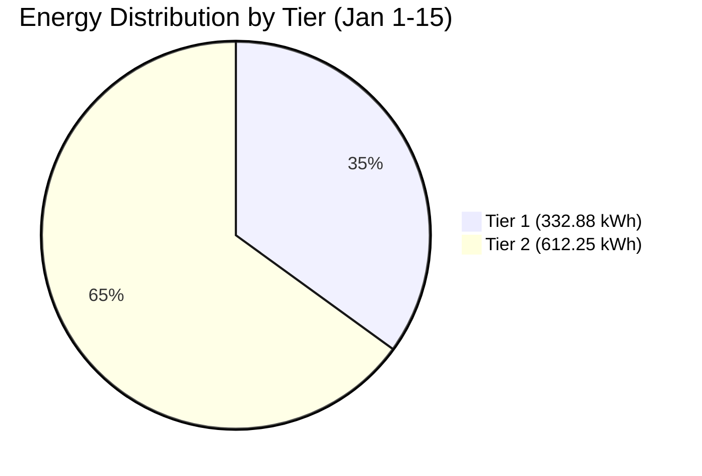
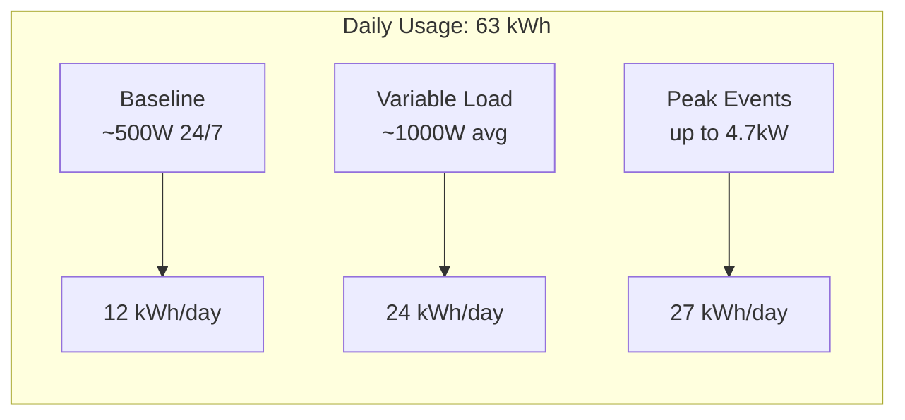
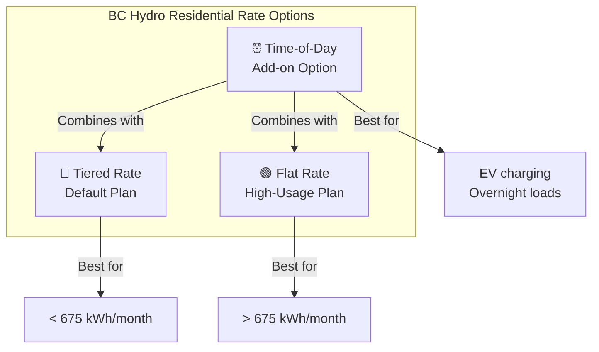
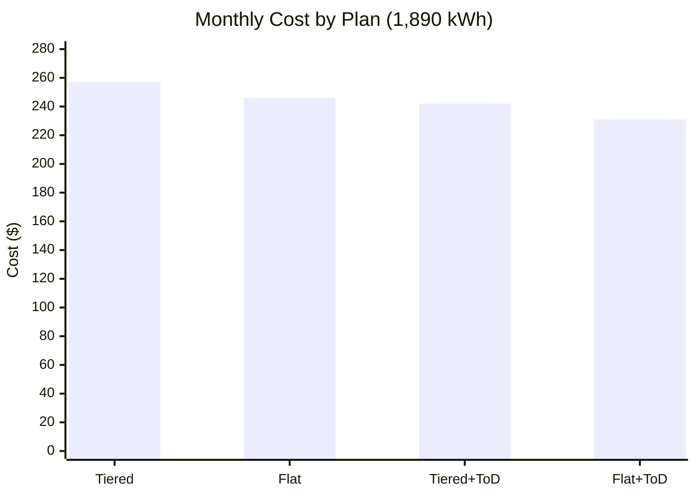
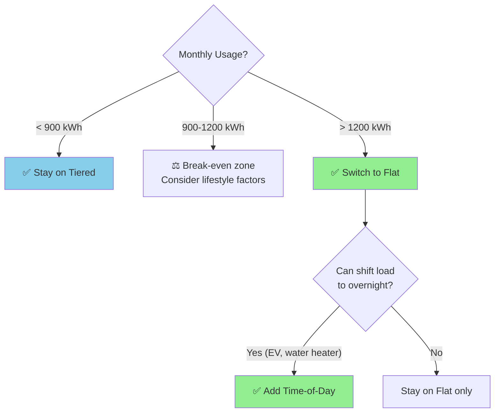
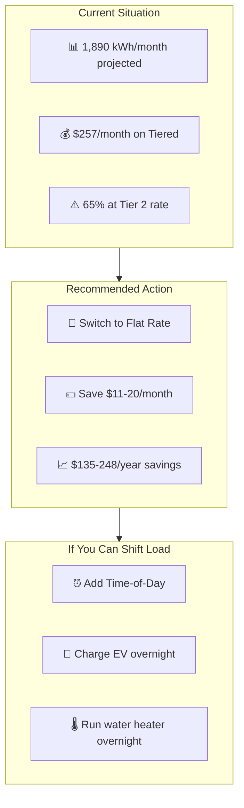

# BC Hydro Residential Rate Plan Analysis

> **Analysis Date:** January 15, 2026
> **Data Source:** Eagle-200 Energy Monitor via Linknode
> **Billing Period Analyzed:** January 1-15, 2026 (15 days)

## Executive Summary

Based on your monitored consumption data, **the Flat Rate plan would save you approximately $15-20/month** compared to the Tiered Rate plan you're currently on. Your high usage pattern (65% of consumption at Tier 2 rates) makes you an ideal candidate for the Flat Rate.

---

## Your Consumption Profile



| Metric | Value |
|--------|-------|
| **Energy Consumed** | 945.13 kWh |
| **Days Monitored** | 15 |
| **Daily Average** | 63.0 kWh/day |
| **Monthly Projection** | ~1,890 kWh |
| **Average Power** | 1,039 W |
| **Peak Power** | 4,690 W |

### Consumption Pattern



---

## BC Hydro Rate Plans Comparison

### Plan Overview



### Rate Structure

| Component | Tiered Rate | Flat Rate | Difference |
|-----------|-------------|-----------|------------|
| **Tier 1 / Base Rate** | $0.1172/kWh | $0.1263/kWh | +$0.0091 |
| **Tier 2 Rate** | $0.1408/kWh | N/A | - |
| **Daily Basic Charge** | $0.2330/day | $0.2485/day | +$0.0155 |
| **Monthly Basic Charge** | ~$7.00/month | ~$7.46/month | +$0.46 |

### Time-of-Day Modifiers (Optional Add-on)

| Period | Hours | Modifier |
|--------|-------|----------|
| **Overnight** | 11 PM - 7 AM | **-$0.05/kWh** |
| **Off-Peak** | 7 AM - 4 PM, 9 PM - 11 PM | No change |
| **On-Peak** | 4 PM - 9 PM | **+$0.05/kWh** |

```mermaid
gantt
    title Time-of-Day Rate Periods (24-hour cycle)
    dateFormat HH:mm
    axisFormat %H:%M

    section Rate
    Overnight (-5¢)     :overnight, 00:00, 07:00
    Off-Peak (base)     :offpeak1, 07:00, 16:00
    On-Peak (+5¢)       :crit, onpeak, 16:00, 21:00
    Off-Peak (base)     :offpeak2, 21:00, 23:00
    Overnight (-5¢)     :overnight2, 23:00, 24:00
```



---

## Cost Projections: Your Usage

### Monthly Cost Comparison (1,890 kWh/month)



#### Detailed Calculations

**1. Tiered Rate (Current Plan)**
```
Threshold (30 days): 30 × 22.1918 = 665.75 kWh

Tier 1: 665.75 kWh × $0.1172 = $78.03
Tier 2: 1,224.25 kWh × $0.1408 = $172.37
Basic Charge: 30 × $0.2330 = $6.99
─────────────────────────────────────
TOTAL: $257.39/month
```

**2. Flat Rate**
```
Energy: 1,890 kWh × $0.1263 = $238.71
Basic Charge: 30 × $0.2485 = $7.46
─────────────────────────────────────
TOTAL: $246.17/month

SAVINGS vs Tiered: $11.22/month ($134.64/year)
```

**3. Tiered + Time-of-Day** (estimated 30% overnight usage)
```
Assuming: 30% overnight, 50% off-peak, 20% on-peak

Overnight: 567 kWh × (-$0.05) = -$28.35
Off-Peak: 945 kWh × $0 = $0
On-Peak: 378 kWh × (+$0.05) = +$18.90
ToD Adjustment: -$9.45

Tiered Base: $257.39
ToD Adjustment: -$9.45
─────────────────────────────────────
TOTAL: ~$247.94/month

SAVINGS vs Tiered: $9.45/month ($113.40/year)
```

**4. Flat + Time-of-Day** (estimated 30% overnight usage)
```
Flat Base: $246.17
ToD Adjustment: -$9.45
─────────────────────────────────────
TOTAL: ~$236.72/month

SAVINGS vs Tiered: $20.67/month ($248.04/year)
```

### Break-Even Analysis



The **break-even point** between Tiered and Flat is approximately **900-950 kWh/month**:

| Monthly Usage | Best Plan | Annual Difference |
|---------------|-----------|-------------------|
| 500 kWh | Tiered | Tiered saves ~$36/year |
| 675 kWh | Tiered | Tiered saves ~$18/year |
| 900 kWh | Break-even | ~$0 difference |
| 1,200 kWh | Flat | Flat saves ~$48/year |
| 1,500 kWh | Flat | Flat saves ~$96/year |
| **1,890 kWh** | **Flat** | **Flat saves ~$135/year** |
| 2,500 kWh | Flat | Flat saves ~$216/year |

---

## Recommendation



### Primary Recommendation: **Switch to Flat Rate**

| Factor | Assessment |
|--------|------------|
| Your Usage | 1,890 kWh/month (HIGH) |
| Tier 2 Exposure | 65% of consumption |
| Break-even | You're 2x above break-even |
| Annual Savings | **$135+** |

### Secondary Recommendation: **Consider Time-of-Day Add-on**

If you can shift usage to overnight hours (11 PM - 7 AM):
- EV charging
- Water heater scheduling
- Dishwasher/laundry timing

**Potential additional savings: $100+/year**

---

## How to Switch Plans

1. **Log in** to [bchydro.com](https://www.bchydro.com)
2. Navigate to **My Account** → **Rates**
3. Select **Change Rate Plan**
4. Choose **Flat Rate** (Schedule 1151)
5. Optionally add **Time-of-Day Pricing**

Changes typically take effect on your next billing cycle.

---

## Monitoring Your Savings

After switching, use your Eagle-200 monitor to track:

1. **Monthly consumption** - Verify it stays above break-even (~900 kWh)
2. **Time-of-day patterns** - If using ToD, maximize overnight usage
3. **Seasonal variations** - Summer vs winter consumption differences

The `/api/stats` endpoint now includes billing period calculations that can be extended to support Flat Rate and Time-of-Day comparisons.

---

## Appendix: Rate Schedule References

| Plan | BC Hydro Schedule | Effective Date |
|------|-------------------|----------------|
| Tiered Rate | RS 1101 | Current |
| Flat Rate | RS 1151 | Current |
| Time-of-Day | Add-on to RS 1101/1151 | Current |

*Rates sourced from [BC Hydro Electric Tariff](https://www.bchydro.com/about/planning_regulatory/tariff.html)*
