# Home Energy Cost Analysis: Gas & Electric Heating Optimization

> **Analysis Date:** January 15, 2026
> **Data Sources:**
> - [Eagle-200 Energy Monitor](https://rainforestautomation.com/rfa-z114-eagle-200-2/) (real-time, January 2026)
> - BC Hydro Bill #111016322656 (Sep 26 - Nov 26, 2025)
> - FortisBC Gas Bill #4421276 (Dec 2, 2025 - Jan 2, 2026)
> - [BC Hydro Residential Rates](https://app.bchydro.com/accounts-billing/rates-energy-use/electricity-rates/residential-rates.html)
> - [FortisBC Natural Gas Rates](https://www.fortisbc.com/gas/gas-rates)
>
> **Location:** 1344 129a St, Surrey, BC
> **Electric Account:** 1 2094 937 | **Gas Account:** 4421276

## Executive Summary

### Key Finding: Gas Heating is 2.5× Cheaper Than Electric

| Heating Source | Cost per kWh of Heat | Relative Cost |
|----------------|---------------------|---------------|
| **Gas Furnace** (92% efficient) | **$0.054/kWh** | 1.0× (baseline) |
| Electric Space Heater (Tier 1) | $0.117/kWh | 2.2× more expensive |
| Electric Space Heater (Tier 2) | $0.141/kWh | 2.6× more expensive |

### Recommendations

1. **Turn UP the gas furnace thermostat** - Gas heat is significantly cheaper
2. **Reduce/eliminate electric space heater use** - Your winter electricity spike (+40 kWh/day) suggests heavy space heater usage costing ~$95/month more than equivalent gas heat
3. **Stay on BC Hydro Tiered Rate** - Seasonal variation makes it nearly equal to Flat Rate
4. **Consider Time-of-Day pricing** - Potential ~$65-115/year savings if loads can shift overnight

### Potential Monthly Savings: ~$95/month in Winter

By shifting 40 kWh/day of electric space heater load to gas furnace:
- Current electric heating cost: ~$162/month
- Equivalent gas heating cost: ~$67/month
- **Monthly savings: ~$95**

---

## Gas vs Electric Heating Analysis

### Your Heating System

| Component | Type | Notes |
|-----------|------|-------|
| **Primary Heat** | Gas-fired forced air furnace | FortisBC natural gas |
| **Cooling** | Heat pump (in-line heat exchanger) | Outdoor unit, ducted |
| **Supplemental** | Electric space heaters | Portable/baseboard |

### FortisBC Gas Rates (Effective January 1, 2026)

```
Rate Component                              Per GJ
─────────────────────────────────────────────────────
Delivery                                    $8.469
Storage & Transport                         $2.255
Cost of Gas                                 $2.230
                                           ────────
Subtotal                                   $12.954

Additional Charges:
  Municipal Operating Fee (0.70%)           +$0.091
  BC Clean Energy Levy (0.40%)              +$0.052
  GST (5%)                                  +$0.655
                                           ────────
TOTAL EFFECTIVE RATE                       $13.75/GJ

Basic Charge: $0.4216/day ($12.65/month)
```

*Note: Gas rates increased ~11.1% effective January 1, 2026*

### Cost Per kWh of Delivered Heat

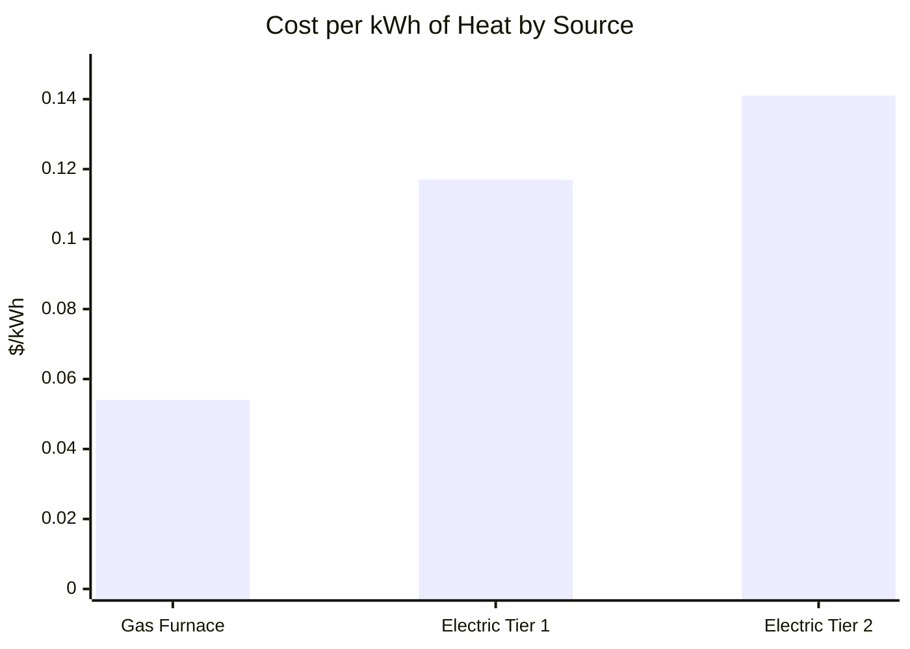

**Calculation:**

| Energy Source | Rate | Efficiency | Cost per kWh Heat |
|---------------|------|------------|-------------------|
| Natural Gas | $13.75/GJ | 92% (furnace) | $13.75 ÷ 277.78 ÷ 0.92 = **$0.054** |
| BC Hydro Tier 1 | $0.1172/kWh | 100% (resistive) | **$0.117** |
| BC Hydro Tier 2 | $0.1408/kWh | 100% (resistive) | **$0.141** |

**Gas furnace delivers heat at 46% the cost of Tier 1 electric, and 38% the cost of Tier 2.**

### Heat Pump Considerations

Your heat pump's heating efficiency depends on outdoor temperature:

| Outdoor Temp | Heat Pump COP | Electric Cost/kWh Heat | vs Gas |
|--------------|---------------|------------------------|--------|
| 10°C (50°F) | ~3.0 | $0.039-$0.047 | Cheaper than gas |
| 5°C (41°F) | ~2.5 | $0.047-$0.056 | Break-even |
| 0°C (32°F) | ~2.0 | $0.059-$0.070 | Gas cheaper |
| -5°C (23°F) | ~1.5 | $0.078-$0.094 | Gas much cheaper |

**Recommendation:** Use heat pump for heating when temps are above 5°C; rely on gas furnace below 5°C.

---

## Winter Electricity Spike Analysis

### Evidence of Electric Space Heater Usage

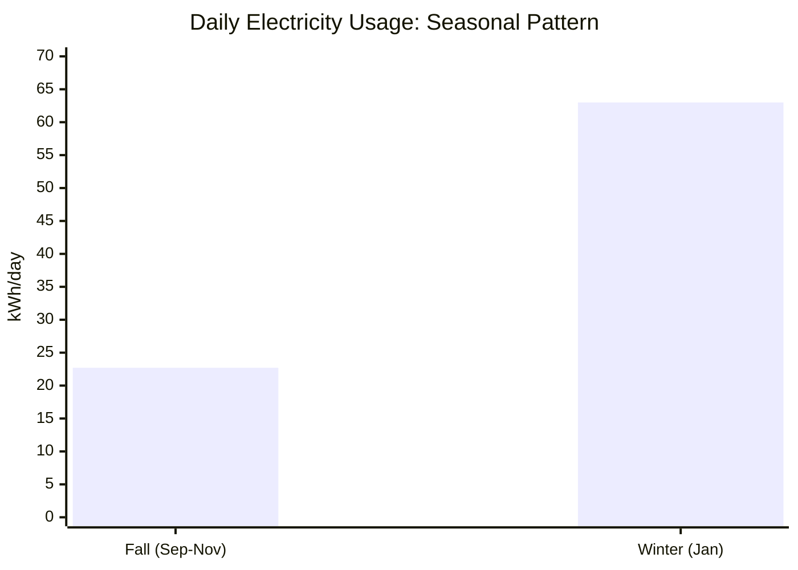

| Period | Daily kWh | Baseline | Heating Load | Monthly Cost |
|--------|-----------|----------|--------------|--------------|
| **Fall** (Sep-Nov) | 22.7 | 22.7 | ~0 | $89/month |
| **Winter** (Jan) | 63.0 | 22.7 | **40.3** | $258/month |

**The 40 kWh/day increase (1.68 kW continuous) strongly suggests significant electric space heater usage.**

### What 40 kWh/day of Electric Heating Costs

```
Monthly Electric Heating Cost (40 kWh/day × 31 days):
  1,240 kWh × $0.13/kWh (blended rate) = $161/month

If Same Heat Came from Gas Furnace:
  Heat needed: 1,240 kWh
  Gas required: 1,240 ÷ 0.92 efficiency = 1,348 kWh = 4.85 GJ
  Gas cost: 4.85 GJ × $13.75/GJ = $67/month

MONTHLY SAVINGS BY USING GAS: $161 - $67 = $94/month
```

### Gas Usage Correlation

Your FortisBC history confirms furnace usage tracks temperature:

| Period | Avg Temp | Gas (GJ) | GJ/day | Notes |
|--------|----------|----------|--------|-------|
| Jan 2026 | 6°C | 10.2 | 0.32 | Current bill |
| Feb 2025 | 2°C | 13.8 | 0.43 | Coldest month, highest gas |
| Aug 2025 | 20°C | 2.4 | 0.08 | Summer baseline (hot water) |

**Summer baseline:** ~2 GJ/month (hot water + cooking)
**Winter heating:** ~8-12 GJ/month additional

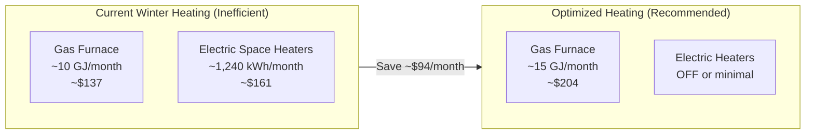

---

## BC Hydro Rate Plan Analysis

*This section analyzes electricity rate plans independent of the gas/electric heating question.*

---

## Your Billing Profile

### Account Details

| Detail | Value |
|--------|-------|
| **Account Number** | 1 2094 937 |
| **Meter Number** | 5101641 |
| **Current Rate** | Residential Tiered (RS 1101) |
| **Billing Cycle** | Bi-monthly (~62 days) |
| **Cycle Dates** | ~26th to ~26th |
| **Next Reading** | January 27, 2026 |

### Actual Bill Breakdown (Sep 26 - Nov 26, 2025)

```
Total Usage: 1,408 kWh over 62 days

Basic Charge:        62 days × $0.2330/day     =  $14.45
Tier 1 Energy:    1,376 kWh × $0.1172/kWh     = $161.27
Tier 2 Energy:       32 kWh × $0.1408/kWh     =   $4.51
                                               ─────────
Subtotal:                                      $180.23
Deferral Rate Rider: -4.5%                     =  -$8.11
Transit Levy:        62 days × $0.0624/day     =   $3.87
                                               ─────────
Pre-tax Total:                                 $175.99
GST (5%):                                      =   $8.80
                                               ─────────
TOTAL DUE:                                     $184.79
```

---

## Seasonal Usage Comparison

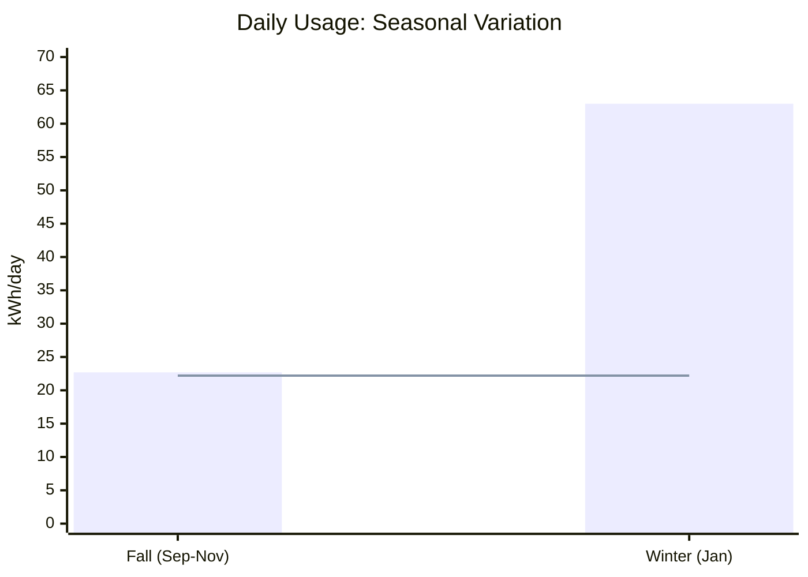
*Red line = Tier 1 threshold (22.1918 kWh/day)*

| Season | Period | Daily Avg | vs Threshold | Tier 2 Exposure |
|--------|--------|-----------|--------------|-----------------|
| **Fall** | Sep-Nov 2025 | 22.7 kWh | +2.3% | 2.3% of usage |
| **Winter** | Jan 2026 | 63.0 kWh | +184% | 65% of usage |

### Winter Heating Impact

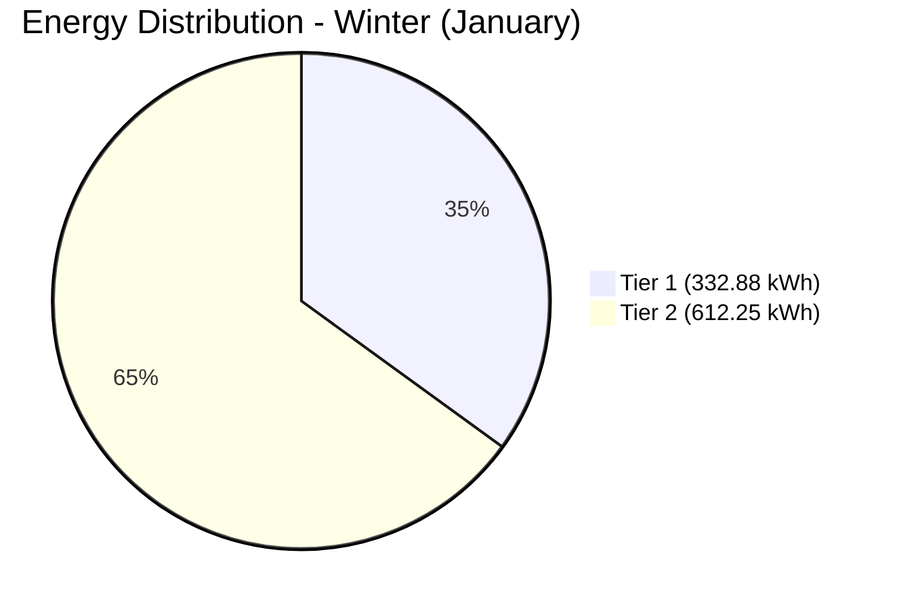

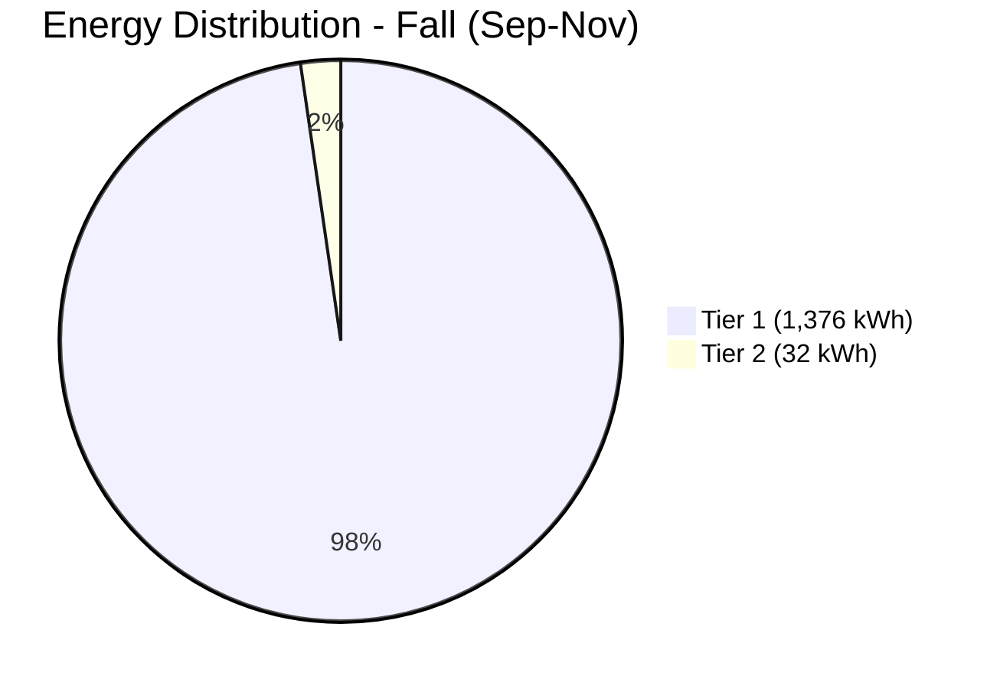

| Metric | Fall (Actual Bill) | Winter (Monitored) |
|--------|--------------------|--------------------|
| **Energy/Period** | 1,408 kWh / 62 days | ~3,906 kWh / 62 days* |
| **Daily Average** | 22.7 kWh | 63.0 kWh |
| **Tier 2 kWh** | 32 kWh (2.3%) | ~2,530 kWh (65%) |
| **Average Power** | ~946 W | 1,039 W |

*Winter projection based on 15 days of monitored data*

### Consumption Pattern

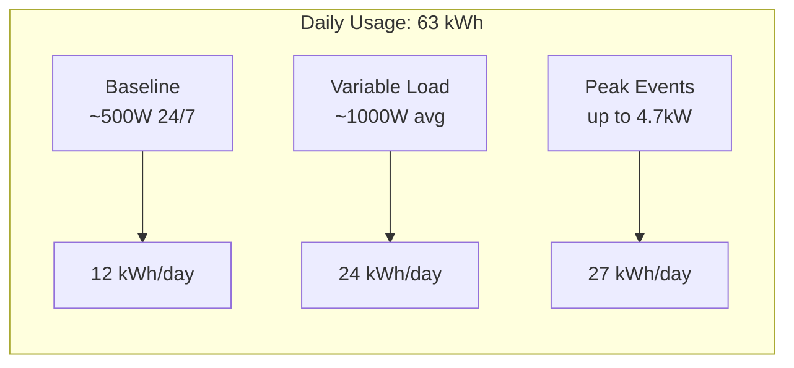

---

## BC Hydro Rate Plans Comparison

### Plan Overview

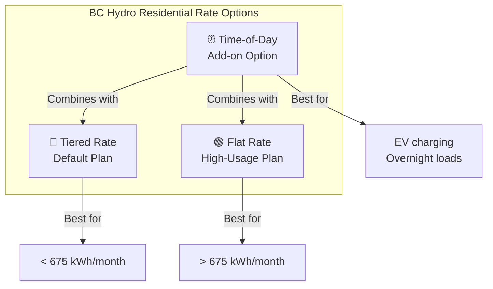

### Rate Structure

| Component | Tiered Rate | Flat Rate | Difference |
|-----------|-------------|-----------|------------|
| **Tier 1 / Base Rate** | $0.1172/kWh | $0.1263/kWh | +$0.0091 |
| **Tier 2 Rate** | $0.1408/kWh | N/A | - |
| **Daily Basic Charge** | $0.2330/day | $0.2485/day | +$0.0155 |
| **Monthly Basic Charge** | ~$7.00/month | ~$7.46/month | +$0.46 |

### Time-of-Day Modifiers (Optional Add-on)

| Period | Hours | Modifier |
|--------|-------|----------|
| **Overnight** | 11 PM - 7 AM | **-$0.05/kWh** |
| **Off-Peak** | 7 AM - 4 PM, 9 PM - 11 PM | No change |
| **On-Peak** | 4 PM - 9 PM | **+$0.05/kWh** |


---

## Cost Projections: Complete Analysis

### All Charges Included

Your bill includes charges beyond just energy:

| Charge Type | Tiered Rate | Flat Rate |
|-------------|-------------|-----------|
| Basic Charge | $0.2330/day | $0.2485/day |
| Tier 1 / Flat Rate | $0.1172/kWh | $0.1263/kWh |
| Tier 2 Rate | $0.1408/kWh | N/A |
| Deferral Rider | -4.5% | -4.5% |
| Transit Levy | $0.0624/day | $0.0624/day |
| GST | 5% | 5% |

### Seasonal Cost Comparison (62-day billing period)

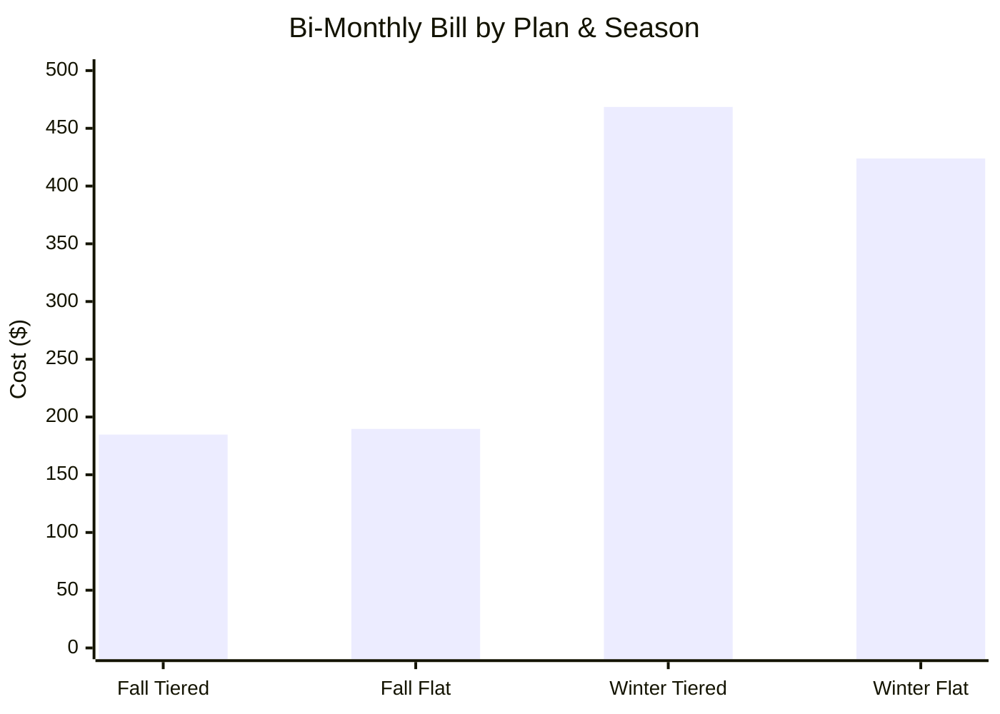

#### Fall Period (Sep-Nov): 1,408 kWh / 62 days

**Tiered Rate (Actual Bill)**
```
Basic Charge:     62 × $0.2330          =  $14.45
Tier 1:        1,376 × $0.1172          = $161.27
Tier 2:           32 × $0.1408          =   $4.51
                                         ─────────
Subtotal:                                $180.23
Deferral Rider: -4.5%                   =  -$8.11
Transit Levy:     62 × $0.0624          =   $3.87
                                         ─────────
Pre-tax:                                 $175.99
GST 5%:                                  =  $8.80
                                         ─────────
TOTAL:                                   $184.79 ✓ (matches bill)
```

**Flat Rate (Hypothetical)**
```
Basic Charge:     62 × $0.2485          =  $15.41
Energy:        1,408 × $0.1263          = $177.83
                                         ─────────
Subtotal:                                $193.24
Deferral Rider: -4.5%                   =  -$8.70
Transit Levy:     62 × $0.0624          =   $3.87
                                         ─────────
Pre-tax:                                 $188.41
GST 5%:                                  =  $9.42
                                         ─────────
TOTAL:                                   $197.83

DIFFERENCE: Flat costs $13.04 MORE in fall
```

#### Winter Period (Jan): ~3,906 kWh / 62 days (projected)

**Tiered Rate (Projected)**
```
Threshold:        62 × 22.1918          = 1,376 kWh
Tier 2 Usage:  3,906 - 1,376            = 2,530 kWh

Basic Charge:     62 × $0.2330          =  $14.45
Tier 1:        1,376 × $0.1172          = $161.27
Tier 2:        2,530 × $0.1408          = $356.22
                                         ─────────
Subtotal:                                $531.94
Deferral Rider: -4.5%                   = -$23.94
Transit Levy:     62 × $0.0624          =   $3.87
                                         ─────────
Pre-tax:                                 $511.87
GST 5%:                                  = $25.59
                                         ─────────
TOTAL:                                   $537.46
```

**Flat Rate (Projected)**
```
Basic Charge:     62 × $0.2485          =  $15.41
Energy:        3,906 × $0.1263          = $493.33
                                         ─────────
Subtotal:                                $508.74
Deferral Rider: -4.5%                   = -$22.89
Transit Levy:     62 × $0.0624          =   $3.87
                                         ─────────
Pre-tax:                                 $489.72
GST 5%:                                  = $24.49
                                         ─────────
TOTAL:                                   $514.21

DIFFERENCE: Flat SAVES $23.25 in winter
```

### Annual Cost Projection

Assuming seasonal pattern:
- **4 months winter** (Nov-Feb): ~63 kWh/day
- **4 months summer** (May-Aug): ~18 kWh/day (estimated)
- **4 months shoulder** (Mar-Apr, Sep-Oct): ~23 kWh/day

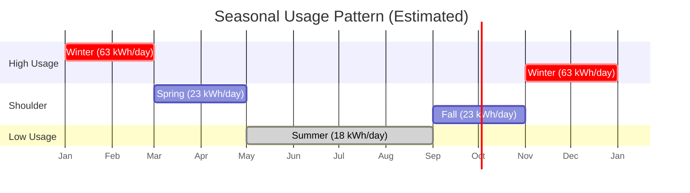

| Season | Months | Daily kWh | Bi-monthly kWh | Tiered Cost | Flat Cost |
|--------|--------|-----------|----------------|-------------|-----------|
| Winter | 4 | 63 | 3,906 | $537.46 | $514.21 |
| Shoulder | 4 | 23 | 1,426 | $186.68 | $199.61 |
| Summer | 4 | 18 | 1,116 | $150.23 | $163.27 |

**Annual Totals (6 billing periods)**

| Plan | Winter (×2) | Shoulder (×2) | Summer (×2) | **Annual** |
|------|-------------|---------------|-------------|------------|
| **Tiered** | $1,074.92 | $373.36 | $300.46 | **$1,748.74** |
| **Flat** | $1,028.42 | $399.22 | $326.54 | **$1,754.18** |

**Annual Difference: Flat costs ~$5 MORE per year**

### Time-of-Day Impact (Optional Add-on)

If you can shift 30% of usage to overnight (11 PM - 7 AM):

| Usage | kWh | ToD Adjustment |
|-------|-----|----------------|
| Overnight (30%) | varies | -$0.05/kWh |
| Off-Peak (50%) | varies | $0.00/kWh |
| On-Peak (20%) | varies | +$0.05/kWh |

**Net ToD Impact:** -$0.005/kWh average (30% × -5¢ + 20% × +5¢)

For winter period (3,906 kWh): ~$19.53 savings
For annual (est. 13,000 kWh): ~$65 savings

### Break-Even Analysis

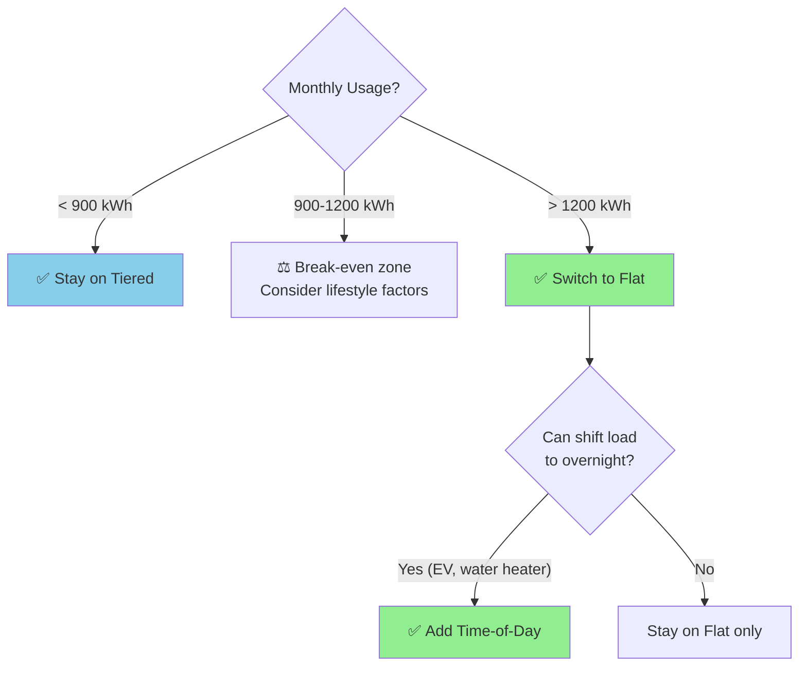

The **break-even point** between Tiered and Flat is approximately **900-950 kWh/month**:

| Monthly Usage | Best Plan | Annual Difference |
|---------------|-----------|-------------------|
| 500 kWh | Tiered | Tiered saves ~$36/year |
| 675 kWh | Tiered | Tiered saves ~$18/year |
| 900 kWh | Break-even | ~$0 difference |
| 1,200 kWh | Flat | Flat saves ~$48/year |
| 1,500 kWh | Flat | Flat saves ~$96/year |
| **1,890 kWh** | **Flat** | **Flat saves ~$135/year** |
| 2,500 kWh | Flat | Flat saves ~$216/year |

---

## Recommendation

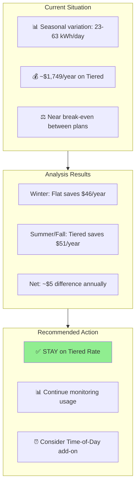

### Primary Recommendation: **Stay on Tiered Rate**

| Factor | Assessment |
|--------|------------|
| Annual Cost (Tiered) | $1,748.74 |
| Annual Cost (Flat) | $1,754.18 |
| **Difference** | **Tiered saves ~$5/year** |
| Seasonal Pattern | High variation favors Tiered |

**Why Tiered wins for your usage pattern:**

Your fall bill showed you're barely over the Tier 1 threshold (only 32 kWh in Tier 2). The Flat Rate's higher base price ($0.1263 vs $0.1172) costs more during your low-usage months, which offsets the savings during high-usage winter months.

```mermaid
quadrantChart
    title Rate Plan Decision Matrix
    x-axis Low Usage --> High Usage
    y-axis Seasonal Variation Low --> Seasonal Variation High
    quadrant-1 Flat Rate (consistent high use)
    quadrant-2 Either Plan (monitor closely)
    quadrant-3 Tiered Rate (low use)
    quadrant-4 Tiered Rate (variable use)
    Your Profile: [0.65, 0.85]
```

### Secondary Recommendation: **Consider Time-of-Day Add-on**

Since the base plans are nearly equal, Time-of-Day pricing offers the best opportunity for savings:

| Scenario | Annual Savings |
|----------|----------------|
| 30% overnight usage | ~$65/year |
| 40% overnight usage | ~$90/year |
| 50% overnight usage (EV charging) | ~$115/year |

**Best candidates for overnight shifting:**
- Electric vehicle charging
- Electric water heater (with timer)
- Dishwasher/laundry (delayed start)
- Pool/hot tub equipment

### Action Items

1. **Stay on Tiered Rate** - No change needed
2. **Add Time-of-Day pricing** if you can shift loads to 11 PM - 7 AM
3. **Continue monitoring** with Eagle-200 to track seasonal patterns
4. **Reassess in spring** after a full winter of monitored data

---

## How to Switch Plans

1. **Log in** to [bchydro.com](https://www.bchydro.com)
2. Navigate to **My Account** → **Rates**
3. Select **Change Rate Plan**
4. Choose **Flat Rate** (Schedule 1151)
5. Optionally add **Time-of-Day Pricing**

Changes typically take effect on your next billing cycle.

---

## Monitoring Your Savings

After switching, use your Eagle-200 monitor to track:

1. **Monthly consumption** - Verify it stays above break-even (~900 kWh)
2. **Time-of-day patterns** - If using ToD, maximize overnight usage
3. **Seasonal variations** - Summer vs winter consumption differences

The `/api/stats` endpoint now includes billing period calculations that can be extended to support Flat Rate and Time-of-Day comparisons.

---

## Appendix: Rate Schedule References

| Plan | BC Hydro Schedule | Effective Date |
|------|-------------------|----------------|
| Tiered Rate | RS 1101 | Current |
| Flat Rate | RS 1151 | Current |
| Time-of-Day | Add-on to RS 1101/1151 | Current |

---

## References

### BC Hydro Rate Documentation

1. **[Residential Rates Overview](https://app.bchydro.com/accounts-billing/rates-energy-use/electricity-rates/residential-rates.html)**
   Main page explaining all residential rate options available to BC Hydro customers.

2. **[Tiered Conservation Rate (RS 1101)](https://app.bchydro.com/accounts-billing/rates-energy-use/electricity-rates/residential-rates/tiered-conservation.html)**
   Default residential rate with two-tier pricing structure. Tier 1 threshold is 22.1918 kWh/day (~675 kWh/month).

3. **[Flat Rate (RS 1151)](https://app.bchydro.com/accounts-billing/rates-energy-use/electricity-rates/residential-rates/equal-flat.html)**
   Alternative rate for high-usage households. Single flat rate for all consumption.

4. **[Time-of-Day Pricing](https://app.bchydro.com/accounts-billing/rates-energy-use/electricity-rates/residential-rates/time-of-use.html)**
   Optional add-on providing ±$0.05/kWh rate adjustments based on time periods.

5. **[Electric Tariff Schedule](https://www.bchydro.com/about/planning_regulatory/tariff.html)**
   Official tariff documentation with full rate schedules and terms.

6. **[Rate Calculator](https://app.bchydro.com/accounts-billing/rates-energy-use/compare-your-rate.html)**
   BC Hydro's online tool to compare rate plans based on your usage.

### Hardware Documentation

7. **[Rainforest EAGLE-200 Energy Monitor](https://rainforestautomation.com/rfa-z114-eagle-200-2/)**
   Real-time energy monitoring device used for data collection.

8. **[EAGLE-200 Local API Manual](https://rainforestautomation.com/wp-content/uploads/2017/02/EAGLE-200-Local-API-Manual-v1.0.pdf)**
   Technical documentation for the Eagle-200 XML data format and dual Zigbee radio architecture.

### FortisBC Natural Gas Documentation

9. **[FortisBC Natural Gas Rates](https://www.fortisbc.com/gas/gas-rates)**
   Current natural gas rate schedules for residential customers.

10. **[FortisBC Account Online](https://accounts.fortisbc.com/)**
    Online portal for viewing usage history and bill details.

11. **[FortisBC Energy Saving Tips](https://www.fortisbc.com/energy-savings/energy-saving-tips)**
    Recommendations for reducing natural gas consumption.

12. **[FortisBC Rate Changes (Jan 2026)](https://www.fortisbc.com/gas/rates)**
    Details on the 11.1% rate increase effective January 1, 2026.

### Data Sources for This Analysis

| Source | Data Used |
|--------|-----------|
| Eagle-200 Monitor | Real-time power (January 2026): 63 kWh/day average |
| BC Hydro Bill #111016322656 | Fall usage (Sep-Nov 2025): 22.7 kWh/day, $184.79 total |
| FortisBC Bill #4421276 | Gas usage (Dec 2025-Jan 2026): 10.2 GJ, $139.14 total |
| FortisBC Usage History | 24-month gas consumption vs temperature correlation |
| InfluxDB (`energy` bucket) | Historical power_w, energy_kwh, price_per_kwh |

### Real-Time Monitoring API

Your installation provides live data at:

- **Dashboard**: [linknode.com](https://linknode.com) - Real-time power consumption display
- **Grafana**: [linknode.com/grafana](https://linknode.com/grafana) - Detailed analytics
- **API Endpoint**: `https://linknode.com/api/stats` - JSON response with:
  ```json
  {
    "current_power_watts": 1039,
    "billing_period": {
      "start": "2025-12-26T00:00:00Z",
      "days_elapsed": 20,
      "energy_kwh": 1261.2,
      "tiered_cost": {
        "tier1_kwh": 443.84,
        "tier2_kwh": 817.36,
        "basic_charge": 4.66,
        "energy_cost": 167.00,
        "total": 171.66
      }
    }
  }
  ```

---

*Document generated: January 15, 2026*
*Analysis by: Murray Kopit using Eagle-200 monitor data, BC Hydro rates, and FortisBC gas rates*
