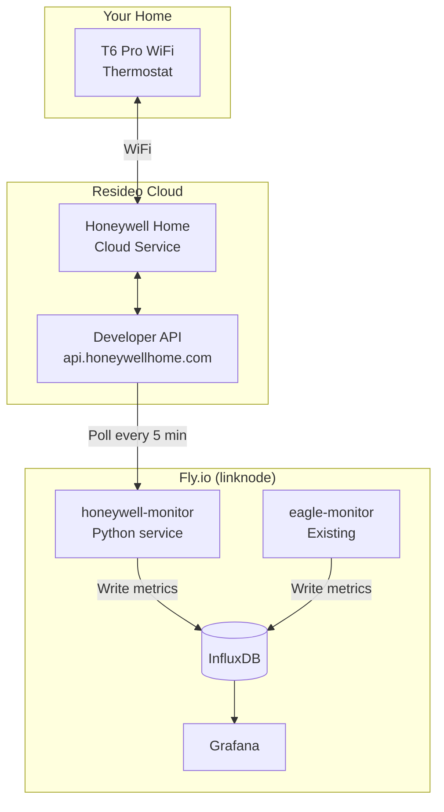
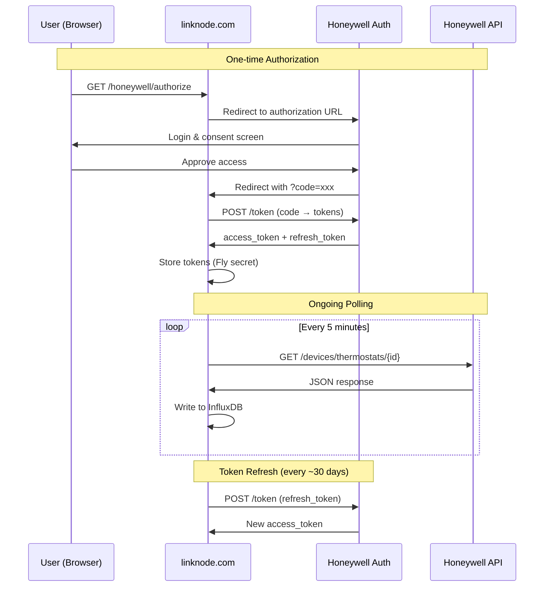

# Honeywell Thermostat Monitor - Implementation Plan

> **Status:** Planning (awaiting thermostat installation)
> **Target Device:** Honeywell T6 Pro WiFi (TH6220WF2006)
> **Integration:** Fly.io → InfluxDB → Grafana (same stack as Eagle-200 monitor)

## Overview

This service polls the Resideo/Honeywell Home API to capture thermostat state and calculates furnace runtime metrics that aren't directly available from the API.



---

## Prerequisites

### Hardware
- [ ] Honeywell T6 Pro WiFi (TH6220WF2006) installed and connected to WiFi
- [ ] Thermostat registered in Resideo app

### Accounts Required
- [ ] **Resideo App Account**: [Download App](https://www.resideo.com/us/en/resideo-smart-home-app/)
- [ ] **Honeywell Developer Account**: [Register Here](https://developer.honeywellhome.com/user/register)
  - Use the **same email** as your Resideo app account

### Developer Portal Setup
1. Log in to [developer.honeywellhome.com](https://developer.honeywellhome.com/)
2. Create a new application:
   - **App Name:** `linknode-monitor` (no special characters)
   - **Callback URL:** `https://linknode.com/honeywell/callback`
3. Note down:
   - **Consumer Key** (= Client ID)
   - **Consumer Secret** (= Client Secret)

---

## Reference Documentation

| Resource | URL | Purpose |
|----------|-----|---------|
| Developer Portal | https://developer.honeywellhome.com/ | Account & app management |
| API Methods | https://developer.honeywellhome.com/api-methods | Endpoint reference |
| T-Series Guide | https://developer.honeywellhome.com/content/t-series-thermostat-guide | T6-specific fields |
| Getting Started | https://developer.honeywellhome.com/content/getting-started-guide | OAuth flow |
| Get Thermostat | https://developer.honeywellhome.com/lyric/apis/get/devices/thermostats/%7BdeviceId%7D-0 | Main data endpoint |
| FAQ (Rate Limits) | https://developer.honeywellhome.com/faq-page | 5-min polling limit |
| OpenHAB Binding | https://community.openhab.org/t/resideo-api-binding-for-honeywell-thermostats-and-sensors/159903 | Community implementation reference |

---

## OAuth 2.0 Authorization Flow

The Honeywell API uses OAuth 2.0 with authorization code grant. This is a one-time setup per installation.



### OAuth Endpoints

| Endpoint | URL |
|----------|-----|
| Authorization | `https://api.honeywellhome.com/oauth2/authorize` |
| Token | `https://api.honeywellhome.com/oauth2/token` |
| API Base | `https://api.honeywellhome.com/v2` |

### Authorization URL Parameters

```
https://api.honeywellhome.com/oauth2/authorize?
  response_type=code&
  client_id={CONSUMER_KEY}&
  redirect_uri=https://linknode.com/honeywell/callback&
  scope=&
  state={random_state}
```

### Token Exchange Request

```bash
curl -X POST https://api.honeywellhome.com/oauth2/token \
  -H "Content-Type: application/x-www-form-urlencoded" \
  -d "grant_type=authorization_code" \
  -d "code={AUTH_CODE}" \
  -d "client_id={CONSUMER_KEY}" \
  -d "client_secret={CONSUMER_SECRET}" \
  -d "redirect_uri=https://linknode.com/honeywell/callback"
```

### Token Refresh Request

```bash
curl -X POST https://api.honeywellhome.com/oauth2/token \
  -H "Content-Type: application/x-www-form-urlencoded" \
  -d "grant_type=refresh_token" \
  -d "refresh_token={REFRESH_TOKEN}" \
  -d "client_id={CONSUMER_KEY}" \
  -d "client_secret={CONSUMER_SECRET}"
```

---

## API Polling

### Get Locations (to find locationId)

```bash
curl -H "Authorization: Bearer {ACCESS_TOKEN}" \
  "https://api.honeywellhome.com/v2/locations?apikey={CONSUMER_KEY}"
```

**Response:**
```json
[
  {
    "locationID": 123456,
    "name": "Home",
    "devices": [
      {
        "deviceID": "LCC-XXXXXXXXXXXXXX",
        "deviceType": "Thermostat",
        "name": "Main Floor"
      }
    ]
  }
]
```

### Get Thermostat Data (main polling endpoint)

```bash
curl -H "Authorization: Bearer {ACCESS_TOKEN}" \
  "https://api.honeywellhome.com/v2/devices/thermostats/{deviceId}?apikey={CONSUMER_KEY}&locationId={locationId}"
```

**Expected Response (T6 Pro):**
```json
{
  "deviceID": "LCC-XXXXXXXXXXXXXX",
  "name": "Main Floor",
  "isAlive": true,
  "deviceClass": "Thermostat",
  "deviceType": "Thermostat",
  "units": "Celsius",
  "indoorTemperature": 20.5,
  "outdoorTemperature": 5.0,
  "displayedOutdoorHumidity": 65,
  "indoorHumidity": 35,
  "heatSetpoint": 20.0,
  "coolSetpoint": 24.0,
  "operationStatus": {
    "mode": "Heat",
    "fanRequest": true,
    "circulationFanRequest": false
  },
  "thermostatSetpointStatus": "NoHold",
  "currentSchedulePeriod": {
    "day": "Monday",
    "period": "Wake"
  },
  "scheduleStatus": "Resume",
  "settings": {
    "fan": {
      "changeableValues": {
        "mode": "Auto"
      }
    }
  }
}
```

### Key Fields to Capture

| Field | Type | Description | InfluxDB Field |
|-------|------|-------------|----------------|
| `operationStatus.mode` | string | "Heat", "Cool", "Off" | `hvac_mode` (tag) |
| `operationStatus.fanRequest` | bool | Furnace actively running | `heating_active` |
| `indoorTemperature` | float | Current indoor temp | `indoor_temp_c` |
| `heatSetpoint` | float | Heat target | `heat_setpoint_c` |
| `outdoorTemperature` | float | Outdoor temp (if available) | `outdoor_temp_c` |
| `indoorHumidity` | int | Indoor humidity % | `indoor_humidity` |
| `thermostatSetpointStatus` | string | Hold status | `hold_status` (tag) |

---

## InfluxDB Data Model

### Measurement: `thermostat`

```
thermostat,device_id=LCC-XXX,hvac_mode=Heat heating_active=true,indoor_temp_c=20.5,heat_setpoint_c=20.0,outdoor_temp_c=5.0,indoor_humidity=35i 1704067200000000000
```

| Component | Value | Description |
|-----------|-------|-------------|
| **Measurement** | `thermostat` | Main measurement name |
| **Tags** | `device_id`, `hvac_mode`, `hold_status` | Indexed for filtering |
| **Fields** | `heating_active`, `indoor_temp_c`, etc. | Actual values |
| **Timestamp** | Unix nanoseconds | From API or current time |

### Retention Policy

Use the existing `energy` bucket with default retention, or create a dedicated bucket:

```bash
influx bucket create \
  --name thermostat \
  --org linknode \
  --retention 365d
```

---

## Runtime Calculation Algorithms

Since the API only provides current state (not historical runtime), we calculate metrics from state changes.

### Algorithm 1: Daily Runtime Hours

```flux
// Calculate total heating runtime in the last 24 hours
// Uses stateDuration to track how long heating_active was true

from(bucket: "energy")
  |> range(start: -24h)
  |> filter(fn: (r) => r._measurement == "thermostat")
  |> filter(fn: (r) => r._field == "heating_active")
  |> stateDuration(fn: (r) => r._value == true, unit: 1h)
  |> last()
  |> map(fn: (r) => ({r with _value: r.stateDuration}))

// Result: runtime_hours (float)
```

### Algorithm 2: Cycle Count

```flux
// Count heating cycles (transitions from false to true)

from(bucket: "energy")
  |> range(start: -24h)
  |> filter(fn: (r) => r._measurement == "thermostat")
  |> filter(fn: (r) => r._field == "heating_active")
  |> difference()
  |> filter(fn: (r) => r._value == 1)  // false→true transitions
  |> count()

// Result: cycle_count (int)
```

### Algorithm 3: Duty Cycle Percentage

```flux
// Calculate what percentage of time the furnace was running

runtime = from(bucket: "energy")
  |> range(start: -24h)
  |> filter(fn: (r) => r._measurement == "thermostat")
  |> filter(fn: (r) => r._field == "heating_active")
  |> stateDuration(fn: (r) => r._value == true, unit: 1s)
  |> last()
  |> findRecord(fn: (key) => true, idx: 0)

duty_cycle = float(v: runtime.stateDuration) / (24.0 * 3600.0) * 100.0

// Result: duty_cycle_percent (float, 0-100)
```

### Algorithm 4: Runtime vs Outdoor Temperature Correlation

```flux
// Join thermostat runtime with outdoor temperature
// to analyze heating efficiency

runtime_data = from(bucket: "energy")
  |> range(start: -7d)
  |> filter(fn: (r) => r._measurement == "thermostat")
  |> filter(fn: (r) => r._field == "heating_active")
  |> aggregateWindow(every: 1h, fn: (tables=<-, column) =>
      tables |> stateDuration(fn: (r) => r._value == true, unit: 1m) |> last())

outdoor_temp = from(bucket: "energy")
  |> range(start: -7d)
  |> filter(fn: (r) => r._measurement == "thermostat")
  |> filter(fn: (r) => r._field == "outdoor_temp_c")
  |> aggregateWindow(every: 1h, fn: mean)

join(
  tables: {runtime: runtime_data, temp: outdoor_temp},
  on: ["_time"]
)
```

### Algorithm 5: Gas Usage Correlation

```flux
// Correlate furnace runtime with actual gas consumption
// Requires manual gas meter reads or future gas meter integration

// Hypothesis: runtime_hours × furnace_btu_rating ≈ gas_gj_used
// If 100,000 BTU furnace runs 4 hours:
// 100,000 BTU/hr × 4 hr = 400,000 BTU = 0.422 GJ

// This can validate furnace efficiency over time
```

---

## File Structure

```
fly/honeywell-monitor/
├── app.py                 # Main Flask application
├── honeywell_client.py    # API client with OAuth handling
├── influx_writer.py       # InfluxDB write operations
├── config.py              # Configuration management
├── Dockerfile
├── fly.toml
├── requirements.txt
└── README.md
```

### app.py - Main Application

```python
"""
Honeywell Thermostat Monitor for Fly.io

Polls Honeywell Home API every 5 minutes and writes state to InfluxDB.
Runtime metrics are calculated in Grafana using Flux queries.
"""

import os
import time
import logging
from datetime import datetime, timezone
from flask import Flask, request, redirect, jsonify
from honeywell_client import HoneywellClient
from influx_writer import InfluxWriter

app = Flask(__name__)
logging.basicConfig(level=logging.INFO)
logger = logging.getLogger(__name__)

# Configuration
POLL_INTERVAL_SECONDS = 300  # 5 minutes (API rate limit)
INFLUXDB_URL = os.getenv('INFLUXDB_URL', 'http://linknode-influxdb.internal:8086')
INFLUXDB_TOKEN = os.getenv('INFLUXDB_TOKEN')
INFLUXDB_ORG = os.getenv('INFLUXDB_ORG', 'linknode')
INFLUXDB_BUCKET = os.getenv('INFLUXDB_BUCKET', 'energy')

# Initialize clients
honeywell = HoneywellClient(
    client_id=os.getenv('HONEYWELL_CLIENT_ID'),
    client_secret=os.getenv('HONEYWELL_CLIENT_SECRET'),
    redirect_uri=os.getenv('HONEYWELL_REDIRECT_URI', 'https://linknode.com/honeywell/callback')
)
influx = InfluxWriter(INFLUXDB_URL, INFLUXDB_TOKEN, INFLUXDB_ORG, INFLUXDB_BUCKET)

# Polling state
last_poll_time = None
last_thermostat_data = None
poll_count = 0
error_count = 0


@app.route('/')
def index():
    """Service information endpoint."""
    return jsonify({
        'service': 'honeywell-monitor',
        'status': 'running',
        'poll_interval_seconds': POLL_INTERVAL_SECONDS,
        'last_poll': last_poll_time.isoformat() if last_poll_time else None,
        'poll_count': poll_count,
        'error_count': error_count,
        'authorized': honeywell.is_authorized()
    })


@app.route('/health')
def health():
    """Health check endpoint."""
    return jsonify({'status': 'healthy'})


@app.route('/honeywell/authorize')
def authorize():
    """Initiate OAuth authorization flow."""
    auth_url = honeywell.get_authorization_url()
    return redirect(auth_url)


@app.route('/honeywell/callback')
def callback():
    """OAuth callback - exchange code for tokens."""
    code = request.args.get('code')
    state = request.args.get('state')

    if not code:
        return jsonify({'error': 'No authorization code received'}), 400

    try:
        honeywell.exchange_code(code)
        return jsonify({
            'status': 'authorized',
            'message': 'Honeywell account linked successfully'
        })
    except Exception as e:
        logger.error(f"OAuth callback error: {e}")
        return jsonify({'error': str(e)}), 500


@app.route('/api/thermostat')
def get_thermostat():
    """Get current thermostat data."""
    if not honeywell.is_authorized():
        return jsonify({'error': 'Not authorized. Visit /honeywell/authorize'}), 401

    return jsonify(last_thermostat_data or {'error': 'No data yet'})


@app.route('/api/stats')
def get_stats():
    """Get polling statistics."""
    return jsonify({
        'poll_count': poll_count,
        'error_count': error_count,
        'last_poll': last_poll_time.isoformat() if last_poll_time else None,
        'last_data': last_thermostat_data
    })


def poll_thermostat():
    """Poll thermostat and write to InfluxDB."""
    global last_poll_time, last_thermostat_data, poll_count, error_count

    if not honeywell.is_authorized():
        logger.warning("Not authorized - skipping poll")
        return

    try:
        # Get thermostat data
        data = honeywell.get_thermostat_data()

        if data:
            last_thermostat_data = data
            last_poll_time = datetime.now(timezone.utc)
            poll_count += 1

            # Extract fields for InfluxDB
            point = {
                'measurement': 'thermostat',
                'tags': {
                    'device_id': data.get('deviceID', 'unknown'),
                    'hvac_mode': data.get('operationStatus', {}).get('mode', 'Unknown'),
                    'hold_status': data.get('thermostatSetpointStatus', 'Unknown')
                },
                'fields': {
                    'heating_active': data.get('operationStatus', {}).get('fanRequest', False),
                    'indoor_temp_c': float(data.get('indoorTemperature', 0)),
                    'heat_setpoint_c': float(data.get('heatSetpoint', 0)),
                    'cool_setpoint_c': float(data.get('coolSetpoint', 0)),
                    'indoor_humidity': int(data.get('indoorHumidity', 0)),
                },
                'time': last_poll_time
            }

            # Add outdoor temp if available
            if 'outdoorTemperature' in data:
                point['fields']['outdoor_temp_c'] = float(data['outdoorTemperature'])

            # Write to InfluxDB
            influx.write_point(point)
            logger.info(f"Poll #{poll_count}: {point['tags']['hvac_mode']}, "
                       f"heating={point['fields']['heating_active']}, "
                       f"temp={point['fields']['indoor_temp_c']}°C")

    except Exception as e:
        error_count += 1
        logger.error(f"Poll error: {e}")


def polling_loop():
    """Background polling loop."""
    while True:
        poll_thermostat()
        time.sleep(POLL_INTERVAL_SECONDS)


if __name__ == '__main__':
    import threading

    # Start polling in background thread
    poll_thread = threading.Thread(target=polling_loop, daemon=True)
    poll_thread.start()

    # Run Flask app
    app.run(host='0.0.0.0', port=8080)
```

### honeywell_client.py - API Client

```python
"""
Honeywell Home API Client with OAuth 2.0 handling.

Reference: https://developer.honeywellhome.com/
"""

import os
import json
import requests
import logging
from datetime import datetime, timedelta
from urllib.parse import urlencode

logger = logging.getLogger(__name__)

# Token storage file (persisted via Fly volume or secrets)
TOKEN_FILE = '/data/honeywell_tokens.json'


class HoneywellClient:
    AUTH_URL = 'https://api.honeywellhome.com/oauth2/authorize'
    TOKEN_URL = 'https://api.honeywellhome.com/oauth2/token'
    API_BASE = 'https://api.honeywellhome.com/v2'

    def __init__(self, client_id, client_secret, redirect_uri):
        self.client_id = client_id
        self.client_secret = client_secret
        self.redirect_uri = redirect_uri
        self.tokens = self._load_tokens()
        self.location_id = None
        self.device_id = None

    def _load_tokens(self):
        """Load tokens from persistent storage."""
        try:
            if os.path.exists(TOKEN_FILE):
                with open(TOKEN_FILE, 'r') as f:
                    return json.load(f)
        except Exception as e:
            logger.error(f"Error loading tokens: {e}")
        return {}

    def _save_tokens(self):
        """Save tokens to persistent storage."""
        try:
            os.makedirs(os.path.dirname(TOKEN_FILE), exist_ok=True)
            with open(TOKEN_FILE, 'w') as f:
                json.dump(self.tokens, f)
        except Exception as e:
            logger.error(f"Error saving tokens: {e}")

    def is_authorized(self):
        """Check if we have valid tokens."""
        return bool(self.tokens.get('access_token'))

    def get_authorization_url(self):
        """Generate OAuth authorization URL."""
        import secrets
        state = secrets.token_urlsafe(16)

        params = {
            'response_type': 'code',
            'client_id': self.client_id,
            'redirect_uri': self.redirect_uri,
            'scope': '',
            'state': state
        }
        return f"{self.AUTH_URL}?{urlencode(params)}"

    def exchange_code(self, code):
        """Exchange authorization code for tokens."""
        data = {
            'grant_type': 'authorization_code',
            'code': code,
            'client_id': self.client_id,
            'client_secret': self.client_secret,
            'redirect_uri': self.redirect_uri
        }

        response = requests.post(self.TOKEN_URL, data=data)
        response.raise_for_status()

        self.tokens = response.json()
        self.tokens['obtained_at'] = datetime.utcnow().isoformat()
        self._save_tokens()

        logger.info("Successfully obtained access tokens")
        return self.tokens

    def _refresh_token(self):
        """Refresh the access token."""
        if not self.tokens.get('refresh_token'):
            raise Exception("No refresh token available")

        data = {
            'grant_type': 'refresh_token',
            'refresh_token': self.tokens['refresh_token'],
            'client_id': self.client_id,
            'client_secret': self.client_secret
        }

        response = requests.post(self.TOKEN_URL, data=data)
        response.raise_for_status()

        new_tokens = response.json()
        self.tokens['access_token'] = new_tokens['access_token']
        if 'refresh_token' in new_tokens:
            self.tokens['refresh_token'] = new_tokens['refresh_token']
        self.tokens['refreshed_at'] = datetime.utcnow().isoformat()
        self._save_tokens()

        logger.info("Successfully refreshed access token")

    def _api_request(self, endpoint, retry_on_401=True):
        """Make authenticated API request."""
        if not self.tokens.get('access_token'):
            raise Exception("Not authorized")

        url = f"{self.API_BASE}{endpoint}"
        if '?' in url:
            url += f"&apikey={self.client_id}"
        else:
            url += f"?apikey={self.client_id}"

        headers = {
            'Authorization': f"Bearer {self.tokens['access_token']}",
            'Content-Type': 'application/json'
        }

        response = requests.get(url, headers=headers)

        # Handle token expiration
        if response.status_code == 401 and retry_on_401:
            logger.info("Access token expired, refreshing...")
            self._refresh_token()
            return self._api_request(endpoint, retry_on_401=False)

        response.raise_for_status()
        return response.json()

    def get_locations(self):
        """Get all locations and devices."""
        return self._api_request('/locations')

    def _ensure_device_info(self):
        """Ensure we have location_id and device_id."""
        if not self.location_id or not self.device_id:
            locations = self.get_locations()
            if locations:
                self.location_id = locations[0]['locationID']
                for device in locations[0].get('devices', []):
                    if device.get('deviceType') == 'Thermostat':
                        self.device_id = device['deviceID']
                        break

            if not self.device_id:
                raise Exception("No thermostat found in account")

            logger.info(f"Found thermostat: {self.device_id} at location {self.location_id}")

    def get_thermostat_data(self):
        """Get current thermostat data."""
        self._ensure_device_info()

        endpoint = f"/devices/thermostats/{self.device_id}?locationId={self.location_id}"
        return self._api_request(endpoint)
```

### Dockerfile

```dockerfile
FROM python:3.11-slim

WORKDIR /app

# Install dependencies
COPY requirements.txt .
RUN pip install --no-cache-dir -r requirements.txt

# Copy application
COPY . .

# Create data directory for token storage
RUN mkdir -p /data

EXPOSE 8080

# Health check
HEALTHCHECK --interval=60s --timeout=10s --start-period=30s --retries=3 \
    CMD python -c "import requests; requests.get('http://localhost:8080/health').raise_for_status()"

CMD ["python", "app.py"]
```

### fly.toml

```toml
app = "linknode-honeywell-monitor"
primary_region = "sea"

[build]

[env]
  INFLUXDB_URL = "http://linknode-influxdb.internal:8086"
  INFLUXDB_ORG = "linknode"
  INFLUXDB_BUCKET = "energy"
  HONEYWELL_REDIRECT_URI = "https://linknode.com/honeywell/callback"

[http_service]
  internal_port = 8080
  force_https = true
  auto_stop_machines = false  # Keep running for continuous polling
  auto_start_machines = true
  min_machines_running = 1

[[http_service.checks]]
  grace_period = "30s"
  interval = "60s"
  method = "GET"
  path = "/health"
  timeout = "10s"

[[mounts]]
  source = "honeywell_data"
  destination = "/data"
```

### requirements.txt

```
flask==3.0.0
requests==2.31.0
influxdb-client==1.38.0
gunicorn==21.2.0
```

---

## Deployment Steps

### Step 1: Create Fly App and Volume

```bash
cd fly/honeywell-monitor

# Create the app
fly apps create linknode-honeywell-monitor

# Create volume for token storage
fly volumes create honeywell_data --region sea --size 1
```

### Step 2: Set Secrets

```bash
# From your Honeywell developer portal
fly secrets set HONEYWELL_CLIENT_ID="your-consumer-key"
fly secrets set HONEYWELL_CLIENT_SECRET="your-consumer-secret"

# InfluxDB token (same as eagle-monitor)
fly secrets set INFLUXDB_TOKEN="your-influxdb-token"
```

### Step 3: Deploy

```bash
fly deploy
```

### Step 4: Authorize Thermostat

1. Visit: `https://linknode-honeywell-monitor.fly.dev/honeywell/authorize`
2. Log in with your Resideo account
3. Approve access
4. Callback will store tokens automatically

### Step 5: Verify Polling

```bash
# Check service status
curl https://linknode-honeywell-monitor.fly.dev/

# Check latest thermostat data
curl https://linknode-honeywell-monitor.fly.dev/api/thermostat

# Check polling stats
curl https://linknode-honeywell-monitor.fly.dev/api/stats
```

---

## Grafana Dashboard Panels

### Panel 1: Furnace Runtime Today

```flux
from(bucket: "energy")
  |> range(start: today())
  |> filter(fn: (r) => r._measurement == "thermostat")
  |> filter(fn: (r) => r._field == "heating_active")
  |> stateDuration(fn: (r) => r._value == true, unit: 1h)
  |> last()
  |> map(fn: (r) => ({_value: r.stateDuration}))
```

**Visualization:** Stat panel, unit: hours

### Panel 2: Heating State Timeline

```flux
from(bucket: "energy")
  |> range(start: v.timeRangeStart, stop: v.timeRangeStop)
  |> filter(fn: (r) => r._measurement == "thermostat")
  |> filter(fn: (r) => r._field == "heating_active")
```

**Visualization:** State timeline (green=on, gray=off)

### Panel 3: Indoor Temperature vs Setpoint

```flux
from(bucket: "energy")
  |> range(start: v.timeRangeStart, stop: v.timeRangeStop)
  |> filter(fn: (r) => r._measurement == "thermostat")
  |> filter(fn: (r) => r._field == "indoor_temp_c" or r._field == "heat_setpoint_c")
```

**Visualization:** Time series, two lines

### Panel 4: Daily Runtime History

```flux
from(bucket: "energy")
  |> range(start: -30d)
  |> filter(fn: (r) => r._measurement == "thermostat")
  |> filter(fn: (r) => r._field == "heating_active")
  |> aggregateWindow(every: 1d, fn: (tables=<-, column) =>
      tables
        |> stateDuration(fn: (r) => r._value == true, unit: 1h)
        |> last()
        |> map(fn: (r) => ({r with _value: r.stateDuration})))
```

**Visualization:** Bar chart, daily bars

### Panel 5: Runtime vs Outdoor Temperature

```flux
// Scatter plot: outdoor temp (x) vs runtime hours (y)
// Shows heating efficiency - steeper slope = more sensitive to cold
```

**Visualization:** XY scatter plot

### Panel 6: Cycles Per Day

```flux
from(bucket: "energy")
  |> range(start: -7d)
  |> filter(fn: (r) => r._measurement == "thermostat")
  |> filter(fn: (r) => r._field == "heating_active")
  |> difference()
  |> filter(fn: (r) => r._value == 1)
  |> aggregateWindow(every: 1d, fn: count)
```

**Visualization:** Bar chart

---

## Future Enhancements

### Phase 2: Gas Meter Integration

If FortisBC meter has pulse output or can be read:
- Correlate actual gas consumption with furnace runtime
- Calculate real furnace efficiency (not assumed 92%)

### Phase 3: Predictive Analytics

- Predict daily gas cost based on weather forecast
- Alert when runtime exceeds expected for given temperature
- Detect furnace efficiency degradation over time

### Phase 4: Automated Optimization

- Integrate with BC Hydro Time-of-Day pricing
- Pre-heat during overnight cheap electricity (if electric backup)
- Optimize setback schedule based on actual thermal performance

---

## Troubleshooting

### "Not authorized" errors
- Visit `/honeywell/authorize` to re-authenticate
- Check if tokens expired (30-day refresh cycle)

### No data in InfluxDB
- Check Fly logs: `fly logs -a linknode-honeywell-monitor`
- Verify InfluxDB connectivity
- Check API rate limits (max 1 poll per 5 minutes)

### Token refresh failures
- Re-authorize from scratch via `/honeywell/authorize`
- Check Honeywell developer portal for app status

---

## References

- [Honeywell Developer Portal](https://developer.honeywellhome.com/)
- [API Methods Reference](https://developer.honeywellhome.com/api-methods)
- [T-Series Thermostat Guide](https://developer.honeywellhome.com/content/t-series-thermostat-guide)
- [OAuth Getting Started](https://developer.honeywellhome.com/content/getting-started-guide)
- [API FAQ & Rate Limits](https://developer.honeywellhome.com/faq-page)
- [Resideo App](https://www.resideo.com/us/en/resideo-smart-home-app/)
- [Monthly Energy Reports](https://www.honeywellhome.com/blogs/support/home-energy-report-what-is-the-report)
- [OpenHAB Binding (community reference)](https://community.openhab.org/t/resideo-api-binding-for-honeywell-thermostats-and-sensors/159903)

---

*Document created: January 15, 2026*
*Status: Ready for implementation when T6 Pro WiFi is installed*
