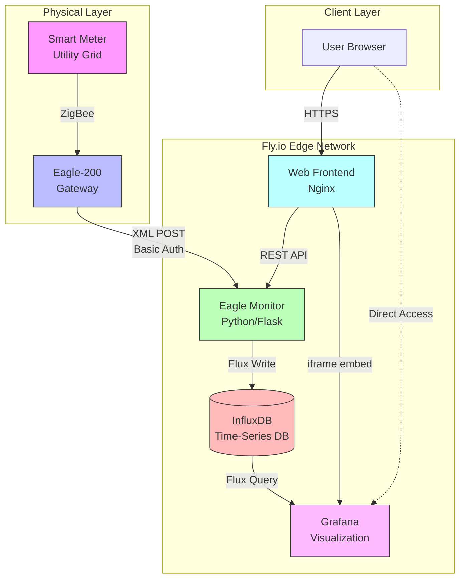
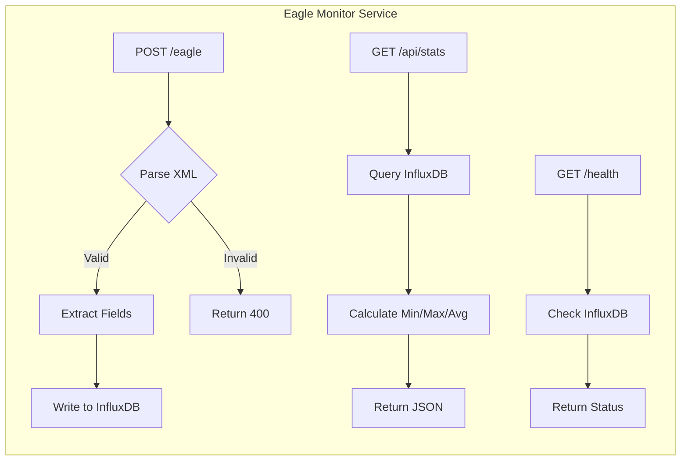
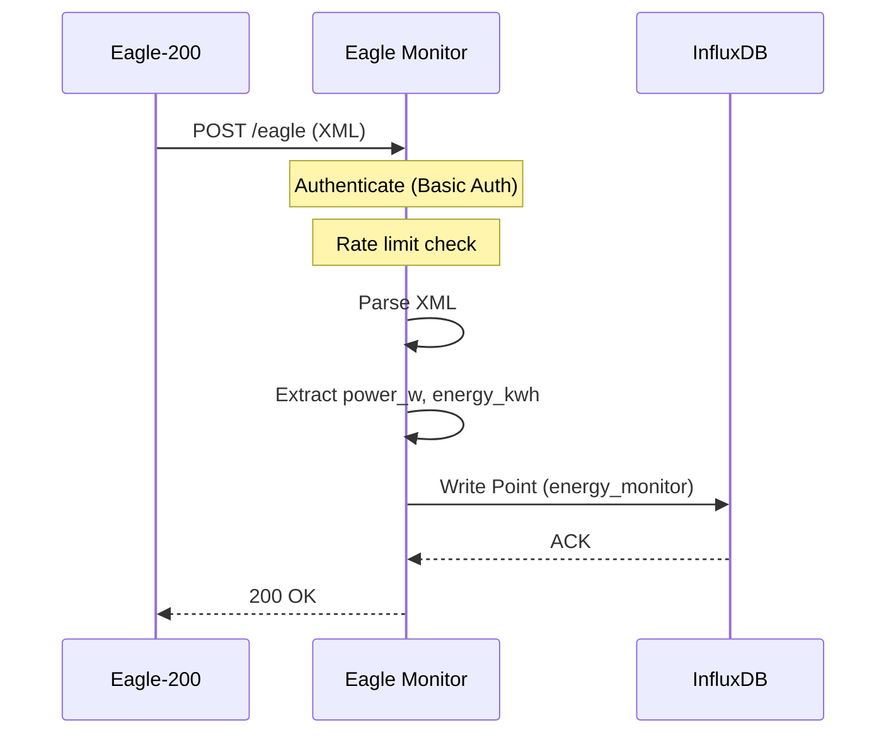
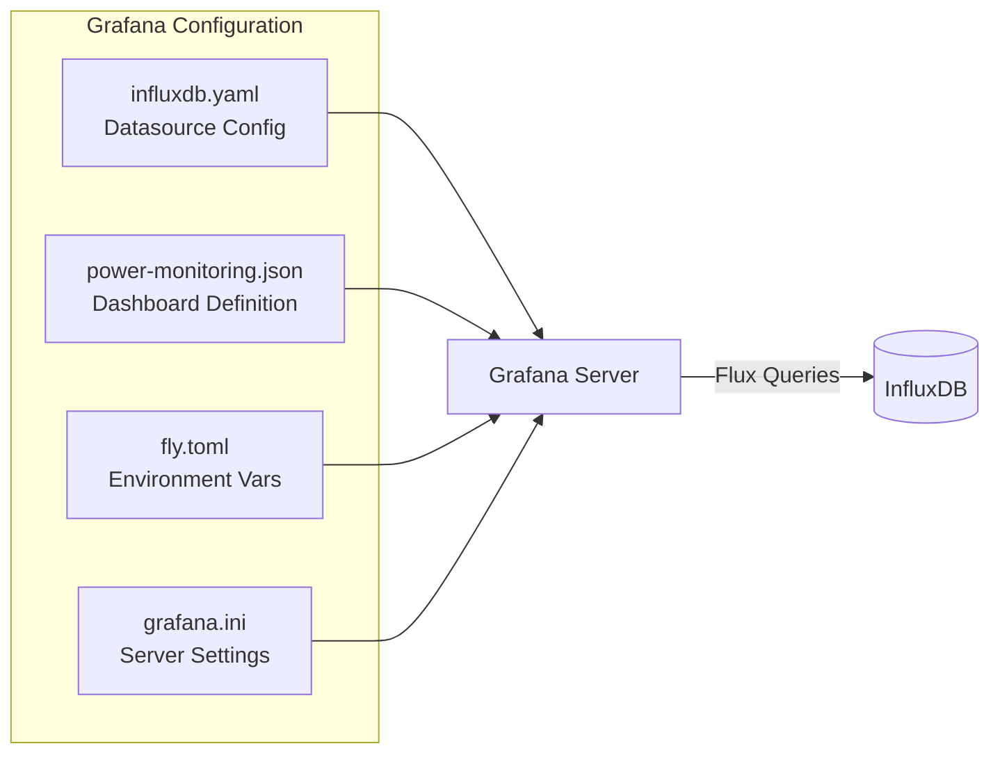
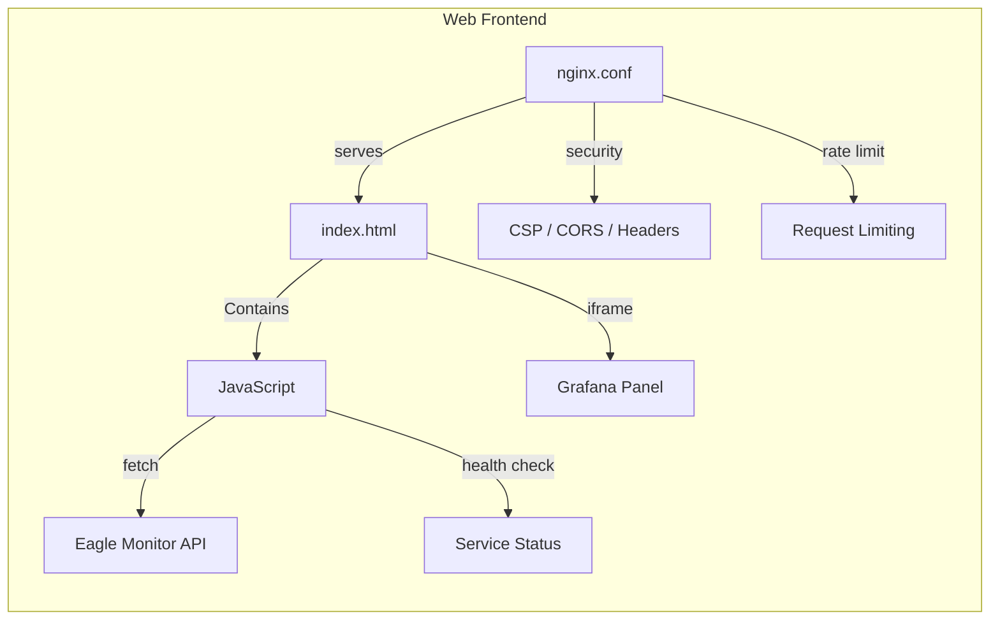
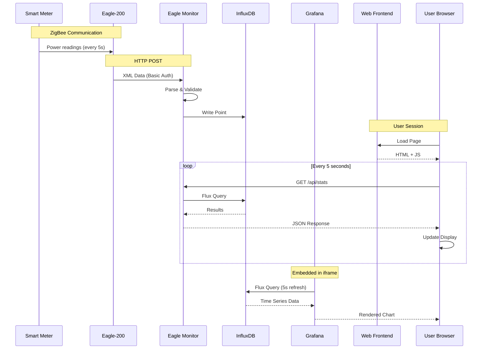
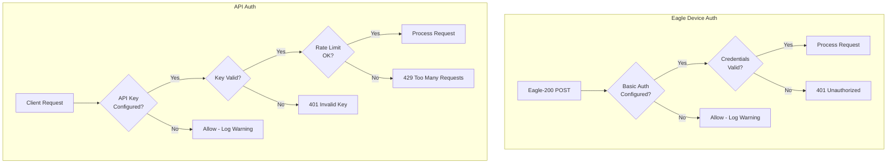
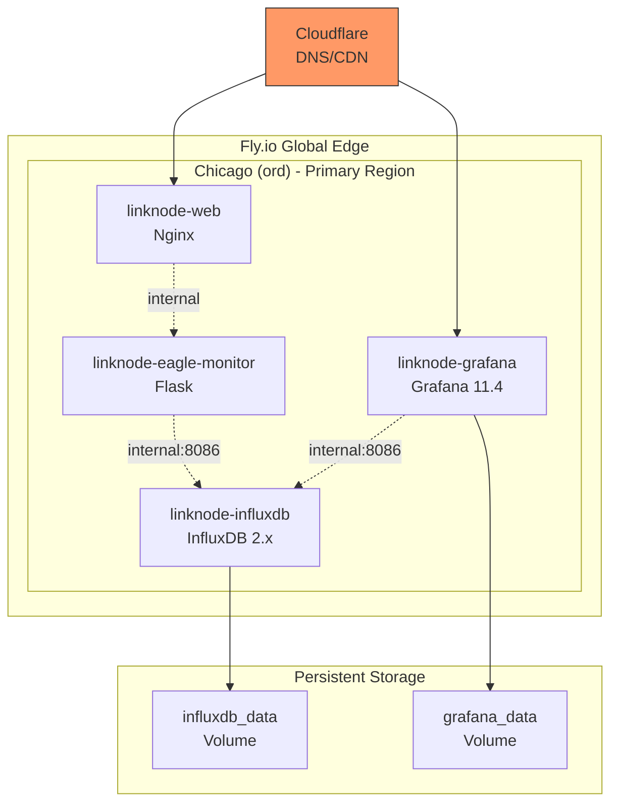
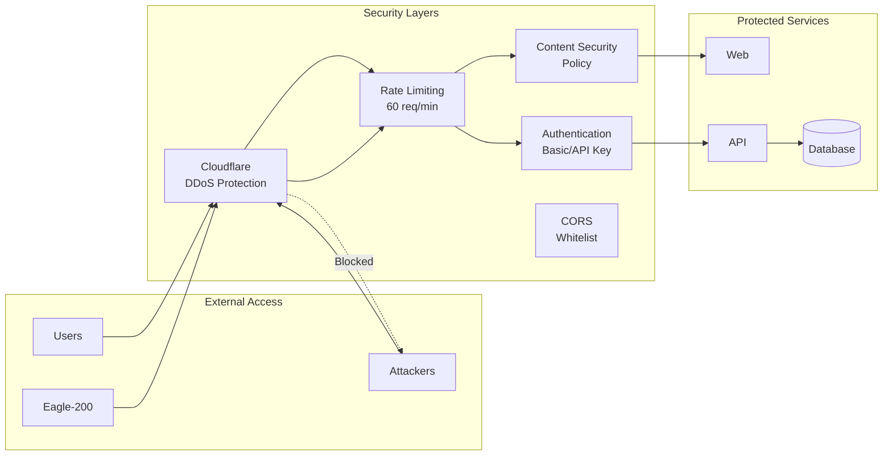
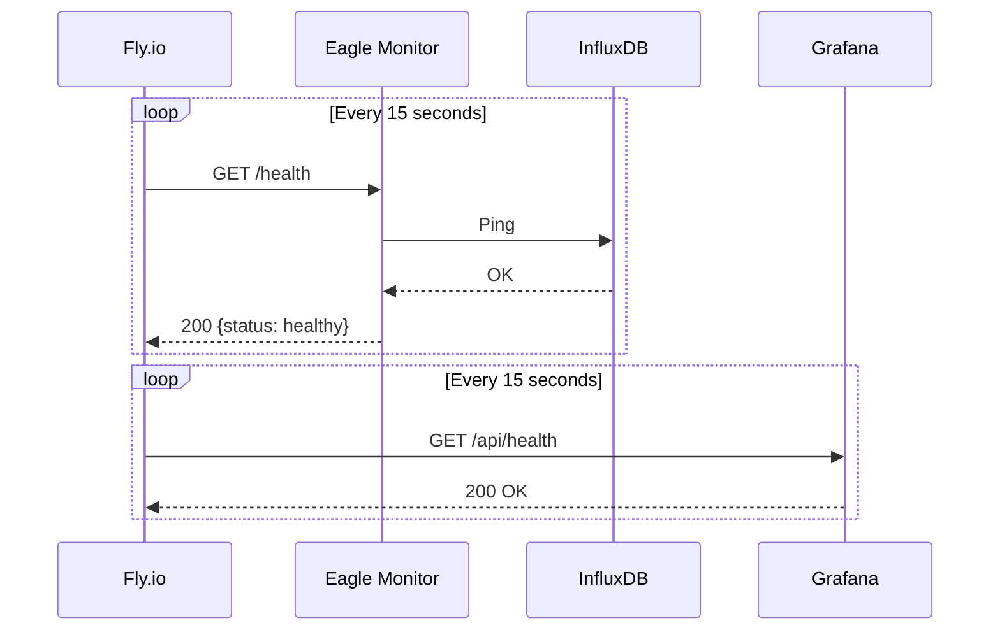

# Linknode Energy Monitor - Theory of Operation

> **Document Version:** 1.0
> **Last Updated:** 2026-01-14
> **Author:** Murray Kopit

## Executive Summary

The Linknode Energy Monitor is a production-grade IoT energy monitoring system that tracks real-time power consumption from an Eagle-200 smart meter device. The platform provides live power visualization, historical data analysis, and cost estimation through a modern web interface with embedded Grafana dashboards.

**Live Endpoints:**
| Service | URL |
|---------|-----|
| Main Website | https://linknode.com |
| Grafana Dashboard | https://linknode-grafana.fly.dev |
| Eagle Monitor API | https://linknode-eagle-monitor.fly.dev/api/stats |

---

## System Architecture Overview



---

## Component Details

### 1. Eagle-200 Smart Meter Gateway

The Rainforest Eagle-200 is a ZigBee-to-IP gateway that connects to the utility smart meter and transmits energy data via HTTP POST.

**Specifications:**
- Communication: ZigBee (to meter) + WiFi/Ethernet (to network)
- Data Format: XML
- Push Interval: ~5-10 seconds (configurable)
- Authentication: HTTP Basic Auth

**Message Types Supported:**
| Message Type | Data Provided |
|--------------|---------------|
| `InstantaneousDemand` | Current power draw (watts) |
| `CurrentSummationDelivered` | Cumulative energy (kWh) |
| `CurrentSummationReceived` | Solar export (kWh) |
| `PriceCluster` | Utility pricing per kWh |
| `NetworkInfo` | ZigBee link strength |
| `TimeCluster` | Time synchronization |

---

### 2. Eagle Monitor Service (Backend API)

**Location:** `fly/eagle-monitor/app.py`
**Technology:** Python 3, Flask, InfluxDB Client
**Deployment:** Fly.io (linknode-eagle-monitor.fly.dev)



**API Endpoints:**

| Endpoint | Method | Auth | Description |
|----------|--------|------|-------------|
| `/eagle` | POST | Basic Auth | Receive Eagle-200 XML data |
| `/api/stats` | GET | API Key (optional) | Power statistics & 24h metrics |
| `/health` | GET | None | Health check with InfluxDB status |
| `/api/security/stats` | GET | Admin API Key | Security monitoring stats |
| `/` | GET | None | Service information |

**Data Processing Flow:**



**Security Features:**
- HTTP Basic Authentication for Eagle webhook
- API Key authentication for stats endpoint
- Rate limiting: 60 requests/minute per client
- CORS restricted to specific origins
- Security headers (HSTS, X-Frame-Options, etc.)
- Suspicious IP monitoring

---

### 3. InfluxDB (Time-Series Database)

**Location:** `fly/influxdb/fly.toml`
**Technology:** InfluxDB 2.x
**Deployment:** Fly.io (linknode-influxdb.internal:8086)

**Configuration:**
| Parameter | Value |
|-----------|-------|
| Organization | `linknode` |
| Bucket | `energy` |
| Retention | 30 days |
| Query Language | Flux |

**Data Schema:**

```
Measurement: energy_monitor
Tags:
  - device_mac (Eagle device ID)
  - meter_mac (Utility meter ID)
  - message_type (instantaneous_demand, current_summation_delivered, etc.)

Fields:
  - power_w (float) - Current power in watts
  - energy_delivered_kwh (float) - Cumulative energy consumed
  - energy_received_kwh (float) - Solar energy exported
  - price_per_kwh (float) - Utility pricing
  - link_strength (string) - ZigBee signal strength
```

**Sample Flux Queries:**

```flux
// Get current power
from(bucket: "energy")
  |> range(start: -5m)
  |> filter(fn: (r) => r["_measurement"] == "energy_monitor")
  |> filter(fn: (r) => r["_field"] == "power_w")
  |> last()

// Get 24h average
from(bucket: "energy")
  |> range(start: -24h)
  |> filter(fn: (r) => r["_field"] == "power_w")
  |> mean()
```

---

### 4. Grafana (Visualization)

**Location:** `fly/grafana/`
**Technology:** Grafana 11.4.0
**Deployment:** Fly.io (linknode-grafana.fly.dev)



**Dashboard Panels:**

| Panel | Type | Query | Description |
|-------|------|-------|-------------|
| Current Power Demand | Gauge | `last(power_w)` | Real-time watts with color thresholds |
| Power Over Time | Time Series | `power_w` over 2h | Historical power graph |
| Utility Meter Reading | Stat | `last(energy_delivered_kwh)` | Cumulative kWh |
| Average Power (1h) | Stat | `mean(power_w)` | 1-hour average |
| Peak Power (1h) | Stat | `max(power_w)` | 1-hour maximum |

**Access Configuration:**
```
GF_AUTH_ANONYMOUS_ENABLED = true      # No login required
GF_AUTH_ANONYMOUS_ORG_ROLE = Admin    # Full dashboard access
GF_AUTH_DISABLE_LOGIN_FORM = true     # Hide login form
GF_SECURITY_ALLOW_EMBEDDING = true    # Enable iframe embed
GF_PUBLIC_DASHBOARDS_ENABLED = true   # Public sharing
```

---

### 5. Web Frontend

**Location:** `fly/web/`
**Technology:** Nginx, Vanilla JavaScript, HTML5/CSS3
**Deployment:** Fly.io (linknode.com)



**Frontend Features:**

1. **Live Power Display**
   - Fetches from `/api/stats` every 5 seconds
   - Color-coded power levels (green <1kW, yellow 1-2kW, red >2kW)
   - Data staleness detection (>2 minutes = stale warning)

2. **24-Hour Statistics**
   - Minimum, Maximum, Average power
   - Estimated cost at $0.12/kWh

3. **Embedded Grafana**
   - Solo panel view of Power Over Time graph
   - Dark theme, 5-second auto-refresh

4. **Service Status Indicators**
   - Eagle Monitor: Online/Offline
   - InfluxDB: Derived from Eagle health endpoint

**Nginx Security:**
- Rate limiting: 30 req/s general, 10 req/s API
- CSP headers restricting frame sources
- CORS whitelist for Fly.io services
- Cloud metadata endpoint blocking
- Hidden files and admin paths blocked

---

## Data Flow Diagrams

### Complete Request Flow



### Authentication Flow



---

## Deployment Architecture



**Resource Allocation:**

| Service | CPUs | Memory | Storage |
|---------|------|--------|---------|
| Web (Nginx) | 1 shared | 256 MB | None |
| Eagle Monitor | 1 shared | 256 MB | None |
| Grafana | 2 shared | 1024 MB | Volume (grafana_data) |
| InfluxDB | 1 shared | 256 MB | Volume (influxdb_data) |

---

## Security Model



**Security Controls:**

| Layer | Control | Configuration |
|-------|---------|---------------|
| Network | Cloudflare | DDoS protection, SSL termination |
| Application | Rate Limiting | 60 req/min (API), 30 req/s (web) |
| Application | CORS | Whitelist: linknode.com, *.fly.dev |
| Application | CSP | Strict frame-src, connect-src |
| Authentication | Basic Auth | Eagle webhook endpoint |
| Authentication | API Key | Stats endpoint (optional) |
| Data | InfluxDB Token | Read/Write authorization |

---

## Monitoring & Observability

### Health Check Flow



### Data Staleness Detection

The web frontend implements staleness detection to alert users when data stops flowing:

```
Data Age < 30s  → "Live" (green)
Data Age < 60s  → "Updated Xs ago" (yellow)
Data Age < 120s → "Updated Xm ago" (orange)
Data Age > 120s → "No data for Xm" (red) + display "--"
```

---

## File Structure Reference

```
linknode-com/
├── fly/
│   ├── web/                          # Main website
│   │   ├── index.html                # Frontend (HTML/CSS/JS)
│   │   ├── nginx.conf                # Web server config
│   │   ├── Dockerfile
│   │   └── fly.toml
│   │
│   ├── eagle-monitor/                # Backend API
│   │   ├── app.py                    # Flask application
│   │   ├── security_monitor.py       # Security tracking
│   │   ├── requirements.txt
│   │   ├── Dockerfile
│   │   └── fly.toml
│   │
│   ├── grafana/                      # Visualization
│   │   ├── provisioning/
│   │   │   ├── dashboards/
│   │   │   │   └── power-monitoring.json
│   │   │   └── datasources/
│   │   │       └── influxdb.yaml
│   │   ├── grafana.ini
│   │   ├── Dockerfile
│   │   └── fly.toml
│   │
│   └── influxdb/                     # Database
│       ├── Dockerfile
│       └── fly.toml
│
├── docs/                             # Documentation
│   ├── THEORY_OF_OPERATION.md        # This document
│   ├── HEALTH_CHECKS.md
│   ├── REGRESSION_TESTING.md
│   └── WORKFLOW_NOTIFICATIONS.md
│
├── e2e/                              # Playwright tests
├── scripts/                          # Utility scripts
├── monitoring/                       # Eagle config & debug
└── .github/workflows/                # CI/CD pipelines
```

---

## Operational Procedures

### Deployment

```bash
# Deploy individual service
cd fly/<service>
flyctl deploy

# Deploy all services
flyctl deploy --config fly/web/fly.toml
flyctl deploy --config fly/eagle-monitor/fly.toml
flyctl deploy --config fly/grafana/fly.toml
flyctl deploy --config fly/influxdb/fly.toml
```

### Secrets Management

```bash
# Set InfluxDB token for Eagle Monitor
flyctl secrets set INFLUXDB_TOKEN=<token> -a linknode-eagle-monitor

# Set Grafana InfluxDB token
flyctl secrets set INFLUXDB_TOKEN=<token> -a linknode-grafana

# Set Eagle authentication
flyctl secrets set EAGLE_PASSWORD=<password> -a linknode-eagle-monitor
```

### Troubleshooting

| Symptom | Check | Resolution |
|---------|-------|------------|
| No data in Grafana | Eagle Monitor logs | Verify Eagle-200 is POSTing |
| Stale data warning | `/health` endpoint | Check InfluxDB connection |
| 522 errors | Fly.io status | Check service auto-stop settings |
| CORS errors | nginx.conf | Verify origin whitelist |

---

## Version History

| Version | Date | Changes |
|---------|------|---------|
| 1.0 | 2026-01-14 | Initial document creation |

---

## References

- [Eagle-200 Documentation](https://rainforestautomation.com/support/eagle-200/)
- [InfluxDB Flux Language](https://docs.influxdata.com/flux/)
- [Grafana Documentation](https://grafana.com/docs/)
- [Fly.io Documentation](https://fly.io/docs/)
