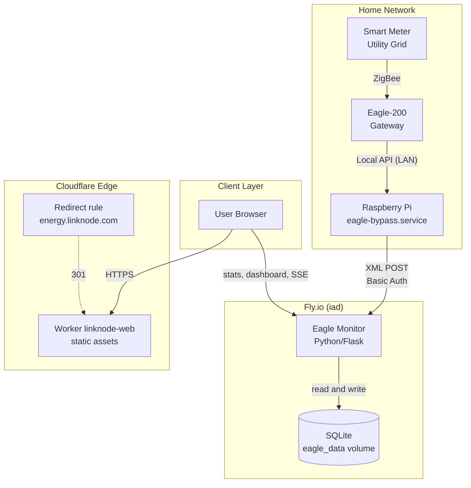
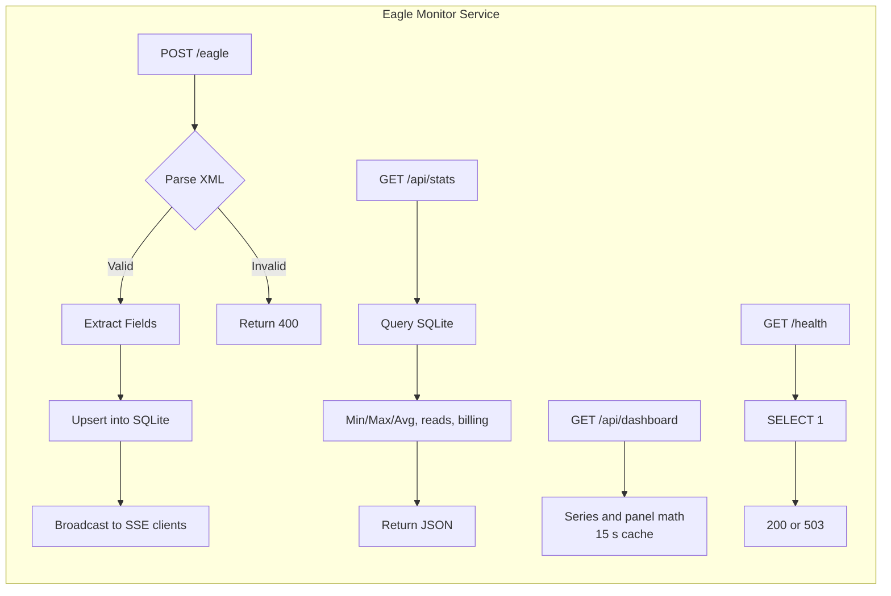
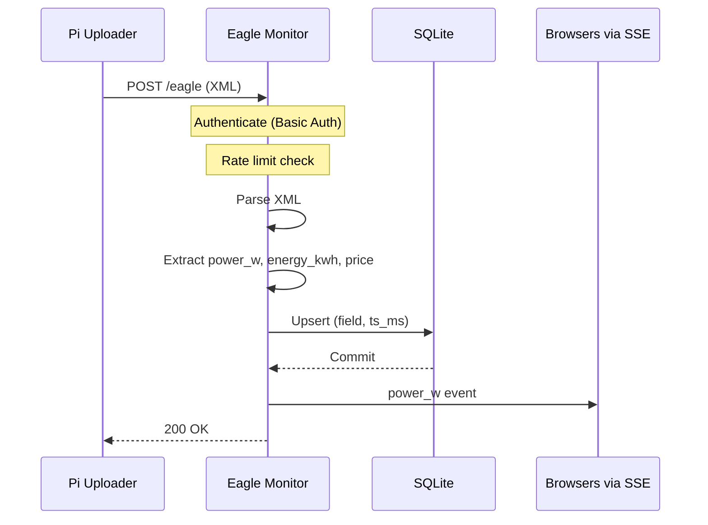
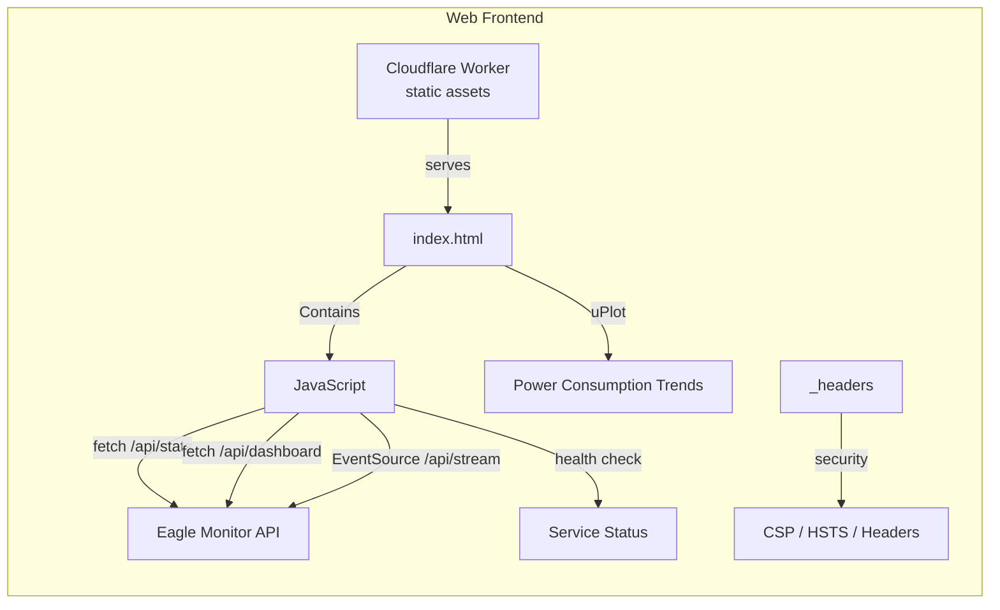
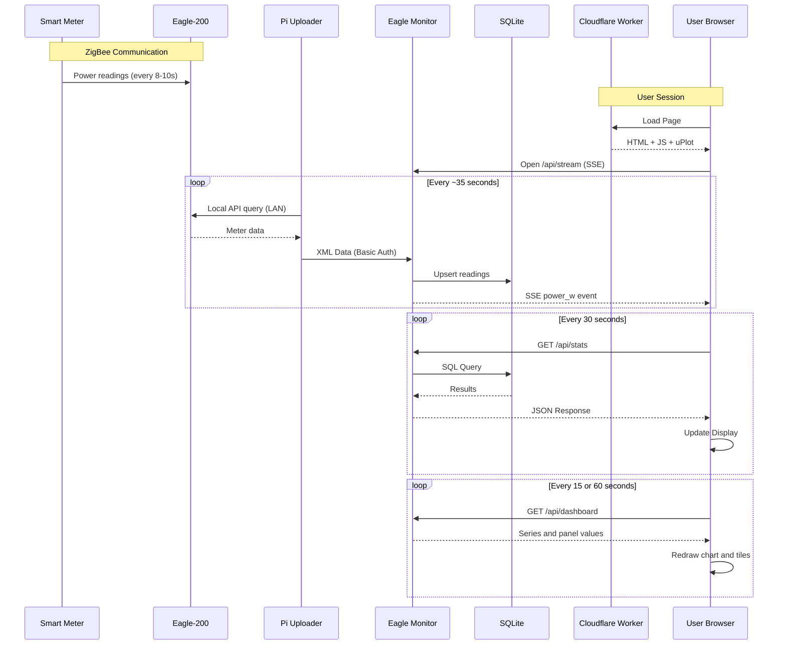
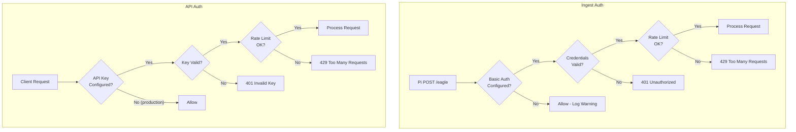
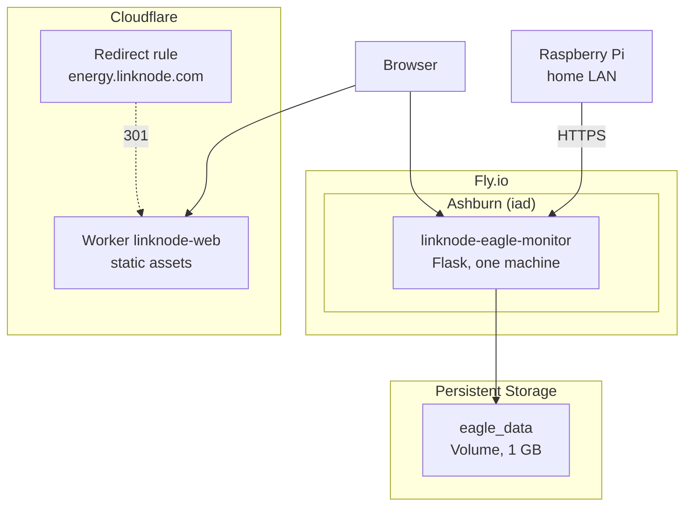
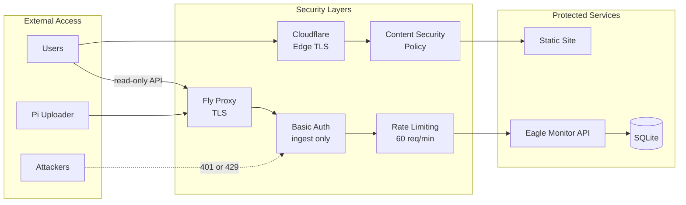
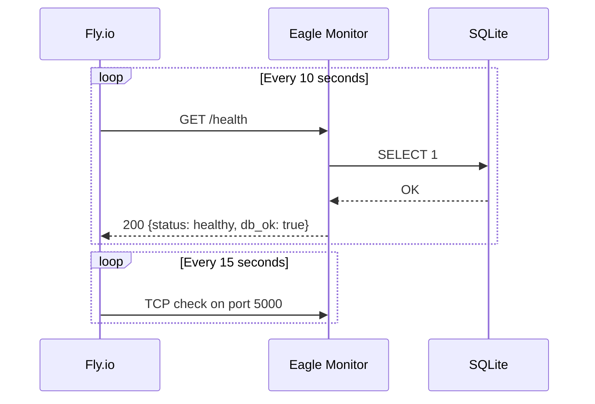

# Linknode Energy Monitor - Theory of Operation

> **Document Version:** 2.0
> **Last Updated:** 2026-09-27
> **Author:** Murray Kopit

## Executive Summary

The Linknode Energy Monitor tracks real-time household power consumption from an Eagle-200 smart meter gateway. A Raspberry Pi on the home network reads the meter over the Eagle's local API and posts each reading to a small Flask ingest service on Fly.io, which stores it in SQLite on a Fly volume. The public site is a static page served by a Cloudflare Worker; it shows a live gauge, a power trend chart and cost estimates, calling the ingest service's API directly.

The stack was consolidated on 2026-09-27. SQLite inside the ingest service replaced InfluxDB, a native uPlot chart on the site replaced the Grafana dashboard, and a Cloudflare Worker replaced the nginx site on Fly. Three of the four Fly apps (`linknode-web`, `linknode-grafana`, `linknode-influxdb`) were destroyed; InfluxDB history before 2026-08-27 was intentionally discarded.

**Live Endpoints:**
| Service | URL |
|---------|-----|
| Main Website | https://linknode.com |
| Energy Dashboard | https://linknode.com/#energy-dashboard (`energy.linknode.com` redirects here) |
| Eagle Monitor API | https://linknode-eagle-monitor.fly.dev/api/stats |
| Dashboard API | https://linknode-eagle-monitor.fly.dev/api/dashboard?range=24h |
| Health Check | https://linknode-eagle-monitor.fly.dev/health |
| Site Preview | https://linknode-web.murr2k.workers.dev |

---

## System Architecture Overview


```mermaid
graph TB
    subgraph "Home Network"
        SM["Smart Meter<br/>Utility Grid"] -->|ZigBee| E200["Eagle-200<br/>Gateway"]
        E200 -->|"Local API (LAN)"| PI["Raspberry Pi<br/>eagle-bypass.service"]
    end

    subgraph "Fly.io (iad)"
        EM["Eagle Monitor<br/>Python/Flask"] -->|"read and write"| DB[("SQLite<br/>eagle_data volume")]
    end

    subgraph "Cloudflare Edge"
        WEB["Worker linknode-web<br/>static assets"]
        RR["Redirect rule<br/>energy.linknode.com"]
    end

    subgraph "Client Layer"
        USER["User Browser"]
    end

    PI -->|"XML POST<br/>Basic Auth"| EM
    USER -->|HTTPS| WEB
    USER -->|"stats, dashboard, SSE"| EM
    RR -.->|301| WEB
```

---

## Component Details

### 1. Eagle-200 Smart Meter Gateway

The Rainforest Eagle-200 is a ZigBee-to-IP gateway paired with the utility smart meter. Rainforest removed the Eagle's own cloud uploader (at our request, to cut load on the failing device), so it no longer pushes data anywhere. The Raspberry Pi reads it over the local API instead. See `docs/eagle-200-hardware-notes.md` for the hardware fault.

**Specifications:**
- Communication: ZigBee (to meter) + WiFi/Ethernet (to network)
- Interface used: local API (`/cgi-bin/post_manager`), HTTP Basic auth with the Cloud ID and Install Code
- Native report rate: ~8-10 seconds; the Pi reads it every ~35 seconds
- Data Format: XML

**Message Types Supported** (by the ingest service):
| Message Type | Data Provided |
|--------------|---------------|
| `InstantaneousDemand` | Current power draw (watts) |
| `CurrentSummationDelivered` | Cumulative energy (kWh), plus export (kWh) |
| `PriceCluster` | Utility pricing per kWh |
| `NetworkInfo` | ZigBee link strength |
| `MessageCluster` | Utility text messages |
| `TimeCluster`, `BlockPriceDetail`, `DeviceInfo` | Metadata, acknowledged but not stored |
| `BypassStatus` | Pi uploader reliability heartbeat (not Eagle telemetry) |

The Pi sends the first three every cycle and `BypassStatus` every 15 minutes. `NetworkInfo` and `MessageCluster` arrived only through the old Rainforest cloud path.

---

### 2. Raspberry Pi Bypass Uploader

**Location:** `scripts/eagle_bypass.py` (install and operation: `deploy/README.md`)
**Technology:** Python 3, standard library only
**Deployment:** systemd `eagle-bypass.service` on a Raspberry Pi on the home LAN, the only host that can reach the Eagle (Fly cannot)

Each cycle (a 30 s wait plus the per-cycle work, ~35 s in total) the Pi:

1. Queries the Eagle's local API (`device_list`, `device_query`).
2. Builds three Rainforest-style XML messages (`InstantaneousDemand`, `CurrentSummationDelivered`, `PriceCluster`) tagged with the Control radio MAC (`...ef69`).
3. POSTs them to `https://linknode-eagle-monitor.fly.dev/eagle` with HTTP Basic auth.

Each reading is timestamped with the meter's `LastContact` time, not the Pi's clock. When the Eagle returns stale data, `LastContact` does not advance, so the re-sent reading lands on an existing (field, timestamp) key and overwrites it instead of adding a row. This is why `reads_24h` counts only fresh reads.

Always-on is the default mode: the Pi is the sole uploader and ships every cycle. `--failover` restores the older hot-standby behaviour if the Eagle ever uploads on its own again. Live counters are in `/run/eagle-bypass/stats.json` and `--report` prints an uptime and outage report.

---

### 3. Eagle Monitor Service (Backend API)

**Location:** `fly/eagle-monitor/app.py` (with `store.py`, `dashboard.py`, `monitor_data_staleness.py`)
**Technology:** Python 3.11, Flask, APScheduler, SQLite (`sqlite3` standard library)
**Deployment:** Fly.io app `linknode-eagle-monitor` (linknode-eagle-monitor.fly.dev), one shared-cpu-1x 256 MB machine in `iad`


```mermaid
flowchart LR
    subgraph Eagle Monitor Service
        direction TB
        A["POST /eagle"] --> B{Parse XML}
        B -->|Valid| C[Extract Fields]
        C --> D[Upsert into SQLite]
        D --> S[Broadcast to SSE clients]
        B -->|Invalid| E[Return 400]

        F["GET /api/stats"] --> G[Query SQLite]
        G --> H["Min/Max/Avg, reads, billing"]
        H --> I[Return JSON]

        P["GET /api/dashboard"] --> Q["Series and panel math<br/>15 s cache"]

        J["GET /health"] --> K["SELECT 1"]
        K --> L["200 or 503"]
    end
```

**API Endpoints:**

| Endpoint | Method | Auth | Description |
|----------|--------|------|-------------|
| `/eagle` | POST | Basic Auth | Receive XML from the Pi (readings and the `BypassStatus` heartbeat) |
| `/api/stats` | GET | API Key (optional, unset) | Current power, 24h min/max/avg and cost, `reads_24h`, `bypass_status`, `monitor_stats`, billing period with BC Hydro tiered cost (`?hours=1` to `720`) |
| `/api/dashboard` | GET | API Key (optional, unset) | Chart series and panel values for `?range=` `1h`, `6h`, `24h`, `7d` or `30d` (15 s cache) |
| `/api/stream` | GET | None | Server-Sent Events: each new power reading as it is stored |
| `/health` | GET | None | `{status, db_ok, uptime_seconds}`; 503 if the database is unavailable |
| `/api/security/stats` | GET | Admin API Key | Security monitoring stats (`ADMIN_API_KEY` is unset, so this returns 403) |
| `/` | GET | None | Service information |

**Dashboard API (`/api/dashboard`):**

| Range | Series | Site refresh |
|-------|--------|--------------|
| `1h` | Raw points | 15 s |
| `6h` | 1-minute means | 15 s |
| `24h` | 2-minute means | 15 s |
| `7d` | 15-minute means | 60 s |
| `30d` | 1-hour means | 60 s |

Alongside the series it returns min/average/max power over the range, energy consumed (trapezoidal integral of `power_w` in Wh, gaps bridged), the latest meter reading (kWh, within 5 minutes), the rate (the configured BC Hydro Step 1 rate, `TIER1_RATE`), cost per hour (current power x rate) and estimated cost (energy x rate x 1.1). The price the Eagle itself reports is returned separately as `meter_price_per_kwh`: it is not updated when BC Hydro changes rates, so it is never used for costs. The series carries null markers across gaps longer than three buckets (three minutes for raw points), so outages show as breaks in the chart. This reproduces the panels and math of the retired Grafana dashboard.

**Data Processing Flow:**


```mermaid
sequenceDiagram
    participant P as Pi Uploader
    participant M as Eagle Monitor
    participant D as SQLite
    participant B as Browsers via SSE

    P->>M: POST /eagle (XML)
    Note over M: Authenticate (Basic Auth)
    Note over M: Rate limit check
    M->>M: Parse XML
    M->>M: Extract power_w, energy_kwh, price
    M->>D: Upsert (field, ts_ms)
    D-->>M: Commit
    M->>B: power_w event
    M-->>P: 200 OK
```

`BypassStatus` heartbeats are handled out of band: they are saved to `meta.bypass_status` (restored on restart) and never touch the readings or the freshness clock, so they cannot mask an outage. Messages from the ignored HAN radio (`...ef68`) and messages with no storable fields are acknowledged without a write.

**Security Features:**
- HTTP Basic Authentication for the ingest endpoint (`EAGLE_USERNAME` / `EAGLE_PASSWORD`)
- Optional API key for the read endpoints; not configured, so they are public and read-only
- Rate limiting: 60 requests/minute per client on authenticated requests (in practice `/eagle`)
- CORS restricted to specific origins (see [Security Model](#security-model)); the SSE stream sends `Access-Control-Allow-Origin: *`
- Security headers (HSTS, X-Frame-Options, etc.)
- Suspicious IP monitoring

---

### 4. SQLite Store (Time-Series Database)

**Location:** `fly/eagle-monitor/store.py`
**Technology:** SQLite, WAL mode
**Deployment:** `/data/energy.db` on Fly volume `eagle_data` (1 GB, encrypted, daily snapshots kept 14 days)

**Configuration:**
| Parameter | Value |
|-----------|-------|
| Path | `/data/energy.db` (`DB_PATH`) |
| Journal | WAL, `synchronous=NORMAL` |
| Connections | Short-lived, one per operation; writes serialized by a lock; 1.5 s busy timeout (under the 2 s health-check timeout) |
| Retention | 5 years (`RETENTION_DAYS=1825`), enforced by a daily prune job |
| History | 30 days backfilled from InfluxDB (from 2026-08-27 23:50 UTC), live since 2026-09-26 23:50:02 UTC |

**Data Schema:**

```
readings(field_id INTEGER, ts_ms INTEGER, value REAL)
  PRIMARY KEY (field_id, ts_ms) WITHOUT ROWID
  field_id 1  power_w               Current power in watts
  field_id 2  energy_delivered_kwh  Cumulative energy consumed
  field_id 3  energy_received_kwh   Energy exported
  field_id 4  price_per_kwh         Utility pricing

text_readings(field TEXT, ts_ms INTEGER, value TEXT)
  PRIMARY KEY (field, ts_ms) WITHOUT ROWID
  link_strength, message_text

meta(key TEXT PRIMARY KEY, value TEXT)
  created_ms      When this store went live
  bypass_status   Last Pi heartbeat (restored on restart)
```

Writes are upserts: writing the same (field, ts) again overwrites the value. The InfluxDB tags (`device_mac`, `meter_mac`, `message_type`) are gone, since each field comes from exactly one message type and the second radio is filtered at ingest.

**Sample Queries:**

```sql
-- Current power
SELECT ts_ms, value FROM readings
WHERE field_id = 1 ORDER BY ts_ms DESC LIMIT 1;

-- 24h average
SELECT AVG(value) FROM readings
WHERE field_id = 1 AND ts_ms >= (strftime('%s', 'now') - 86400) * 1000;
```

For ad-hoc queries on the machine, open the file read-only (`file:/data/energy.db?mode=ro`) with Python's `sqlite3` module.

---

### 5. Web Frontend

**Location:** `web/` (`wrangler.jsonc`, `public/`)
**Technology:** Vanilla JavaScript, HTML5/CSS3, uPlot 1.6.32 (vendored at `web/public/vendor/uplot-1.6.32/`)
**Deployment:** Cloudflare Worker `linknode-web` serving static assets only (no Worker code), routes `linknode.com/*` and `www.linknode.com/*`


```mermaid
flowchart TB
    subgraph Web Frontend
        direction TB
        HTML["index.html"] --> |Contains| JS[JavaScript]
        JS --> |"fetch /api/stats"| API[Eagle Monitor API]
        JS --> |"fetch /api/dashboard"| API
        JS --> |"EventSource /api/stream"| API
        JS --> |health check| HC[Service Status]

        HTML --> |uPlot| CHART[Power Consumption Trends]

        CFW["Cloudflare Worker<br/>static assets"] --> |serves| HTML
        HDR["_headers"] --> |security| SEC["CSP / HSTS / Headers"]
    end
```

**Frontend Features:**

1. **Live Power Display**
   - Hand-coded SVG gauge, updated from the `/api/stream` SSE feed as each reading arrives
   - `/api/stats` polled every 30 seconds (every 5 seconds if SSE fails after 5 reconnects)
   - Gauge zones scaled to the 24h min-max band
   - Data staleness detection (>2 minutes = stale)

2. **24-Hour Statistics**
   - Minimum, Maximum, Average power
   - Estimated cost from average power and the configured BC Hydro Step 1 rate

3. **Power Consumption Trends** (`#energy-dashboard`)
   - uPlot chart and 8 stat tiles from `/api/dashboard`, range picker 1h/6h/24h/7d/30d
   - Polling pauses while the tab is hidden
   - Tile colours use the thresholds of the retired Grafana stat panels (below)

4. **Service Status Indicators**
   - Eagle Monitor: `/health` reachable
   - Database: `db_ok` from `/health`
   - Meter Reads: `reads_24h` received vs expected
   - Active Viewers, Sample Interval (the Pi's measured cycle), Data Uptime and device health (from the Pi heartbeat)

**Stat Tile Thresholds:**

| Tile | Green below | Yellow from | Orange/Red from |
|------|-------------|-------------|-----------------|
| Min Power | 500 W | 500 W | 1000 W (orange) |
| Average Power | 2000 W | 2000 W | 3000 W (orange) |
| Peak Power | 3000 W | 3000 W | 5000 W (red) |
| Energy Consumed | 5 kWh | 5 kWh | 10 kWh (orange) |
| Meter Reading | 50,000 kWh | 50,000 kWh | 100,000 kWh (orange) |
| Rate | $0.15/kWh | $0.15/kWh | $0.25/kWh (red) |
| Cost/Hour | $0.25 | $0.25 | $0.50 (red) |
| Estimated Cost | $5 | $5 | $10 (orange) |

**Cloudflare Security and Delivery:**
- Security headers from `web/public/_headers`: CSP (`default-src 'self'`, `connect-src` adds only `https://linknode-eagle-monitor.fly.dev`, `frame-src 'none'`, `object-src 'none'`), HSTS, X-Frame-Options, nosniff, Referrer-Policy, Permissions-Policy
- Unknown paths return `404.html`; `/vendor/*` is cached as immutable; `build-info.json` (written by CI) is `no-store`
- Rocket Loader is off for the zone (it conflicts with the CSP)
- Cloudflare's zone-level WebMCP feature injects `/.webmcp/bridge.js` into proxied HTML; it is same-origin, so the CSP allows it
- `linknode.com` and `www.linknode.com` are proxied DNS records (placeholder `AAAA 100::`) intercepted by the Worker routes
- `energy.linknode.com` is a Cloudflare redirect rule: 301 to `https://linknode.com/#energy-dashboard`

---

## Data Flow Diagrams

### Complete Request Flow


```mermaid
sequenceDiagram
    participant SM as Smart Meter
    participant E200 as Eagle-200
    participant PI as Pi Uploader
    participant EM as Eagle Monitor
    participant DB as SQLite
    participant CF as Cloudflare Worker
    participant USER as User Browser

    Note over SM,E200: ZigBee Communication
    SM->>E200: Power readings (every 8-10s)

    Note over USER,CF: User Session
    USER->>CF: Load Page
    CF-->>USER: HTML + JS + uPlot
    USER->>EM: Open /api/stream (SSE)

    loop Every ~35 seconds
        PI->>E200: Local API query (LAN)
        E200-->>PI: Meter data
        PI->>EM: XML Data (Basic Auth)
        EM->>DB: Upsert readings
        EM-->>USER: SSE power_w event
    end

    loop Every 30 seconds
        USER->>EM: GET /api/stats
        EM->>DB: SQL Query
        DB-->>EM: Results
        EM-->>USER: JSON Response
        USER->>USER: Update Display
    end

    loop Every 15 or 60 seconds
        USER->>EM: GET /api/dashboard
        EM-->>USER: Series and panel values
        USER->>USER: Redraw chart and tiles
    end
```

### Authentication Flow


```mermaid
flowchart TB
    subgraph "Ingest Auth"
        E1["Pi POST /eagle"] --> A1{Basic Auth<br/>Configured?}
        A1 -->|Yes| A2{Credentials<br/>Valid?}
        A1 -->|No| A3[Allow - Log Warning]
        A2 -->|Yes| A6{Rate Limit<br/>OK?}
        A2 -->|No| A5[401 Unauthorized]
        A6 -->|Yes| A4[Process Request]
        A6 -->|No| A7[429 Too Many Requests]
    end

    subgraph "API Auth"
        E2[Client Request] --> B1{API Key<br/>Configured?}
        B1 -->|Yes| B2{Key Valid?}
        B1 -->|"No (production)"| B3[Allow]
        B2 -->|Yes| B4{Rate Limit<br/>OK?}
        B2 -->|No| B5[401 Invalid Key]
        B4 -->|Yes| B6[Process Request]
        B4 -->|No| B7[429 Too Many Requests]
    end
```

---

## Deployment Architecture


```mermaid
graph TB
    subgraph "Fly.io"
        subgraph "Ashburn (iad)"
            EM["linknode-eagle-monitor<br/>Flask, one machine"]
        end
    end

    subgraph "Persistent Storage"
        V1["eagle_data<br/>Volume, 1 GB"]
    end

    EM --> V1

    subgraph "Cloudflare"
        WEB["Worker linknode-web<br/>static assets"]
        RR["Redirect rule<br/>energy.linknode.com"]
    end

    PI["Raspberry Pi<br/>home LAN"] -->|HTTPS| EM
    USER["Browser"] --> WEB
    USER --> EM
    RR -.->|301| WEB
```

**Resource Allocation:**

| Service | Platform | CPUs | Memory | Storage | Cost |
|---------|----------|------|--------|---------|------|
| Eagle Monitor | Fly.io (`iad`) | 1 shared | 256 MB | Volume (eagle_data, 1 GB) | ~$1.94 machine + $0.15 volume per month |
| Web (static site) | Cloudflare Workers | n/a | n/a | Static assets | Free tier |
| Bypass uploader | Raspberry Pi, home LAN | n/a | n/a | SD card | n/a |

Total hosting is about $2.09/month (`iad` has no regional markup; the same machine in `ord` cost $2.43).

**One machine only.** The database lives on the machine's volume, so a second machine would get its own separate database. Never scale `linknode-eagle-monitor` past one machine.

---

## Security Model


```mermaid
flowchart LR
    subgraph "External Access"
        USER[Users]
        PI[Pi Uploader]
        ATTACKER[Attackers]
    end

    subgraph "Security Layers"
        CF["Cloudflare<br/>Edge TLS"]
        CSP["Content Security<br/>Policy"]
        FLY["Fly Proxy<br/>TLS"]
        AUTH["Basic Auth<br/>ingest only"]
        RL["Rate Limiting<br/>60 req/min"]
    end

    subgraph "Protected Services"
        WEB[Static Site]
        API[Eagle Monitor API]
        DB[(SQLite)]
    end

    USER --> CF --> CSP --> WEB
    USER -->|"read-only API"| FLY
    PI --> FLY --> AUTH --> RL --> API --> DB
    ATTACKER -.->|"401 or 429"| AUTH
```

**Security Controls:**

| Layer | Control | Configuration |
|-------|---------|---------------|
| Network | Cloudflare | TLS termination and DDoS protection for linknode.com |
| Network | Fly.io proxy | TLS for linknode-eagle-monitor.fly.dev |
| Application | Rate Limiting | 60 req/min per client on authenticated requests |
| Application | CORS | Allow-list: linknode.com, www.linknode.com, `linknode-web` workers.dev hosts, local preview on port 8771 (plus the retired `linknode-web.fly.dev`) |
| Application | CSP | `web/public/_headers`: `connect-src` limited to self and the API, `frame-src 'none'` |
| Authentication | Basic Auth | Ingest endpoint `/eagle` |
| Authentication | API Key | Read endpoints (optional; unset, so public read-only) |
| Data | Fly volume | Encrypted at rest, daily snapshots kept 14 days |

---

## Monitoring & Observability

### Health Check Flow


```mermaid
sequenceDiagram
    participant FLY as Fly.io
    participant EM as Eagle Monitor
    participant DB as SQLite

    loop Every 10 seconds
        FLY->>EM: GET /health
        EM->>DB: SELECT 1
        DB-->>EM: OK
        EM-->>FLY: 200 {status: healthy, db_ok: true}
    end

    loop Every 15 seconds
        FLY->>EM: TCP check on port 5000
    end
```

A failed database check returns 503 with `db_ok: false`. See `docs/HEALTH_CHECKS.md`.

### Data Staleness Detection

The web frontend implements staleness detection to alert users when data stops flowing:

```
Data Age < 60s    → "Live"
Data Age 60-120s  → "Xm ago"
Data Age > 120s   → stale: gauge greyed, age shown ("Xm ago", "Xh Xm ago", "Xd Xh ago"), 24h stats show "--"
No timestamp      → "No data"
```

### Outage Alerting

The ingest service runs two APScheduler jobs: a data-freshness check every 5 minutes and a retention prune once a day. The freshness check marks the feed unhealthy when the newest power reading in the store is older than `STALE_THRESHOLD_MINUTES` (default 5) or is zero or missing. It goes by the reading's own time, which the Pi takes from the Eagle's last contact with the meter, not by when a POST last arrived: the Pi keeps re-posting a frozen reading while the Eagle answers but has lost the meter. Alerts fire only on state transitions, once per outage:

- **healthy to unhealthy:** Slack (`SLACK_WEBHOOK_URL`) plus a Pushover emergency siren (priority 2, repeats every 60 s until acknowledged, expires after 1 hour)
- **unhealthy to healthy:** Slack only

The state is saved to `/data/monitor_state.json` on the volume, so a restart does not repeat an alert.

`GET /health/data` exposes the same signal: 200 while the newest reading is fresh, 503 once it is stale. `/health` stays a liveness check (process up, store answering), because Fly restarts the machine when it fails and a restart does not fix a dead Pi.

The ingest service cannot report its own death, so the Pi runs the other half: `scripts/linknode_watchdog.py`, a systemd timer every 2 minutes (`deploy/linknode-watchdog.*`). It checks that `/health/data` answers, that linknode.com serves the dashboard, and that `/api/stats` answers with the CORS header the page needs, and sends its own Pushover siren after three consecutive failures. The two watch each other; only both failing at once goes unreported.

---

## File Structure Reference

```
linknode-com/
├── fly/
│   ├── eagle-monitor/                # Ingest + API service (the only Fly app)
│   │   ├── app.py                    # Flask routes, auth, SSE, scheduler
│   │   ├── store.py                  # SQLite time-series store
│   │   ├── dashboard.py              # /api/dashboard series and panel math
│   │   ├── monitor_data_staleness.py # Slack/Pushover outage alerting
│   │   ├── security_monitor.py       # Security tracking
│   │   ├── test_*.py                 # Unit tests (run by deploy-fly.yml)
│   │   ├── requirements.txt
│   │   ├── Dockerfile
│   │   └── fly.toml
│   ├── README.md
│   └── SECRETS_SETUP.md
│
├── web/                              # Site (Cloudflare Worker, static assets)
│   ├── wrangler.jsonc                # Worker name, routes, assets config
│   └── public/
│       ├── index.html                # Frontend (HTML/CSS/JS)
│       ├── _headers                  # CSP and security headers
│       ├── 404.html
│       └── vendor/uplot-1.6.32/      # Vendored chart library
│
├── scripts/eagle_bypass.py           # Pi uploader
├── deploy/                           # Pi systemd unit and env example
├── docs/                             # Documentation
│   ├── THEORY_OF_OPERATION.md        # This document
│   ├── HEALTH_CHECKS.md
│   ├── REGRESSION_TESTING.md
│   ├── WORKFLOW_NOTIFICATIONS.md
│   └── archive/                      # Retired systems (Grafana, InfluxDB, Kubernetes)
│
├── run.cmd                           # Local site preview (wrangler dev, port 8771)
└── .github/workflows/                # CI/CD pipelines
```

---

## Operational Procedures

### Deployment

Pushing to `main` is a production deploy:

- `fly/eagle-monitor/**` triggers `.github/workflows/deploy-fly.yml`: runs the unit tests, captures the current image for rollback, deploys (with retries), checks `/health`, and redeploys the captured image if the deploy fails.
- `web/**` triggers `.github/workflows/deploy-web.yml`: writes `build-info.json`, deploys with Wrangler, and verifies the preview URL.

```bash
# Unit tests
python -m unittest discover -s fly/eagle-monitor -p "test_*.py"

# Ingest service (manual)
cd fly/eagle-monitor
flyctl deploy --remote-only

# Site (manual, needs wrangler login)
npx wrangler deploy --config web/wrangler.jsonc

# Local site preview on http://127.0.0.1:8771 (live production data)
run.cmd
```

### Secrets Management

```bash
# Ingest Basic auth; must match EAGLE_UPLOAD_PASSWORD in /etc/eagle-bypass.env on the Pi
flyctl secrets set EAGLE_PASSWORD=<password> -a linknode-eagle-monitor

# Outage alerting
flyctl secrets set SLACK_WEBHOOK_URL=<url> -a linknode-eagle-monitor
flyctl secrets set PUSHOVER_API_TOKEN=<token> PUSHOVER_USER_KEY=<key> -a linknode-eagle-monitor
```

GitHub Actions secrets: `FLY_API_TOKEN` (Fly deploy), `CLOUDFLARE_API_TOKEN` and `CLOUDFLARE_ACCOUNT_ID` (site deploy). `INFLUXDB_TOKEN` and `GRAFANA_ADMIN_PASSWORD` are retired. See `fly/SECRETS_SETUP.md`.

### Troubleshooting

| Symptom | Check | Resolution |
|---------|-------|------------|
| Gauge shows stale or "No data" | Pi: `journalctl -u eagle-bypass`, `/run/eagle-bypass/stats.json`; `fly logs -a linknode-eagle-monitor` | The Eagle not answering its local API is expected flapping; a 401 on upload means the Pi and Fly passwords differ |
| Chart and tiles show "--" | `/api/dashboard?range=24h` | 503 means the store is unavailable: check `/health` |
| `/health` returns 503 (`db_ok: false`) | Fly logs (`/data is not a mounted volume`, SQLite errors) | Confirm the `eagle_data` volume is attached, then restart the machine |
| Site loads but no data, CSP errors in console | `connect-src` in `web/public/_headers` | The API host must be listed; keep Rocket Loader off |
| CORS errors | `CORS(...)` origins in `fly/eagle-monitor/app.py` | Add the calling origin |
| History differs between requests | `fly status -a linknode-eagle-monitor` | More than one machine is running; scale back to one |

---

## Version History

| Version | Date | Changes |
|---------|------|---------|
| 1.0 | 2026-01-14 | Initial document creation |
| 2.0 | 2026-09-27 | SQLite replaces InfluxDB, native chart replaces Grafana, Cloudflare Worker replaces nginx on Fly; Pi uploader and alerting documented |

---

## References

- [Eagle-200 Documentation](https://rainforestautomation.com/support/eagle-200/)
- [SQLite Documentation](https://www.sqlite.org/docs.html)
- [uPlot](https://github.com/leeoniya/uPlot)
- [Cloudflare Workers Static Assets](https://developers.cloudflare.com/workers/static-assets/)
- [Fly.io Documentation](https://fly.io/docs/)
